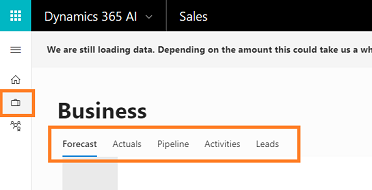
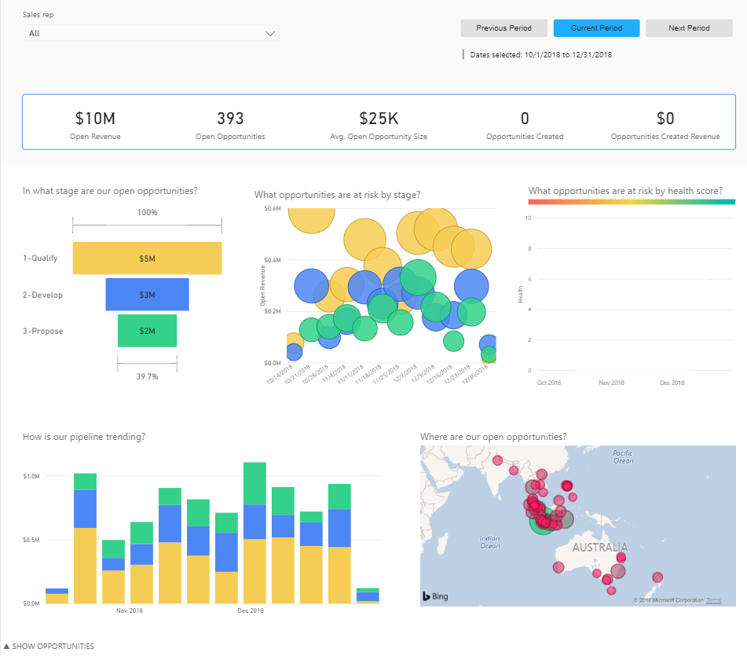
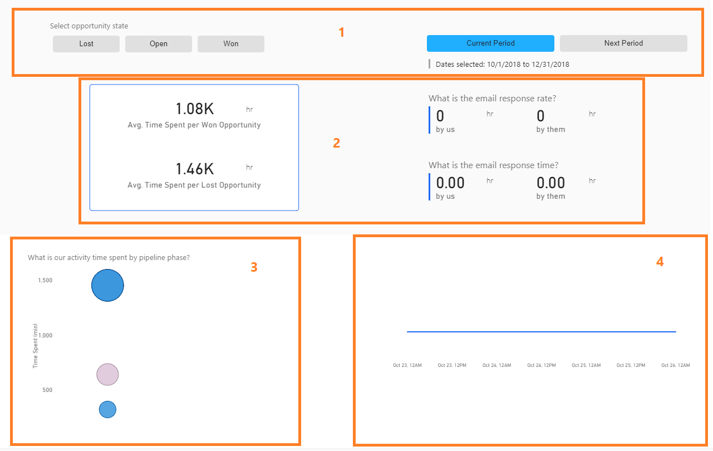

# Preview: Analyze business performance

Applies to [!INCLUDE[pn-crm-online](../includes/pn-crm-online.md)] version 9.1.0.

[!INCLUDE [cc-beta-prerelease-disclaimer](../includes/cc-beta-prerelease-disclaimer.md)]

> [!IMPORTANT]
> [!INCLUDE[cc_preview_features_definition](../includes/cc-preview-features-definition.md)]

As a sales manager, it is important for you to understand how your business is doing at each level of the sales cycle such as lead capture, account creation, contact setup, opportunity management, product catalog, and quote management. Using the Business section, you will get detailed information on all phases of the sales cycle to help you understand how your team is performing and to plan your day-to-day activities. 

On [!INCLUDE[pn_dynamics_sales_insights](../includes/pn-dynamics-sales-insights.md)] app, select **Business**. The **Business** section displays, containing the following tabs:

<<<<<<< HEAD
- **Forecast**: Gives you an overview of all sales against the intended quota for the full period. To learn more, see [Forecast](#forecast)
- **Actuals**: Give you a deeper understanding of closed revenue. To learn more, see [Actuals](#actuals)
- **Pipeline**: Give you visibility into the upcoming deals to identify risks. To learn more, see [Pipeline](#pipeline)
- **Activities**: Give you visibility into the activities that have contributed most to success. To learn more, see [Activities](#activities)
- **Lead**: Helps you predict whether there are enough leads to replenish the pipeline. To learn more, see [Leads](#leads)
=======
- **Forecast**: Gives you an overview of all sales against the intended quota for the full period.
- **Actuals**: Give you a deeper understanding of closed revenue.
- **Pipeline**: Give you visibility into the upcoming deals to identify risks.
- **Lead**: Helps you predict whether there are enough leads to replenish the pipeline.
- **Activities**: Give you visibility into the activities that have contributed most to success.
- **Predictive forecast**: Helps you to predict sales forecast for the current period by providing visibility into your business.
>>>>>>> 9038288590d9c0ede6e36a98eef443aa9aa336f1

> [!div class="mx-imgBorder"]
> 

## Forecast

The **Forecast** tab helps you to see the forecast trend and understand whether you will meet the target quota for the sales period. This tab helps you to answer questions such as:

- How much are we anticipating to sell this period?
- Is there a risk of not meeting our quota?
- What are we forecasting for this period? 
- How much have we won?
- How close are we to reaching our revenue goal?
- Where will we be at the end of this time period?
- How much pipeline do we have in open to close the gap to reach our quota?

The following is an example of how the **Forecast** tab displays:

> [!div class="mx-imgBorder"]
> 

|Section|Description|
|-|-|
|**1. Filter**|Filters information based on the selected sales rep and time period.  For example, when you select Sales Rep as **All** and time period as **Current Period**, other sections in the forecast tab are updated to display information about the forecast of all sales reps in the current time period.|
|**2. Quota**|Specifies the revenue that you need to generate for the selected time period.|
|**3. Projected revenue**|Displays the projected revenue based on the current actuals and open revenue when the current win rate is maintained. This revenue is the sum of actual revenue generated (Closed Won) till date and the revenue that is available in the pipeline (Projected to Close) with the win rate maintained in the current time period. **Closed Won**: Specifies how much actual revenue you have generated so far. Information is shown on a radial graph along with the number of deals you have won and the average revenue size of each opportunity that is won. For example, in the snippet, a total of 5 opportunities are won and the average value of each opportunity that is closed is $8,621. **Projected to close**: Specifies the revenue available in your pipeline to close for the current period. Information about the total opportunities available in the pipeline with average revenue size of each opportunity is also displayed. For example, in the snippet, 164 opportunities are available to win and the average value of each opportunity that is to be closed is $250,000.|
|**4. Progress towards quota**|Displays how you are progressing towards achieving your quota for the specified time period. You can compare the quota with how you are reaching target against the best case, projected, and worst case. The information is displayed on a basic area chart where the x-axis represents the time period and the y-axis represents the revenue. The vertical line specifies the current time and hovering over the chart displays more information such as quota, projected, and period at that time. Highlighting a line in the graph cross-filters the other visualizations on the report page... and vice versa. |
|**5. Revenue pipeline**|Displays the total open revenue available in the pipeline for you and with how much revenue you can exceed the quota in this point in time.|

## Actuals
The **Actuals** tab helps you to understand how much you have deals won until now and why you are losing for the sales period. This tab helps you to answer questions such as:

- Where are we now in the current period?
- How does our progress compare historically?
- How many deals we have won this time period?
- What is the average size of the deal I have won this time period?
- Which region is our revenue coming from? 
- What industry is our revenue coming from? 
- How successful I am in winning deals?
- How many deals did I lose this time period?
- How much potential revenue did I lose this time period?

The following is an example of how the **Actuals** tab displays:

> [!div class="mx-imgBorder"]
> 

|Section|Description|
|-|-|
|**1.	Filters**|Filters information based on the selected sales rep, time period, and won/lost deals. For example, when you select Sales Rep as **All**, time period as **Current Period**, and **Won**, other sections in the actual tab are updated to display information about the actual deals won by all sales reps in the current time period.|
|**2.	Revenue details**|Displays information about the actual revenue you won, the average size of each won deal, the number of winning opportunities, the percentage at which you are successful in winning a deal, number of deals you lost, and the potential revenue you lost in this time period. Also, you can view at what percentage you are up (up arrow) or down (down arrow) compared to last year at the same time.|
|**3.	Revenue trend**|Displays how your revenue is trending. This helps you in measuring the revenue growth against the previous year during the same period. The information is displayed on the basic area chart where the x-axis represents the time period and the y-axis represents the revenue. The vertical line specifies the current time and hovering over the chart displays more information such as last year’s revenue, the current year’s revenue, and selected period. Highlighting a line in the graph cross-filters the other visualizations on the report page, and vice versa.|
|**4.	Revenue against win ratio**|Displays information on the percentage of wins according to the opportunity size. This helps you to analyze what type of opportunities you have to concentrate on. The information is plotted on a bubble chart, where the x-axis defines the estimated revenue, the y-axis defines the percentage of win ratio, and each bubble an opportunity. Hover over the bubble to display more information such as opportunity name, win rate, estimated revenue, and select period. Highlighting a bubble in the graph cross-filters the other visualizations on the report page, and vice versa.|
|**5.	Revenue by location**|Displays information about which regions you are most successful in and have generated more revenue. This helps you analyze which regions you have to focus on to improve revenue generation. Each revenue is plotted on the map as a bubble and attached to the address of the account. The size of the bubble determines the revenue generated. Hover over the bubble to see more information such as city and revenue. Highlighting a bubble cross-filters the other visualizations on the report page, and vice versa.|
|**6.	Revenue by industry**|Displays the industry from which your revenue is generating and helps you to analyze which industry you should pursue or not spend time on. Hover over an industry to display more information such as the industry name, status of the deals, estimated revenue, and the time period. Highlighting an industry cross-filters the other visualizations on the report page, and vice versa.|
|**7.	Win and loss trend**|Displays how you are trending on win and loss opportunities in the specified time period. The information is displayed on a combo chart where the x-axis represents the time period and the y-axis represents the number of deals. Also, a line represents the percentage of win ratio in the specified time period. Hovering over a bar or line displays more information of that bar or line. In the graph, the blue bar represents the won opportunities and orange represents the lost opportunities in the time period. Highlighting a bar in the graph cross-filters the other visualizations on the report page, and vice versa. For example, on October 2, you lost three opportunities and converted one opportunity into a win deal. The win ratio was 25%, based on the two losses and one win. On October 4, you lost one opportunity and converted one opportunity to into a win deal. The ratio is 50%, based on the previous win ratio.|
|**8.	Lost deal reason**|Displays how you are trending on win and loss opportunities in the specified time period. The information is displayed on a combo chart where the x-axis represents the time period and the y-axis represents the number of deals. Also, a line represents the percentage of win ratio in the specified time period. Hovering over a bar or line displays more information of that bar or line. In the graph, the blue bar represents the won opportunities and orange represents the lost opportunities in the time period. Highlighting a bar in the graph cross-filters the other visualizations on the report page, and vice versa. For example, on October 2, you lost three opportunities and converted one opportunity into a win deal. The win ratio was 25%, based on the two losses and one win. On October 4, you lost one opportunity and converted one opportunity to into a win deal. The ratio is 50%, based on the previous win ratio.|

## Pipeline

The **Pipeline** tab helps you to understand opportunities that you have in the pipeline to meet your goals, identify opportunities that are at risk, and prioritize the right opportunities. This tab helps you to answer questions such as: 

- How much pipeline do we have in open to close the gap to reach our quota?
- How many deals are open in this period to help reach our quota?
- What is the average size of deals we have for each opportunity to close?
- Where are our open opportunities?
- How is our pipeline trending by stage?
- What deals are closing soon and are not in the right stage?
- Which regions are our open opportunities coming from?

The following is an example of how the **Pipeline** tab displays:

> [!div class="mx-imgBorder"]
> 

|Section|Description|
|-|-|
|**1. Filters**|Filters information based on the selected sales rep and time period.  For example, when you select Sales Rep as **All** and time period as **Current Period**, other sections in the pipeline tab are updated to display information about the pipeline opportunities for all sales reps in the current time period.|
|**2. Revenue details**|**Open revenue**: The revenue that is open and available in your pipeline to close the gap in quota for your current period. **Open opportunities**: The opportunities that are open and available for you to reach our quota in this period. **Average open opportunity size**: The average deal size of each open opportunity that you can close. **Opportunities created**: The number of opportunities that you have created in the current period. **Opportunities created revenue**: The open revenue created by the opportunities in the current period. |
|**3. Open opportunities by stage**|Displays information on the value of opportunities available at each stage in a specified time period. The stages include qualify, develop, and progress. Hovering over a bar displays information such as stage name, open revenue, and percentage of first (qualify). Highlighting a bar in a funnel cross-filters the other visualizations on the report page, and vice versa. For example, selecting the Proposal bar will cross-highlight the other visualizations on the page.|
|**4. Opportunities at risk by stage**|Displays information about the open opportunities such as when they are closing and what stage they are at. This information is plotted on a bubble chart where the x-axis denotes the closing dates for opportunities and the y-axis denotes the open revenue. The color determines the stage and the size determines the open revenue that opportunity holds. Hover over the bubble to see more information about the opportunity. Highlighting a bubble in the graph cross-filters the other visualizations on the report page, and vice versa.|
|**5. Opportunity at risk health score**|Displays information about the number of open opportunities and their relationship health in a specified time period. This helps to identify opportunities that are closing soon and are at risk. The information is displayed on the bubble chart, with each bubble representing an opportunity. Hovering over a bubble displays more information about the opportunity. Highlighting a bubble in the graph cross-filters the other visualizations on the report page, and vice versa.|
|**6. Pipeline trend**|Displays information about the open opportunities with value, stage, and date of close. This information is displayed on the bar chart where the x-axis represents dates and the y-axis represents the value of open opportunities. Hovering over the bar displays information such as close date, stage, and value of the opportunity. Highlighting a bar cross-filters the other visualizations on the report page, and vice versa.|
|**7. Opportunities by regions**|Displays the regions in which you have open opportunities. Also, helps you to analyze in which regions you have to concentrate to increase the opportunities. Each opportunity is plotted on the map as a bubble and attached to the address of the account. The size of the bubble determines the value of the opportunity. Hover over the bubble to see more information such as city and open opportunity count. Highlighting a bubble cross-filters the other visualizations on the report page, and vice versa.|

## Activities

The **Activities** tab helps you to understand your team's activities such as communicating with customers and time spent to enable sales. The communications include emails, phone calls, and meetings. Using this information, you can answer questions such as: 

- How much of the workday do sales reps spend with customers?
- How much of the team's time is spent with customers versus in team meetings?
- Are sales reps spending most of their time on deals with the most potential?
- Which accounts need attention?
- What activities are we doing for a specific deal?

The following is an example of how the **Activities** tab displays:

> [!div class="mx-imgBorder"]
> 

|Section|Description|
|-|-|
|**1. Filters**|Filters information about your team based on the selected opportunity state and time period. For example, when you select opportunity state as **Won** and time period as **Current Period**, other sections in this tab are updated to display information about the opportunities won in the current time period.|
|**2. Activity details**|**Average time spent per won opportunity**: The average time spent by your team on a won deal. **Average time spent per lost opportunity**: The average time spent by your team on a lost deal. **What is the email response rate**: The number of emails communicated between your team and customers per opportunity. **What is the email response time**: The time taken to respond to emails by your team and customers per opportunity.|
|**3. Time spent by pipeline phase**|Displays how much time you have spent on opportunities at different pipeline phases such as qualify, develop, and propose. For example, you can determine that your team spent more time on deals that are still at stage 1 (Qualify), when they could have concentrated on deals that are at stage 3 (Propose). This information is displayed in a scatter chart, where the x-axis defines the phases of the pipeline and the y-axis defines time in minutes.|
|**4. Activities by pipeline phase**|Specifies at what pipeline phase your activities are at peak and which activity has the highest rank on a deal. The information is displayed in a ribbon chart, where the x-axis defines the phases of the pipeline such as qualify, develop, propose, and close.|
|**5. Time spent per dollar**|Helps you to analyze deviations where the team has been spending too much time per potential revenue. You can identify these deviations through a trendline with margins. When a deal is plotted out of the margin, then the deal is said to be deviated (too much time spent or not enough time spent).|

## Leads

The **Leads** tab helps you to understand the leads that are available for you in the pipeline and know if you are prioritizing the proper leads to reach your sales targets. Using this information, you can answer questions such as: 

- How many leads have we created?
- How many leads are still open?
- How many leads are we creating by source?
- Are we generating good quality leads?
- How successful are we in creating opportunities out of leads?
- Where do most of our leads come from?

The following is an example of how the **Leads** tab displays:

> [!div class="mx-imgBorder"]
> 

|Section|Description|
|-|-|
|**1. Filters**|Displays filters that you can select to filter the information in the section that you want to see. Select **Disqualified** to see all disqualified leads, **Open** to see all open leads, and **Qualified** to see all the qualified leads. For example, when you select **Qualified**, the information in the section changes to display qualified leads and their qualification rate.|
|**2. Leads details**|Displays information on how many leads are created, open, qualified, rate at which a lead is qualified, projected to qualify, and top channel through which leads are generated. You cannot perform any action on this displayed information. Select a comparison such as **To last period** or **To period yearly** and the information displays comparative values beside each attribute. An arrow icon that displays beside these values indicates whether the current value is good or bad. A green up arrow indicates you are doing better, and a red down arrow indicates you are not doing well in the current period.|
|**3. Lead creation**|Specifies how many leads you have generated in a time period and compares to the previous time period. This helps you to determine if you have enough leads to generate the suggested pipeline. Information is plotted on a bar chart where the x-axis specifies the time period and the y-axis specifies the number of leads. Hovering over the bar displays more information. Highlighting a bar cross-filters the other visualizations on the report page, and vice versa.|
|**4. Lead generation by source**|Helps you to understand where your leads are generating from and which sources are the most successful. Also, you can analyze which sources you should concentrate on to generate more leads. The information is plotted on a stacked bar chart, where the x-axis defines the source of leads and the y-axis defines the leads' stage as open, qualified, or disqualified. A black line specifies the rate of the lead qualification. Hovering over the bar displays more information. Highlighting a bar cross-filters the other visualizations on the report page, and vice versa.|
|**5. Are we going to qualify our best leads?**|Displays the leads that are projected to qualify and not qualify in different grades. The information is displayed in a bar chart, where the x-axis defines the grades and the y-axis defines the number of leads. Hovering over the bar displays more information. Highlighting a bar cross-filters the other visualizations on the report page, and vice versa.|
|**6. Lead quality**|Helps you to understand whether you are generating quality leads. The information is plotted on a pie chart and based on the quality such as hot, warm, and cold. By analyzing this information, you can decide whether to change the process of generating leads or to continue with the existing process. Hovering over a pie displays more information. Highlighting a pie in the chart cross-filters the other visualizations on the report page, and vice versa.|
|**7. Did we qualify our best leads?**|Displays information on the qualification of the best leads available to you in the pipeline according to the grades. The information is displayed in a bar chart, where the x-axis defines the grades and the y-axis defines the number of best leads. Hovering over the bar displays more information. Highlighting a bar cross-filters the other visualizations on the report page, and vice versa.|
|**8. Leads by region**|Displays the regions in which you have open leads. Also, helps you to analyze which regions to focus on to increase the leads. Each lead is plotted on the map as a bubble and attached to the address of the account. The size of the bubble determines the value of the lead. Hover over the bubble to see more information such as city and open lead count. Highlighting a bubble cross-filters the other visualizations on the report page, and vice versa.|

## Preview: Predictive forecast

[!INCLUDE[work_predictive_forecast](../sales/work-predictive-forecasting.md)]  

## Privacy notice  

For specific privacy information about [!INCLUDE[pn_dynamics_sales_insights](../includes/pn-dynamics-sales-insights.md)] capabilities for sales managers, see [Privacy notice](privacy-notice-manager.md).

### See also

<<<<<<< HEAD
- [Unlock sales potential with Dynamics 365 Sales Insights](dynamics365-ai-sales-app.md)
=======
[Unlock sales potential with Dynamics 365 AI for Sales](dynamics365-ai-sales-app.md)
>>>>>>> 9038288590d9c0ede6e36a98eef443aa9aa336f1
