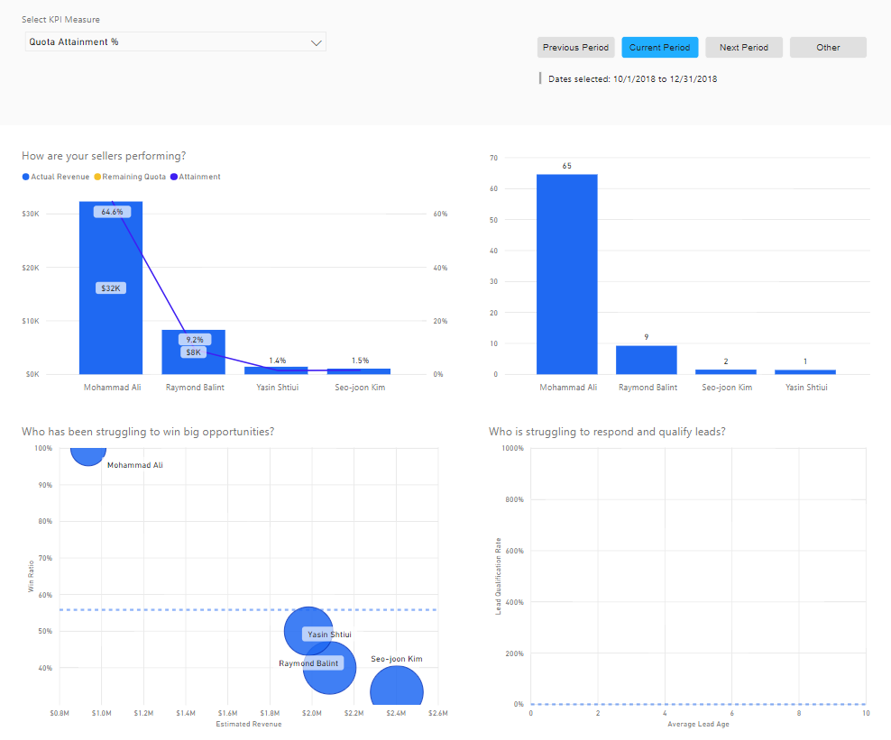
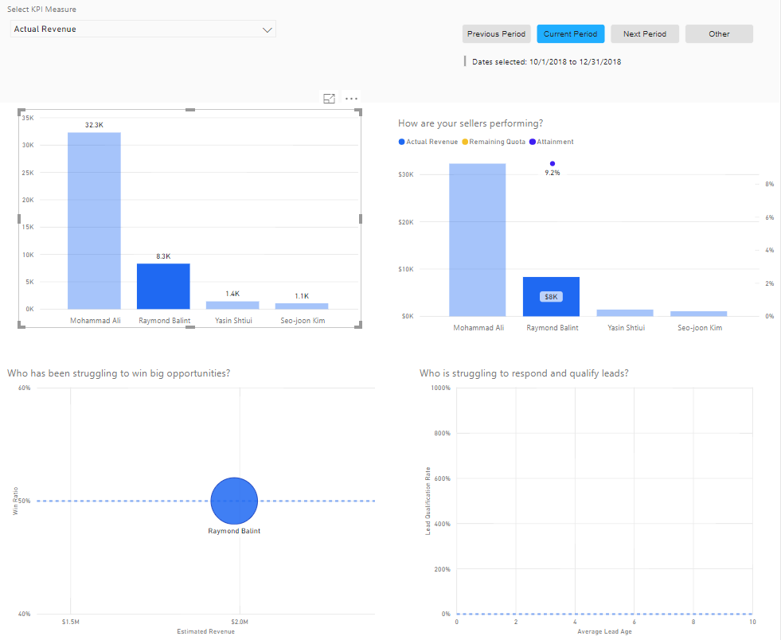
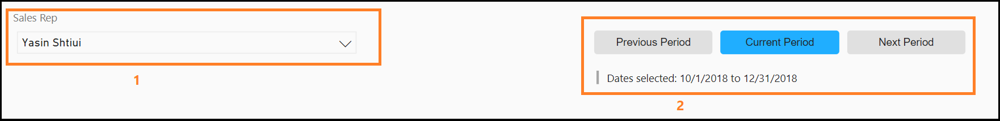
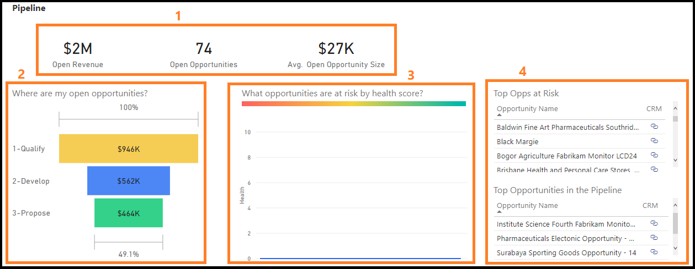

# Preview: Analyze team performance

Applies to [!INCLUDE[pn-crm-online](../includes/pn-crm-online.md)] version 9.1.0.

[!INCLUDE [cc-beta-prerelease-disclaimer](../includes/cc-beta-prerelease-disclaimer.md)]

> [!IMPORTANT]
> [!INCLUDE[cc_preview_features_definition](../includes/cc-preview-features-definition.md)]

As a sales manager, you must help every sales rep to win deals and generate revenue more effectively. Using the **Teams** section, you can get information on how your team is performing when it comes to attaining their objectives. You can analyze the data and coach everyone to win deals and generate revenue. 

On the [!INCLUDE[pn_dynamics_ai_sales](../includes/pn-dynamics-ai-sales.md)] app, select **Teams**. The **Teams** section displays as follows and contains the following two tabs:

- Using the **Leaderboard** tab, you can see individual performances side by side, making it easy to compare which sales rep is doing well and which sales rep needs training.
- Using the **Scorecards** tab, you can see reports that allow you to get a 360-degree view of each sales rep.

> [!div class="mx-imgBorder"]
> 

## Leaderboard

The **Leaderboard** tab provides you with information on the performances of sales reps side by side and compares who is doing better and who needs assistance. These comparisons are done through KPIs and time period. This tab helps you to answer some basic questions such as:

- How are your sales reps performing?
- Who is struggling to win bid opportunities?
- Who is struggling to respond and qualify leads?

The following is an example of how the **Leaderboard** tab displays:

> [!div class="mx-imgBorder"]
> 

You can filter the data based on the KPIs and time period to focus on the performance of sales reps. For example, Bert Hair is a sales rep. You want to see the actual revenue of Bert Hair in the current sales cycle and focus on his performance. Select the KPI as **Actual revenue** and time period as **Current period** and then select Bert Hair information on any report and the information related to him will be highlighted as shown:

> [!div class="mx-imgBorder"]
> 

### KPI measures

KPI measures are used to measure values of the sales team to track and determine their progress on achieving the sales targets. The KPI measures provided in the leaderboard are designed to help you determine how well your team is doing. When you select a KPI, the information displayed in the reports is modified to show the selected KPI. The following KPIs are available:

|KPI measure|Description|
|----|-----|
|**Actual revenue**|Displays the actual revenue generated by each individual in your team in the selected time period.|
|**Leads created**|Displays the leads created by each individual in your team in the selected time period.|
|**Number of open opportunities**|Displays the number of opportunities that are available under each individual in your team for the selected time period.|
|**Number of opportunities won**|Displays the number of opportunities that are won by each individual in your team for the selected time period.|
|**Open revenue**|Displays the total estimated revenue of all open opportunities that are available under each individual in your team in the selected time period.|
|**Qualification ratio %**|Displays the percentage of total leads qualified as opportunities.|
|**Quota attainment %**|Displays the percentage of revenue generated against the target in the provided period.|

## Scorecard

The **Scorecard** tab provides you with an overall picture of the sales metrics of a sales rep across many dimensions. You can analyze this information and identify whether the sales rep requires appropriate coaching to achieve the sales targets. The **Scorecard** tab helps you to answer some basic questions such as:

- How is the sales rep performing?
- What are the strengths and weaknesses of the sales rep?
- Why is this sales rep losing deals?
- What is coming up in the pipeline of the sales rep and what is at risk?
- How is this sales rep spending time?
- Can this sales rep improve their performance and selling process?

### Filters

The **Filters** section helps you to filter information based on your section. Here, the filters are sales reps and time period. When selected, the information is filtered based on the selected sales rep and time period.

> [!div class="mx-imgBorder"]
> 

1. **Sales rep**: Displays a list of sales reps who are on your team. You must select a sales rep to display the information. By default, all sales reps are selected.

2. **Time period**: Specifies the period in which you want to view the information. When you select a time period, the information is filtered for that time.

   For example, Bert Hair is a sales rep who is on your team. To view the information for Bert Hair in the current sales cycle, select **Bert Hair** from the **Sales rep** drop-down list and then select **Current period** from the **time period**. The information is filtered and displayed on the forecast, actuals, pipeline, and leads sections.

## Forecast

The **Forecast** section helps you to predict how the selected sales rep is performing in a specified time period. This section is classified into four subsections:

> [!div class="mx-imgBorder"]
> 

1. **Quota**: Displays the total goal that the selected sales rep needs to achieve in the selected time period.

2. **Projected revenue**: Displays the revenue that the sales rep can achieve in the selected time period. This revenue is the sum of actual revenue generated (Closed Won) to date and the revenue that is available in the pipeline (Projected to Close) to be closed in the current time period.

3. **Progress**: Displays the progress of the sales rep in achieving their quota. The information is displayed on the basic area chart where the x-axis represents the time period and the y-axis represents the revenue. The vertical bar specifies the current time. Hovering over a line displays more information. Highlighting a line in the graph cross-filters the other visualizations on the report page, and vice versa. You can compare the quota (red) with how the sales rep is reaching the target against the best case (blue), projected (yellow), and worst case (purple).

4. **Revenue pipeline**: Displays the total open revenue available in the pipeline of the sales rep and by how much revenue the sales rep could exceed the quota.

   For example, for the current time period, Bert Hair has a revenue quota of $100,000 to achieve in the current sales cycle. By looking at the projected revenue, you can see that he could exceed the quota by 832% with $832,000. Also, you can see how he’s trending toward the quota and what is in his pipeline.

## Actuals

The **Actuals** section helps you to understand the actual revenue generated by a sales rep in the specified time period. This section is classified into five subsections: 

> [!div class="mx-imgBorder"]
> 

1. **Filters**: Displays filters that you can select to filter the information to display in the section that you want to see. Select **Lost** to see all lost opportunities, **Open** to see all open opportunities, and **Won** to see all won opportunities. For example, when you select Lost, the information in the section changes to display lost opportunities and revenue related to it.

2. **Revenue details**: Displays information on the number of opportunities lost, total revenue loss, number of opportunities won, percentage of won opportunities against lost opportunities, and average revenue size of each opportunity. This information is view only and does not perform any actions.

3. **Win loss trend**: Displays how a sales rep is trending on win and loss opportunities in a specified time period. The information is displayed on a combo chart where the x-axis represents the time period and the y-axis represents the number of deals. Also, a line (purple) represents the percentage of the win in the specified time period. Hovering over a bar displays more information.
In the graph, the blue bar represents the won opportunities and orange represents the lost opportunities in the time period. Highlighting a bar in the graph will cross-filter the other visualizations on the report page, and vice versa.

   For example, on October 2, Bert Hair lost two opportunities and converted one opportunity into a win deal. The win ratio was 30%, based on the two losses and one win. On October 4, he lost one opportunity and converted one opportunity into a win deal. The ratio was 40%, based on the previous win ratio.

4. **Lost deals reasons**: Displays reasons why the sales rep is losing the opportunities. The information is displayed on a pie chart where blue represents the percentage of opportunities that are canceled, and orange represents the percentage of opportunities that are outsold. Hovering over a pie displays more information. Highlighting a pie in the pie chart cross-filters the other visualizations on the report page, and vice versa.

  For example, you can see that Bert Hair has lost 66.67% deals due to outsold and 33.33 due to canceled opportunities. Further, you can select **Canceled** to view what opportunities are canceled and the total revenue lost.

5. **List of top opportunities**: Displays the list of top opportunities that are contributing toward the wins and losses for the sales rep. For each opportunity, you see the name, its revenue, won or lost, and a link. When you select the link, the opportunity opens in the Dynamics 365 application. You can filter the opportunities by selecting filter, win-loss trend, and lost reason. Selecting an opportunity cross-filters the other visualizations on the report page, and vice versa.

## Pipeline

The **Pipeline** section helps you to understand open opportunities, opportunity relationship health, and how much opportunity value is in each stage for a sales rep in the specified time period. This section is classified into four subsections:

> [!div class="mx-imgBorder"]
> 

1. **Revenue details**: Displays information on total open revenue, number of open opportunities, and average revenue size of each open opportunity. You cannot perform any action on this displayed information.

2. **Opportunities by stage**: Displays information on the value of opportunities that are available at each stage for the sales rep in a specified time period. The stages include qualify, develop, and progress. The information is displayed on a funnel chart. Hovering over a bar displays information such as stage name, open revenue, and percentage of first (qualify). Highlighting a bar in a funnel cross-filters the other visualizations on the report page, and vice versa. For example, selecting the **Proposal** bar cross-highlights the other visualizations on the page.

3. **Opportunity relationship health**: Displays information on the number of open opportunities and its relationship health for the sales rep in a specified time period. This helps to identify opportunities that are closing soon and are at risk. The information is displayed on a bubble chart, each bubble representing an opportunity. Hovering over a bubble displays more information about the opportunity. Highlighting a bubble in the graph cross-filters the other visualizations on the report page, and vice versa.

4. **Top opportunities at risk and pipeline**: Displays the top opportunities that are at risk and in the pipeline for the sales rep. For each opportunity, you see the name and a link. When you select the link, the opportunity opens in the Dynamics 365 application. Selecting an opportunity cross-filters the other visualizations on the report page, and vice versa. 

## Leads

The **Leads** section helps you to understand open leads by source and leads closed for a sales rep in the specified time period. This section is classified into four subsections:

> [!div class="mx-imgBorder"]
> 

1. **Filters**: Displays filters that you can select to filter the information to display in the section that you want to see. Select **Disqualified** to see all disqualified leads, **Open** to see all open leads, and **Qualified** to see all the qualified leads. For example, when you select **Qualified**, the information in the section changes to display qualified leads and their qualification rates.

2. **Lead details**: Displays information on how many leads are open, leads that are created, and the rate at which a lead is qualified. You cannot perform any action on this displayed information.

3. **Lead qualification by source**: Displays information on where the leads of this sales rep are coming from and which sources are most successful in the specified time period. This helps to identify where the sales rep can invest time for converting leads into opportunities. This information is displayed in a stacked bar chart, where x-axis defines the time period and y-axis defines the source. Hovering over a bar displays more information about the lead. Highlighting a bar in the graph will cross-filter the other visualizations on the report page, and vice versa.

4. **Top leads by quality**: Displays the top leads with better quality to convert into an opportunity for the sales rep. For each lead, you see the name and a link. When you select the link, the lead opens in the Dynamics 365 application. You can filter the leads by selecting the lead and cross-filters for the other visualizations on the report page, and vice versa.

## Privacy notice  

For specific privacy information about [!INCLUDE[pn_dynamics_ai_sales](../includes/pn-dynamics-ai-sales.md)] capabilities for sales managers, see [Privacy notice](privacy-notice-manager.md).

### See also

[Unlock sales potential with Dynamics 365 Sales Insights](dynamics365-ai-sales-app.md)
