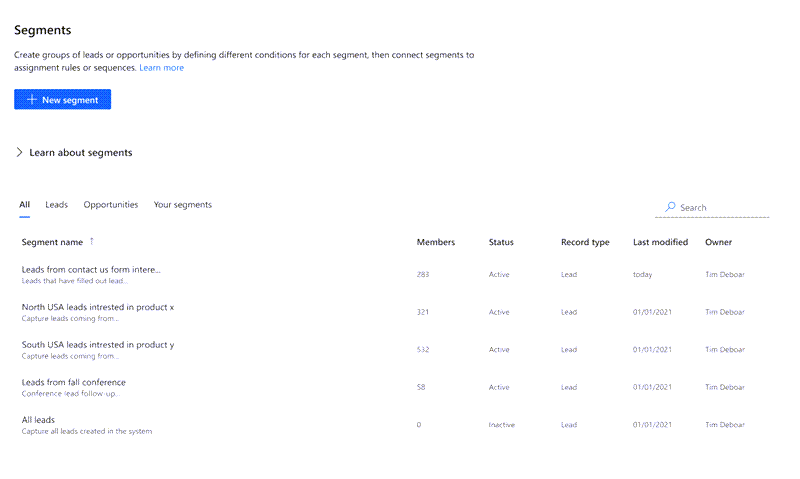
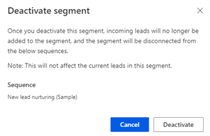
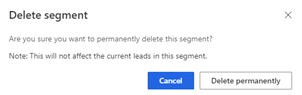

You can deactivate or delete a segment that is no longer required in your organization. Deactivation retains the segment in the application and future records will not be applied. When a segment is deleted, segment records that are already connected to a sequence are not affected.   

1.	Sign in to your Dynamics 365 Sales Hub app.
2.	Go to **Change area** in the lower-left corner of the page and select **Sales Insights settings**.
3.	Under **Sales accelerator**, select **Segments**.   
    The segments page opens with the list of available segments.  

    >[!div class="mx-imgBorder"]
    >  

4.	Select the more options icon corresponding to the segment and select one of the following options as required:   
    -	**To deactivate**:    
        1.	Select **Deactivate** and a confirmation message is displayed.     
            >[!NOTE]
            >If there are any sequences attached to the segment, the names of the sequences are displayed in the message.    

            >[!div class="mx-imgBorder"]
            >        

        2.	Select **Deactivate**.     
            The segment is deactivated from the application.    
    -	**To delete**:
        1.	Select **Delete** and a confirmation message is displayed. 
            >[!NOTE]
            >If there are any sequences attached to the segment, the names of the sequences are displayed in the message.

            >[!div class="mx-imgBorder"]
            >        

        2.	Select **Delete permanently**. 
            The segment is removed permanently from the application.

### See also

[Create and activate a segment](create-and-activate-a-segment.md)   

[!INCLUDE[footer-include](../includes/footer-banner.md)]

