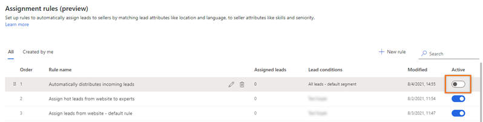
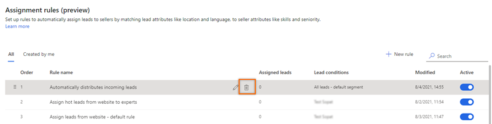
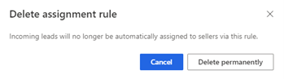

# Delete or deactivate an assignment rule    
You can deactivate or delete an assignment rule that's no longer required in your organization. Deactivation keeps the rule in the application but won't assign leads to any sellers in the future. When a rule is deleted, leads that were already assigned to sellers through the rule won't be affected.  

1.	Sign in to your Dynamics 365 Sales Hub app.   
2.	Go to **Change area** in the lower-left corner of the page and select **Sales Insights settings**.   
3.	Under **Sales accelerator**, select **Assignment rules (preview)**.   
4.	On the **Assignment rules** page, select the rule that you want to delete or deactivate from the **Rules** section.   
    -	To deactivate a rule, under the **Active** column, turn off its toggle.   
        >[!div class="mx-imgBorder"]
        >    
    -	To delete a rule, select the **More options** icon, and then select **Delete**.    
        >[!div class="mx-imgBorder"]
        >    

        On the confirmation message, select **Delete permanently**.      
        >[!div class="mx-imgBorder"]
        >            

### See also

[Manage assignment rules for lead routing](create-manage-assignment-rules-lead-routing.md)    
[Create and activate an assignment rule](create-and-activate-assignment-rule.md)

[!INCLUDE[footer-include](../includes/footer-banner.md)]
