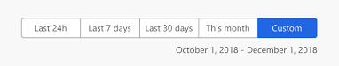
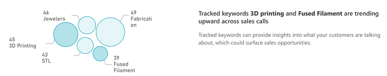
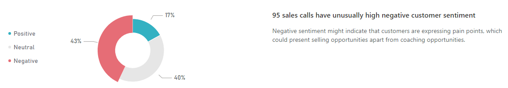
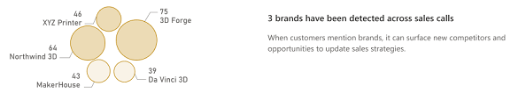
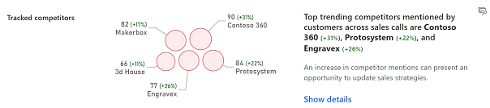
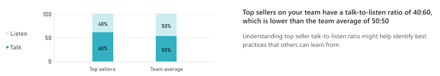
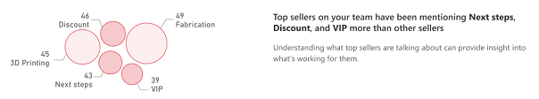
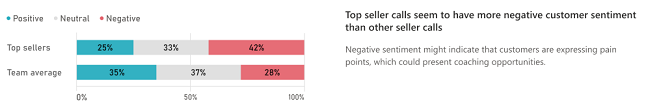
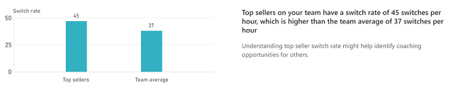
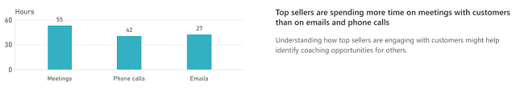

# View overall sales and seller insights

Applies to [!INCLUDE[pn-crm-online](../includes/pn-crm-online.md)] version 9.1.0.

When you sign into the Dynamics 365 Sales Insights application as a sales manager, you’ll see the home page. This page provides a high-level information on the status of your current sales period and insights on what your customers are talking about, what are behaviors of your top sellers, and team’s sales pipeline for the current quarter.

Typically, the home page is divided into the following sections:

-	[Time period filter](#time-period-filter)

-	[Base KPIs](#base-kpis)

-	[What are customers talking about?](#what-are-customers-talking-about)

-	[What characterizes top sellers?](#what-characterizes-top-sellers)

-	[Are my team’s deals on track?](#are-my-teams-deals-on-track)

-	[Call recording KPIs](#call-recording-kpis)

## Time period filter

You can filter the information on the home page based on a time period such as last 24 hours, last 7 days, last month, current month, or a custom time period. For example, to view the information of the current month, select **This month** and the information is filtered to display the current month's status on Base KPIs, What are customers talking about?, What characterizes top sellers?, and Are my team’s deals on track? sections.

  > [!div class="mx-imgBorder"]
  > 

> [!NOTE]
> By default, the information displayed from the day the application is configured for your organization.

## Base KPIs

The base KPIs provide information on the status of your current sales period. By viewing these KPIs, you’ll know:

-	The time left in the current period to achieve your sales target.

-	The sum of actual revenue of all won opportunities.

-	The total estimated revenues of all open opportunities.

-	The total deals that are won by you in this period.

-	The percentage of deals that you have won against available opportunities in this period.

-	The average revenue generated through each deal in this period.

The following image is an example of how the base KPIs are displayed.

  > [!div class="mx-imgBorder"]
  > 

## What are customers talking about?

**What are customers talking about** section helps you to understand what’s happening in sales calls and what customers are talking about. Through these understandings, you can derive coaching scenarios for your sales team so that they could be more efficient during the sales calls. 

This also helps in driving new sales strategic motion by looking at the keywords, brands, and competitors mentioned during the call. For example, 3D printer is trending more during customer calls and the 3D printer sales are not reaching targets. You can coach sales reps in selling the 3D printers more effectively to the customers which are not been selling before.

The following insights are available for you to understand what customers are talking about:

-	[Tracked keywords](#tracked-keywords)

-	[Customer sentiment](#customer-sentiment)

-	[Brands detected](#brands-detected)

-	[Competitors mentioned](#competitors-mentioned)

### Tracked keywords

This section shows the tracked keywords that are defined in the application and customers use the most during the sales calls. The application highlights these keywords in this section. Using these keywords, you can identify new sales opportunities that are related to these keywords. 

The following image is an example of how the tracked keyword section is displayed:

  > [!div class="mx-imgBorder"]
  > 

In this example, you can see that 3D printing and Fused Filament are the trending keywords, and you can define a sales strategy related to these keywords. The bubbles show the top 20 tracked keywords that are trending and the number of times that these keywords were mentioned in the calls. The dark-shade bubbles are the trending keywords.

You can define what keywords you want to track during the sales call. To learn more, see configure conversation content. <link to configure conversation content >.

### Customer sentiment

This section shows the number of calls that has negative sentiment of customers than the average. Using this insight, you can analyze the pain points that customers express during the call and coach your sales reps to address them to increase the sentient levels.

The following image is an example of how the customer sentiment section is displayed:

  > [!div class="mx-imgBorder"]
  > 

In this example, you can see that out of 96 sales calls 20 calls have higher than average negative customer sentiment. The doughnut chart shows the total number of calls and the percentage of calls that are positive, neutral, and negative.

### Brands detected

This section shows the brands that customers have used during the sales calls. Using this insight, you can identify if any competitor brands are mentioned on the sales calls and update your sales strategies accordingly.

The following image is an example of how the brands detected section is displayed:

  > [!div class="mx-imgBorder"]
  > 

In this example, you can see that 3 brands, Northwind 3D, XYG Printer, and 3D Forge are mentioned in the sales calls. You can update the sales strategies to coach your sales teams to minimize the mention of these brands in the calls. The bubbles show the 20 brands that are used most and the number of times that these brands were mentioned in the calls. The dark-shade bubbles are the brands detected.

### Competitors mentioned

This section shows the defined competitor names that customers use most and trending upwards during the sales calls. The application highlights these competitors in this section. Using these competitors, you can identify new sales opportunities that are related to these competitors.

The following image is an example of how the competitors mentioned section is displayed:

  > [!div class="mx-imgBorder"]
  > 

In this example, you can see that 3D House and Contoso 360 are the trending competitors, and you can define a sales strategy related to these competitors. The bubbles show the 20 competitors that are trending and the number of times that these competitors were mentioned in the calls. The dark-shade bubbles are the trending competitors.

You can define what competitors you want to track during the sales call. To learn more, see configure conversation content. <link to configure conversation content >.

## What characterizes top sellers?

**What characterizes top sellers** section helps you understand the conversational behavior of your top sellers. The insights are generated based on the revenue that the top sellers generate. For example, Bart and John are sellers and they generate more revenue in your team. The insights in this section are generated based on the conversational behavior of Bart and John.

By analyzing these insights, you can understand what makes the top sellers most effective in generating the revenue and you can apply this knowledge on other sellers to generate revenue more effectively. 

The following insights are available for you to understand what characterizes top sellers:

-	[Talk-to-listen ratio](#talk-to-listen-ratio)

-	[What are they talking about](#what-are-they-talking-about)

-	[Customer sentiment](#customer-sentiment)

-	[Switch rate](#switch-rate)

-	[Engagement with customers](#engagement-with-customers)

### Talk-to-listen ratio

This section shows the average listen and talk ratio of top sellers and rest of the team in conversations with customers. By analyzing this insight, you can understand what working-out for top sellers while in conversation with customers to close deals and generate revenue.

The following image is an example of how the talk-to-listen ratio section is displayed:

  > [!div class="mx-imgBorder"]
  > 

In this example, you can observe that the top sellers talk (60%) more than listen (40%) to customers compared to the team’s average of talk (50%) to listen (50%). Through this insight, you learn that talking more is helping the top seller to generate revenue and you can make it as a best practice for other sellers to follow.

### What are they talking about

This section shows the keywords that are used by the top sellers use more frequently in conversations with customers. By analyzing this insight, you can understand what words the top sellers use that helps them to close deals and generate revenue.

The following image is an example of how the what are they talking about section is displayed:

  > [!div class="mx-imgBorder"]
  > 

In this example, you can see that Next steps, Discount, and VIP are the top words mentioned by your top sellers. The bubbles show the top five words that are trending and the number of times that these keywords were mentioned in the calls. The dark-shade bubbles are the trending words.

### Customer sentiment

This section shows how top sellers are doing when compared to the team in terms of positive, neutral, and negative customers sentiments during sales calls. Using this insight, you can analyze what makes the tops sellers more efficient in addressing the customer pain points during the call and how you can coach your other sellers to increase the sentient levels.

The following image is an example of how the customer sentiment section is displayed:

  > [!div class="mx-imgBorder"]
  > 

In this example, you can see that top sellers (42%) are driving more negative customer sentiment compared to that of your team (28%) and this might be helping the top sellers to address the pain points.

### Switch rate

This section shows the rate at which top sellers are switching the conversations with customers and this indicates a sign of engagement during conversations. Using this insight, you can understand the switch rate of top sellers per hour and identify coaching opportunities for other sellers to improve on switch rate.

The following image is an example of how the switch rate section is displayed:

  > [!div class="mx-imgBorder"]
  > 

In this example, you can see that top seller (45 per hour) are switching more during the conversation with customers then the team average (37 per hour). Through this, you can identify coaching opportunities of the other seller to improve on switch rates during customer conversations.

### Engagement with customers

This section helps you to understand what type of communication mode that top sellers are spending their time in engaging with customers. Using this insight, you can identify coaching opportunities for other sellers on communication mode in engaging with customers.

The following image is an example of how the engagement with customers section is displayed:

  > [!div class="mx-imgBorder"]
  > 

In this example, you can see that top sellers are spending more time on meeting (55 hours), then on phone calls (42 hours), and then on emails (27 hours) while engaging with customers. By analyzing this, top sellers are engaging customers through meetings and phone calls, so you can plan to coach around these communication modes for other sellers to improve.

## Are my team’s deals on track?

Are my team’s deals on track section helps you to understand how your team’s opportunities and leads are doing in the current sales period. Through these understanding, you can identify the opportunities and leads with higher revenue that at risk and need your attention to coach the individual sales reps to improve the health.

The following insights are available for you to understand the deals:

-	[Opportunities at risk](#opportunities-at-risk)
-	[Leads at risk](#leads-at-risk)

### Opportunities at risk

This section helps you to understand the opportunities that are high in revenue and at risk so that you can spend more time by coaching the sales rep who is working with these opportunities to turn into a winning deal.

The following image is an example of how the opportunities at risk section is displayed:

  > [!div class="mx-imgBorder"]
  > 

In this example, you can see that opportunities (Red bubbles) that are high in revenue are poor in health score and are at risk. You need to coach the sales reps who are handling these opportunities that are at risk and turn them into a winning deal.

### Leads at risk

This section helps you to understand the leads that are losing momentum and at risk so that you can spend more time by coaching the sales rep who is working with these leads to turn into opportunities.

The following image is an example of how the leads at risk section is displayed:

  > [!div class="mx-imgBorder"]
  > 
 
In this example, you can see that leads (Red bubbles) that are losing momentum with poor health score and are at risk. You need to coach the sales reps who are handling these leads that are losing momentum and turn them into opportunities.

## Call recording KPIs

The call recording KPIs provide an understanding on how calls are trending month-over-month. By viewing these KPIs, you’ll know:

-	The total number of calls that are recorded and how it is trending.

-	The total number of recorded hours and how it is trending.

-	The total number of calls with defined trackers mentioned and how it is trending.

-	The total number of calls with defined brands mentioned and how it is trending.

The following image is an example of how the call recording KPIs are displayed.

  > [!div class="mx-imgBorder"]
  > 
 
## Privacy notice  

For specific privacy information about [!INCLUDE[pn_dynamics_sales_insights](../includes/pn-dynamics-sales-insights.md)] capabilities for sales managers, see [Privacy notice](privacy-notice-manager.md).

### See also

- [Introduction to administer Sales Insights application](intro-admin-guide-sales-insights-app.md)

- [Overview of Sales Insights applications](dynamics365-sales-insights-app.md) 
