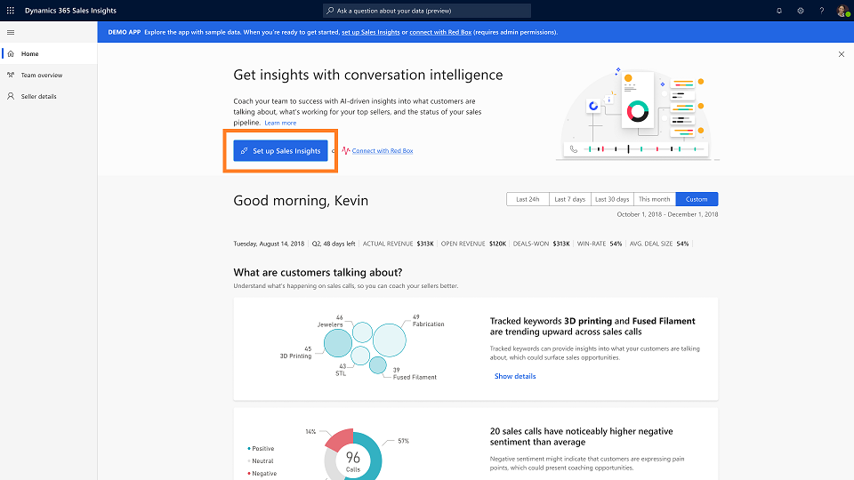

# Improve seller coaching and sales potential with Dynamics 365 Sales Insights application

Applies to [!INCLUDE[pn-crm-online](../includes/pn-crm-online.md)] version 9.1.0.

The [!INCLUDE[pn_dynamics_sales_insights](../includes/pn-dynamics-sales-insights.md)] application uses analytics and data science to gather data from [!INCLUDE[pn-dyn-365-sales](../includes/pn-dyn-365-sales.md)] and Microsoft Office. It then provides you with the information and insights to intelligently manage the sales team, proactively coach sellers, and quickly answer questions regarding the business. To achieve this, the [!INCLUDE[pn_dynamics_sales_insights](../includes/pn-dynamics-sales-insights.md)] application provides you with information through key performance indicators (KPIs) for pipeline and deals, and intelligent call data KPIs through conversations intelligence.

This application is designed to help sales managers and sellers in their day-to-day job to keep track of their work. 

**As a sales manager, you can**

-	View insights on the status of your current sales period such as the sum of actual revenue, total estimated revenues, total deals won, and the average revenue generated.

-	View what’s happening in sales calls, insights on the behaviors of your top sellers, and the sales pipeline for the current quarter. To learn more, see <link will be added Team Overview>

-	View team’s insights, customer sentiment, team’s conversational style, and sales pipeline. To learn more, View and understand team’s overview <link will be added Team Overview>.

-	View and understand individual sale rep’s conversation style, sales pipeline, customer sentiment, insights, and call history. To learn more, View and understand seller details<link will be added Seller details>

-	View who are your team members.

**As a seller, you can**

-	View your conversation insights, customer sentiment, conversations style, sales pipeline, and call history. To learn more, View and understand seller details<link will be added Seller details>

**As a sales manager/administrator, you can**

-	Configure tracker keywords and competitors that you want to track for your team’s calls with customers. To learn more, see [Configure keywords and competitors to track](configure-keywords-competitors.md).

-	Configure how long you want to retain or delete team’s or individual seller’s data from your organization. To learn more, see [Data retention and deletion through Privacy](data-retention-deletion-policy.md).

-	Manage environments and configure call data.

-	Enable preview for natural language Q&A. To learn more, see [Enable preview features](enable-preview-features-sales-insights-app.md).

> [!NOTE]
> When you configure the Sales Insights application as an administrator, the configurations apply to the entire organization. When you configure the Sales Insights application as a manager, the configurations apply only to your team.

The next sections describe:

- Recommendations for using the [!INCLUDE[pn_dynamics_sales_insights](../includes/pn-dynamics-sales-insights.md)] application

- How to get the [!INCLUDE[pn_dynamics_sales_insights](../includes/pn-dynamics-sales-insights.md)] application

- How to access the [!INCLUDE[pn_dynamics_sales_insights](../includes/pn-dynamics-sales-insights.md)] application

## Recommendations to use Sales Insights application

Before you start using the application, we suggest you review the following requirements for effective use of the [!INCLUDE[pn_dynamics_sales_insights](../includes/pn-dynamics-sales-insights.md)] app:

-	Verify that you have a subscription to Microsoft Dynamics 365 for Sales. [!INCLUDE[proc_more_information](../includes/proc-more-information.md)] [Purchase and assign Dynamics 365 for Customer Engagement apps licenses](/dynamics365/customer-engagement/admin/purchase-assign-online-licenses) 

- Verify that the fiscal year period is configured for your organization. [!INCLUDE[proc_more_information](../includes/proc-more-information.md)] [Work with fiscal year settings](/dynamics365/customer-engagement/admin/work-fiscal-year-settings)

- As a sales manager, verify that the proper manager hierarchy is defined for you, and that sellers or individuals are added to it. [!INCLUDE[proc_more_information](../includes/proc-more-information.md)] [Set up manager and position hierarchies](/dynamics365/customer-engagement/admin/hierarchy-security#set-up-manager-and-position-hierarchies)

- As a sales manager, verify that goals are defined for sellers or individuals in your hierarchy.[!INCLUDE[proc_more_information](../includes/proc-more-information.md)] [Create or edit a goal (Sales and Sales Hub)](/dynamics365/customer-engagement/sales-enterprise/create-edit-goal-sales)
    >[!NOTE]
    >While defining goals, ensure that **Goal Metric** parameter is configured as **Revenue**. 

## How to get the Dynamics 365 Sales Insights application

The [!INCLUDE[pn_dynamics_sales_insights](../includes/pn-dynamics-sales-insights.md)] application is a standalone application and you must sign into the app to use it. You can use one of the following entry points to access the app:

-	On the [Dynamics 365 Sales Insights](https://appsource.microsoft.com/en-us/product/dynamics-365/mscrm.70b76f06-f739-4808-bd58-b5674a0a42d4) appsource page, select **FREE TRAIL** or **TEST DRIVE** according to your requirements.

-	Go to [sales.ai.dynamics.com](https://sales.ai.dynamics.com/).

As a manager or seller, if you are using the application for the first time, connect the application to your Dynamics 365 organization or contact administrator to connect. To learn more, see [First-run set up experience](fre-setup-sales-insight-app.md).

## How to access the Dynamics 365 Sales Insights application

An administrator must first sign in and configure the application so that the users such as managers and sellers could sign in seamlessly and work the application. To learn more, see [Introduction to administer Sales Insights application](intro-admin-guide-sales-insights-app.md).

If not, you sign into the Sales Insights application for the first time as a manager or seller, the application loads with sample data. You must connect your Dynamics 365 for Sales organization to the application to gather KPIs and relevant information to be available on the application. However, if you do not want to connect your organization and want to explore the application, you can continue using the application with the provided sample data.

The following procedure explains how to configure your Sales Insights application for the first time when an administrator did not configure the application.

1.	Signs into [Dynamics 365 Sales Insights](https://sales.ai.dynamics.com/) application, the home page is displayed with the demo data.

2.	Selects **Set up Sales Insights** to connect to Dynamics 365 for Sales organization.

    > [!div class="mx-imgBorder"]
    > 

3.	Selects the Dynamics 365 for Sales organization to connect and this helps to compute and consolidate the necessary insights about your team.

    > [!div class="mx-imgBorder"]
    > 

4.	On the **Terms and condition** dialog, accepts the terms and conditions, and selects **Agree and continue**.

    > [!div class="mx-imgBorder"]
    > 

5.	The application takes several minutes to gather the data and display visuals for you. Also, a status message is displayed to update on the progress.

> [!NOTE]
> This configuration allows to only view the team’s or individual data. An administrator must sign in and configure to connect call data and enable preview features in the Sales Insights application for sales managers and sellers to use. To learn more, see [Introduction to administer Sales Insights application](intro-admin-guide-sales-insights-app.md).

## Privacy notice  

For specific privacy information about [!INCLUDE[pn_dynamics_sales_insights](../includes/pn-dynamics-sales-insights.md)] capabilities for sales managers, see [Privacy notice](privacy-notice-manager.md).

### See also

- [Introduction to administer Sales Insights application](intro-admin-guide-sales-insights-app.md)

- [View overall sales and seller insights](dynamics365-sales-insights-app-home-page.md)