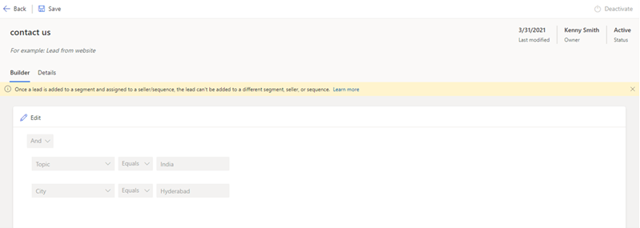
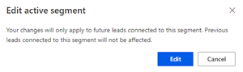
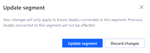

# Edit a segment    
To match latest changes in the process of choosing records, you can update the conditions that are defined in a segment. Follow these steps:   
1.	Sign in to your Dynamics 365 Sales Hub app.   
2.	Go to **Change area** in the lower-left corner of the page and select **Sales Insights settings**.
3.	Under **Sales accelerator**, select **Segments**.   
    The segments page opens with the list of available segments.   

    >[!div class="mx-imgBorder"]
    >  

4.	Select and open the segment that you want to edit. In this example, the **Leads from contact us** is selected.

    >[!div class="mx-imgBorder"]
    >  
 
5.	Select **Edit**. 
6.	On the confirmation message, select **Edit**.

    >[!div class="mx-imgBorder"]
    >  
  
7.	Edit the conditions and select **Save**.   
    A confirmation message is displayed.

    >[!div class="mx-imgBorder"]
    >  
 
8.	On the confirmation message, select **Update segment**.   
    The changes will be applied on records that are going to be created in the application for this segment. The records that are already applied to this segment will not change.

### See also

[Create and activate a segment](create-and-activate-a-segment.md)   

[!INCLUDE[footer-include](../includes/footer-banner.md)]
