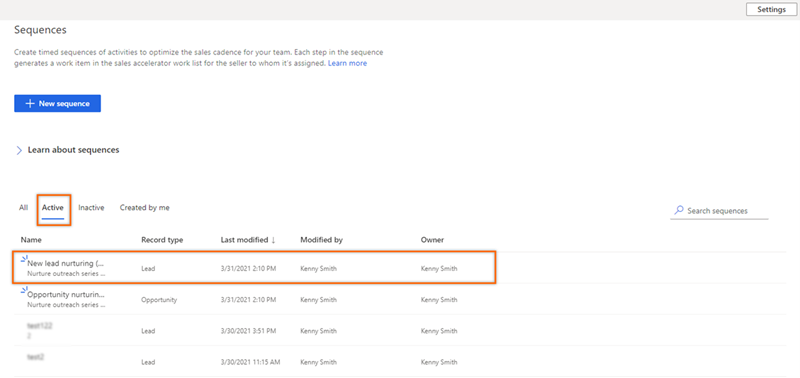
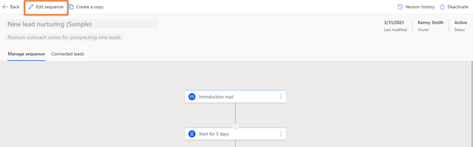
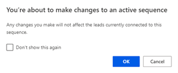
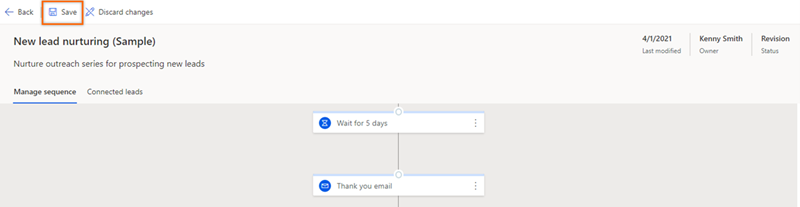
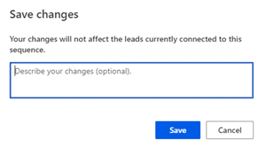
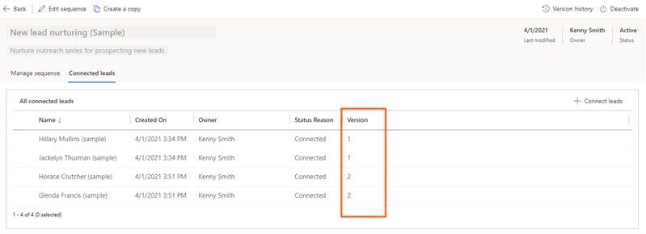
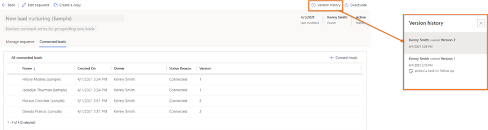

# Edit an active sequence and view version history
<!--note from editor: Title okay? If you don't like it, can you move the introduction to the "View edit history" H2 up to the beginning of the article and then just have procedure headings (**To edit an active sequence**, **To view version history and associated records**) for the two procedures? Otherwise we'll have just one H2, which we want to avoid.-->
When you've changed the process of an active sequence, you can create a new version of the sequence without deactivating it. You can update a sequence multiple times<!--note from editor: Edit okay? "Create multiple versions" to me means that several versions all exist at the same time, not that you update one single version over and over. If I've misunderstood, please excuse.-->, and when you connect a record to the sequence, the record will be connected to the latest version.

>[!IMPORTANT]
>The records that were connected to a previous version of the sequence remain connected to that previous version.

## Edit an active sequence

1.	Sign in to your Dynamics 365 Sales Hub app.   
2.	Go to **Change area** in the lower-left corner of the page, and select **Sales Insights settings**.   
3.	Under **Sales accelerator**, select **Sequence**.   
4.	On the **Sequences** page, go to the **Active** tab, and open the sequence for which you want to create a new version.   

    > [!div class="mx-imgBorder"]
    >     
 
5.	On the sequence view page, select **Edit sequence**.

    > [!div class="mx-imgBorder"]
    >     
 
    A confirmation message is displayed. Select **OK**.

    > [!div class="mx-imgBorder"]
    >     
 
6.	Edit the sequence as required, and then select **Save**.

    > [!div class="mx-imgBorder"]
    >      

7.	On the confirmation message, provide a description of the change, and then select **Save**.

    > [!div class="mx-imgBorder"]
    >      
 
A new version of the existing sequence is created and saved.

## View version history and associated records

Viewing the version history helps you to understand the number of versions that have been created for a sequence, and view the records that are connected to each version.    

1.	Open the sequence for which you want to view the version history.
2.	On the sequence view page, select the **Connected *records*** tab. In this example, we selected the **Connected leads** tab.    

    A list of leads that are connected to the sequence is displayed, along with the version to which they're connected.   

    > [!div class="mx-imgBorder"]
    >      
 
3.	Select **Version history**.   

    A list of versions that exist<!--note from editor: Edit okay? You've said that a new lead gets connected to the most recent version by default, so it doesn't seem quite right to say the older versions are available.--> for the sequence is displayed on the right pane.

    > [!div class="mx-imgBorder"]
    > 

    >[!NOTE]
    >If there are no leads connected to the sequence, and you created a new version, only the latest version is displayed in the list.

### See also

[Edit a sequence](edit-a-sequence.md)  

[!INCLUDE[footer-include](../includes/footer-banner.md)]
