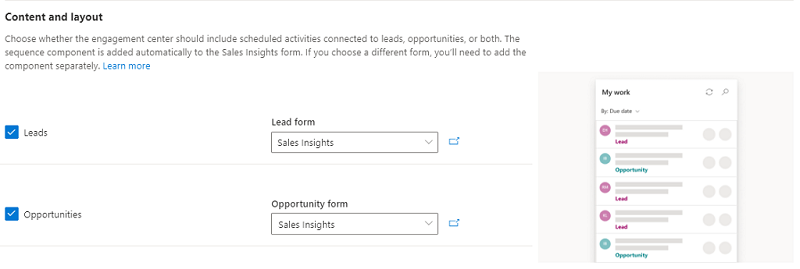
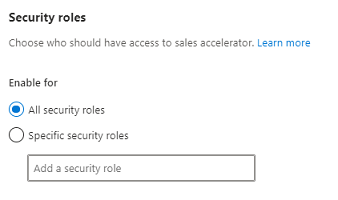

# Enable and configure sales accelerator

Sales accelerator helps the sellers in your organization to increase sales productivity and prioritize activities for the day through the work hub. The sales manager uses the sequence designer to create a series of sequences and activities separated by time intervals including emails, phone calls, and tasks. The series is then applied to leads or opportunities and assigned to the seller automatically according to the sales strategies, productive, and save time.    

As an administrator, you must enable and configure sales accelerator in your organization to make it available for sales managers and sellers to use the feature.

To enable sales accelerator, follow these steps:

1. [Review the perquisites and recommendations](#review-the-perquisites-and-recommendations)

2. [Enable the preview](#enable-the-preview)

3. [Configure sales accelerator](#configure-sales-accelerator)

## Review the perquisites and recommendations

### Prerequisites

Review the following requirements before you enable and configure the sales accelerator features:

- Purchase a **Dynamics 365 Sales Insights** license or start a trial to use advanced Sales Insights features.

- Enable advanced sales insights features. To learn more, see [Enable and configure advanced Sales Insights features](intro-admin-guide-sales-insights.md#enable-and-configure-advanced-sales-insights-features).

### Recommendations

For the better experience of sales accelerator, enable and configure [Predictive lead scoring](configure-predictive-lead-scoring.md) and [Predictive opportunity scoring](configure-predictive-opportunity-scoring.md).

## Enable the preview

Sales accelerator features are available as preview in sales insights. You must enable the preview to accept the preview terms and conditions to use sales accelerator in your organization.

To enable preview, follow these steps:

1. Sign in to Dynamics 365 Sales Hub app, and go to **Change area** > **Sales Insights settings**.

2. On the site map, under **Acceleration**, select **Sales accelerator (preview)**.

3. On the settings page, select **I agree to the preview terms and conditions** to enable the preview.

4. Select **Get started**.
    
    >[!div class="mx-imgBorder"]
    > 

    The sales accelerator is now enabled, and you can configure to use in your organization.

## Configure sales accelerator

1. Sign in to Dynamics 365 Sales Hub app, and go to **Change area** > **Sales Insights settings**.

2. On the site map, under **Acceleration**, select **Sales accelerator (preview)**.

3. In the **Content and layout** section, select **Lead** and **Opportunity** entities and its corresponding related forms as required. The selected entity records are displayed to sellers in the work hub. Also, sales managers use the entities to configure the sequence that will be assigned to records to display in the work hub. By default, the **Lead** and **Opportunity** entities are selected.

    >[!div class="mx-imgBorder"]
    > 

4. In the **Security roles** section, select one of the following options to provide permissions to users to access the work hub.

    >[!div class="mx-imgBorder"]
    > 
    
    | Security roles | Description |
    |----------------|-------------|
    | All security roles | This option provides access to view the work hub to all the security roles of users in your organization. |
    | Specific security roles | This option allows you to specify security roles when you want to give access to view work hub to a few users. Use the lookup box and add the security roles. |

5. Save and publish the configuration.

    A confirmation message is displayed on the top of the page. Sales managers and sellers can start using the sales accelerator feature.

### See also

[Create and manage sequences](create-manage-sequences.md)

[What is sales accelerator](sales-accelerator-intro.md)