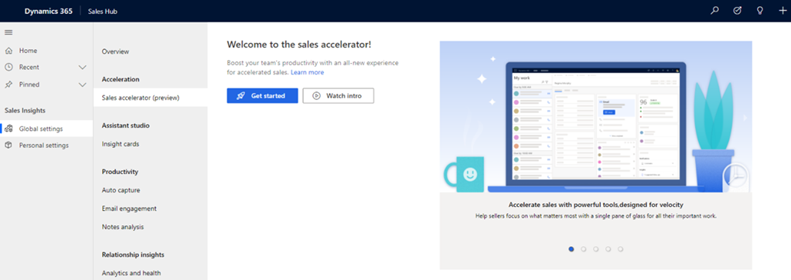
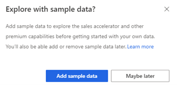
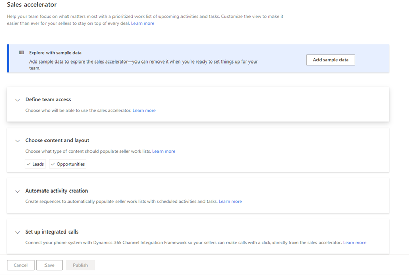
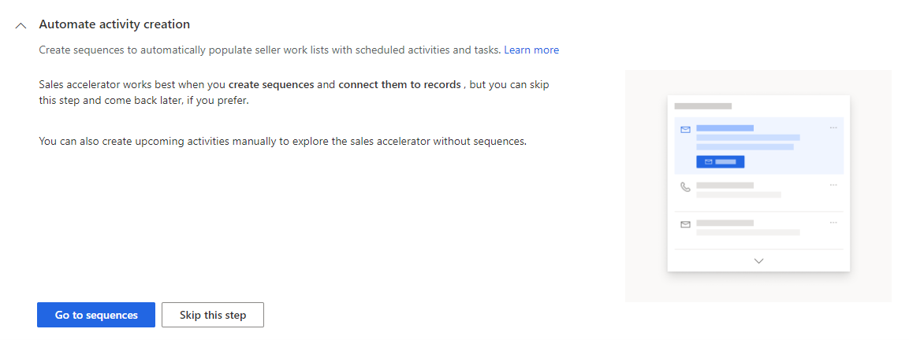
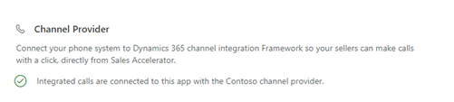
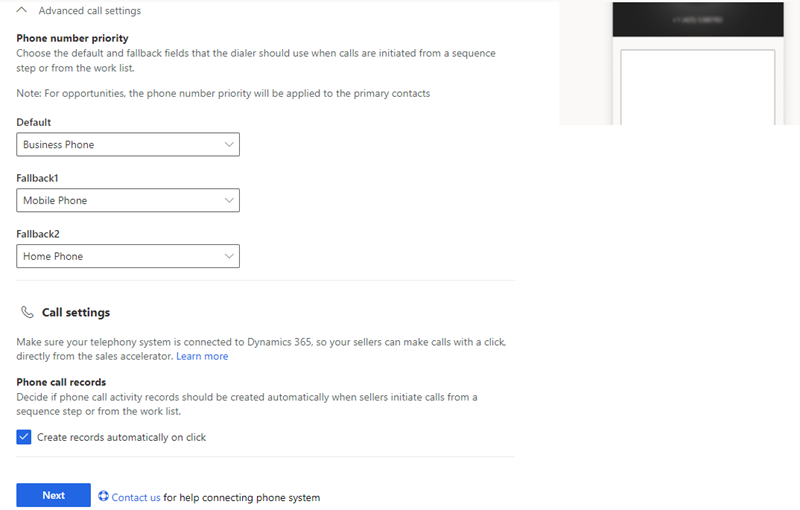
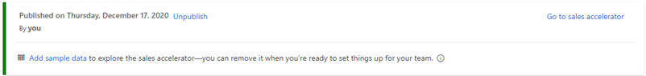

# Configure the sales accelerator

The sales accelerator helps sellers in your organization increase their sales productivity and prioritize activities for the day through the work list available in your sales app. An administrator or a sales manager uses  the sequence designer to create a sequence of activities&mdash;separated by time intervals&mdash;including emails, phone calls, and tasks. Sequences are connected to relevant records so sellers can follow the best practices that have been defined in the sequence for the leads and opportunities that are assigned to them. The sequence is then applied to leads or opportunities, and assigned to a seller automatically according to your organization's sales strategies.  

As an administrator, you must enable and configure the sales accelerator in your organization to make it available for sales managers and sellers to use. Follow these steps:

1. [Review the prerequisites and recommendation](#review-the-prerequisites-and-recommendations).    
2. [Setup the Sales accelerator](#setup-the-sales-accelerator).

## Review the prerequisites and recommendations

### Prerequisites

Ensure that you meet the following requirements:

- Purchase a sales insights license, sales premium license, or start a trial to use advanced Sales Insights features.

- Enable advanced Sales Insights features. More information: [Install and configure premium Sales Insights features](intro-admin-guide-sales-insights.md#install-and-configure-premium-sales-insights-features).

### Recommendation

For the best experience of the sales accelerator, enable and configure [predictive lead scoring](configure-predictive-lead-scoring.md) and [predictive opportunity scoring](configure-predictive-opportunity-scoring.md) to display predictive scores for each record in the work list. Displaying the score helps your sellers to prioritize leads and opportunities based on their predicted likelihood to convert .

## Setup the sales accelerator

1. Sign in to your sales app, and on the bottom-left corner of the page, go to **Change area** > **Sales Insights settings**.     
2. On the site map, under **Sales accelerator**, select **Setup**.    
    The sales accelerator configuration page opens.      
    For first run experience, proceed with step 3. If the feature is already configured and you want to update the configurations proceed to step 4.    
3. If you are configuring the feature for the first time in your organization, select **Get started**.     
    >[!div class="mx-imgBorder"]
    >    

    A pop-up message appears to install sample data to explore the feature. Installing the sample data is relevant only for your sandbox or trail environments. Select an option depending on your requirement. Adding the sample data may take few minutes. However, you can choose to ignore the sample data installation and add later when required. To learn more, see [Manage sample data](manage-sample-data.md).    
    >[!div class="mx-imgBorder"]
    >        

    The configuration page opens.    
    >[!div class="mx-imgBorder"]
    >        
4. In the **Define team access** section, select one of the following options to provide permissions to users to use the sales accelerator feature and select **Next**.     
    >[!div class="mx-imgBorder"]
    >   
    
    | Security roles | Description |
    |----------------|-------------|
    | All security roles | Use this option to give access to view the Sales Hub app to all the security roles in your organization. |
    | Specific security roles | Use this option to specify security roles to give access to view the Sales Hub app to just a few users. Use the lookup box to add the security roles. |    
5.	In the **Choose content and layout** section, choose the record types (**Leads** and **Opportunities**) and their corresponding related forms that users use in your organization, as required. Select **Next**.     
    The selected record type will display the **Sequence (up next)** widget, and sales managers will use the record types to configure the sequence that will be assigned to records to be displayed in the app. By default, the **Leads** and **Opportunities** record types are selected.     
    >[!NOTE]
    >If you are using custom record types for leads and opportunities, the name of your custom record type is displayed.    
    
    >[!div class="mx-imgBorder"]
    >   
6. In the Automate activity creation section, choose one of the options as required.  Sequences help sales managers enforce best practices by introducing a set of consecutive activities for sellers to follow during their day. A manager can connect sequences to leads and opportunities that appear in a seller's work queue, to help sellers prioritize activities to focus on selling, be more productive, and better align to business processes.    
    -	Select **Go to sequences** to create sequences and apply them to records. To learn more, see [Create and manage sequences](create-manage-sequences.md).
    -	Select **Skip this step** to come back later and create the sequences.
    >[!div class="mx-imgBorder"]
    >           
7.	In the **Set up integrated calls** section, the status of the of the phone system that is integrated through Dynamics 365 Channel Integration Framework is displayed under **Channel Provider**. The phone system allows the sellers to make calls directly through the sales accelerator feature.   The priority of the phone system that is selected for sales accelerator depends on the ranking that is defined in the Channel Integration Framework configuration. To learn more, see [Integrate a sample softphone dialer with Dynamics 365 Sales](integrate-sample-softphone.md).     
    >[!div class="mx-imgBorder"]
    >        
    After the phone system is successfully verified, configure the following advanced call settings:    
    -	In **Phone number priority**, select the phone numbers for **Default**, **Fallback1**, and **Fallback2**. When sellers initiate calls through a sequence step or the work list, the softphone chooses the phone numbers in the order they are listed.     
        For example, you can select **Business Phone** in **Default**, **Mobile Phone** in **Fallback1**, and **Home Phone** in **Fallback2**. When sellers initiate a call, the number in the **Default** option is dialed, if it is available. If it is not available, the call goes to the next option.     
       
        >[NOTE]
        >For opportunities, the phone number priority will be applied to the primary contacts.  

    -	In **Call settings**, select the **Create records automatically on click** option to automatically create a phone call activity when sellers initiate call from a sequence step or from the work list.   
    >[!div class="mx-imgBorder"]
    >       
8.	Save and publish the configuration.
    A status message is displayed at the top of the page with details including the time and user who published the configurations. Sales accelerator is ready to use in your organization for the selected security roles.
    >[!div class="mx-imgBorder"]
    >

## Customizations

By default, the **Up next** widget is displayed on the **Default Main** and **Sales Insight** forms. To add the **Up next** widget to other forms, follow the process specified in [How do I add the Up next widget to an entity form?](faqs-sales-insights.md#sales-accelerator). 

### See also

[Create and manage sequences](create-manage-sequences.md)     
[What is the sales accelerator?](sales-accelerator-intro.md)
