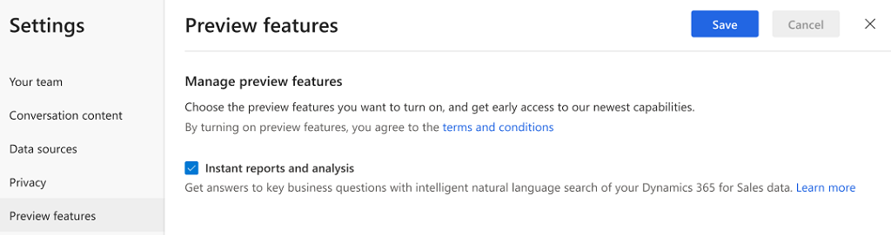

# Enable preview features

Preview features are features that aren’t complete but are made available on a “preview” basis so customers can get early access and provide feedback. In the Dynamics 365 Sales Insights application, we are providing the **Instant reports and analysis** feature that uses the **Natural language Q&A** model to provide answers to the questions you type. 

> [!IMPORTANT]
> The preview feature **Instant reports and analysis** is currently available only in the North American Region (NAM) region.

As an administrator, you must enable the **Instant reports and analysis** feature as preview to use by sales managers and sellers in your organization. 

> [!NOTE]
> If you have already enabled the preview feature through first-run set up, you are not required to enable it again; however, you can disable it if you don’t wish to use it in your organization.

1.	Review the prerequisites. To learn more, see [Prerequisites to configure Sales Insights application](prereq-sales-insights-app.md).

2.	Open the **Dynamics 365 Sales Insights** application. 

3.	Select the **Settings** icon on the top-right of the page and then select **Settings**.

    > [!div class="mx-imgBorder"]
    > 
 
4.	On the **Settings** page, select **Preview features**.

    > [!div class="mx-imgBorder"]
    > 

5.	Select **Instant reports and analysis** and then select **Save**.

    > [!div class="mx-imgBorder"]
    > 

The Preview feature **Instant reports and analysis** is enabled which uses natural language to process the questions and display answers.

### See also

[Introduction to administer Sales Insights application](intro-admin-guide-sales-insights-app.md)

[Prerequisites to use Sales Insights application](prereq-sales-insights-app.md)

[Natural language Q&A](business-qa.md)
