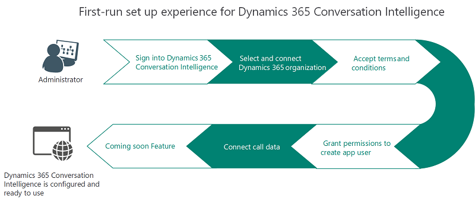
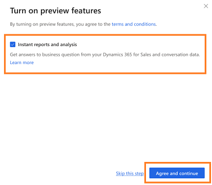

# First-run set up experience of Sales Insight application

When you sign into the Sales Insights application, the application will be available for you to use and explore the various features through the provided demo data. However, you must set up Dynamics 365 environment, grand app permissions, connect call data, and enable preview to use the features that the application offers.
After you sign in, you can set up the application depending on the role that is assigned to you.

-	As an administrator, you can set up the complete application including connecting the call data, grant permissions to create app users, and enable preview. To learn more, see [Administrator setting up application](#administrator-setting-up-application).

-	As a sales manager or seller, you can set up application only by connecting your Dynamics 365 environment to gather data to display on KPIs. To learn more, see [Manager or seller setting up application](#manager-or-seller-setting-up-application).

The following diagram illustrates the process of setting up application through different user roles:   

> [!div class="mx-imgBorder"]
> 

## Administrator setting up application

1.	Review the perquisites. To learn more, see [Prerequisites to setup Sales Insights application](prereq-sales-insights-app.md).

2.	Sign in to **Dynamics 365 Sales Insights** application as administrator.

    > [!div class="mx-imgBorder"]
    > 
 
3.	Select **Set up Sales Insights** and continue with set up wizard. 

4.	On the **Connect your data** dialog box, select your Dynamics 365 for Sales environment to connect with the application.

    > [!div class="mx-imgBorder"]
    > 
  
    The application detects your environment.

5.	On the **Terms and conditions** dialog box, accept the terms and conditions and select **Agree and continue**.

    > [!div class="mx-imgBorder"]
    > 
 
    The application takes few minutes to connect your data with application and progress dialog box is displayed.

    > [!div class="mx-imgBorder"]
    > 
  
6.	On the **Create an application user** dialog box, select **Grant permissions** to create application user to use the application.

    > [!div class="mx-imgBorder"]
    > 
 
    The permission is granted to use the application.

7.	On the **Connect your call data** dialog box, enter the **Storage connection string** and **Container name** and select **Connect**.
    
    To learn more on how to get these values, see [Configure conversation intelligence to connect call data](configure-conversation-intelligence-call-data.md).

    > [!div class="mx-imgBorder"]
    > 
 
8.	If you want to turn the preview feature, on the **Turn on the preview features** dialog box, select the preview feature and then select **Agree and continue**.

    > [!div class="mx-imgBorder"]
    > 
 
    > [!NOTE]
    > If you don’t want to enable the preview feature for your organization, skip this step to proceed. You can always enable the preview features later. To learn more, see [Enable preview features]().

9.	On the **Keyword and competitor tracking** dialog box, add the keywords and competitors that you want to track on the call. You can update these keywords and trackers later when your organization requires a change. To learn more, see [Configure keywords and competitors in Conversation content](configure-keywords-competitors.md).

    > [!NOTE]
    > You can also skip adding the keywords and competitors and add them later when required.

    > [!div class="mx-imgBorder"]
    > 
 
10.	Select **Finish** to complete the set-up of Sales Insights application for your organization.

    The status message will be displayed on the top of the page.

    > [!div class="mx-imgBorder"]
    > 
  
Now, your Sales Insights application is ready, and managers and sellers can use to view this data.

## Manager or seller setting up application

when you sign into the Sales Insights application, you continue exploring the app with the demo data that is provided with the application and you can connect only your Dynamics 365 environment to view the KPIs. 

1.	Sign in to **Dynamics 365 Sales Insights** application.

    > [!div class="mx-imgBorder"]
    > 

2.	Select **Set up Sales Insights** and continue with set up wizard. 

3.	On the **Connect your data** dialog box, select your Dynamics 365 environment to connect with the application.

    > [!div class="mx-imgBorder"]
    > 

    The application detects your environment.

4.	On the Terms and conditions dialog box, accept the terms and conditions and Agree and continue.

    > [!div class="mx-imgBorder"]
    > 
 
    The application takes few minutes to connect your data with application and progress dialog box is displayed.

    > [!div class="mx-imgBorder"]
    > 
 
    The status message will be displayed on the top of the page.
 
After successful set up, Sales Insights application is ready for you to use to view data that is available in your Dynamics 365 for Sales environment.

> [!NOTE]
> You can contact your administrator to complete the full setup of application to use including call data, add keywords and competitors, and enable preview features.

### See also

- [Introduction to administer Sales Insights application](intro-admin-guide-sales-insights-app.md)

- [Prerequisites to use Sales Insights application](prereq-sales-insights-app.md)