# First-run setup experience for conversation intelligence

You can configure conversation intelligence through:      
- [The conversation intelligence application](#the-conversation-intelligence-application)    
- [The Sales Hub app](#the-sales-hub-app)    
- [Microsoft Teams](#microsoft-teams)    

When you sign in to conversation intelligence, the application will be available for you to use and explore the various features through the demo data provided.
After you sign in, you can set up the application depending on the role that's assigned to you.      
- As an administrator, you can set up the complete application&mdash;including connecting to a Dynamics 365 Sales environment&mdash;grant app permissions, connect call data, enable the preview, and define tracked key words and competitors to use the features that the application offers.     
- As a sales manager or seller, you can access the application by using demo data. An administrator must configure the application so you can view the data that's relevant to you.

## The conversation intelligence application

1.	Review the prerequisites. More information: [Prerequisites to setup conversation intelligence](prereq-sales-insights-app.md)  
2.	Sign in to the conversation intelligence application as an administrator.  
    > [!div class="mx-imgBorder"]
    >    
3.	Select **Set up Conversation intelligence**.   
4.	In the **Connect your data** dialog box, select your Dynamics 365 Sales environment to connect with the application.  
    > [!div class="mx-imgBorder"]
    >     
    The application detects your environment.  
5.	In the **Terms and conditions** dialog box, carefully read the [Microsoft privacy statement](https://privacy.microsoft.com/privacystatement), and read and select the check box for the [terms and conditions](https://www.microsoft.com/licensing/product-licensing/products). Select **Agree and continue**.  
    > [!div class="mx-imgBorder"]
    >   
    >[!NOTE]
    >Selecting the first check box allows Microsoft to collect your organization's data to improve the quality of insights. This check box is optional.  
    The application takes few minutes to connect your data with application. A progress dialog box is displayed.   
    > [!div class="mx-imgBorder"]
    >     
6.	In the **Create an application user** dialog box, select **Grant permissions** to create an application user to use the application.  
    > [!div class="mx-imgBorder"]
    >    
    The permission is granted to use the application.  
7.	In the **Connect your call data** dialog box, enter the **Storage connection string** and **Container name**, and then select **Connect**. More information: [Configure conversation intelligence to connect call data](configure-conversation-intelligence-call-data.md)  
    > [!div class="mx-imgBorder"]
    >    
8.	If you want to turn on access to preview features, in the **Coming soon** dialog box, select the check box and then select **Agree and continue**.  
    > [!div class="mx-imgBorder"]
    >    
    > [!NOTE]
    > If you don't want to enable the preview feature for your organization, skip this step. You can always enable preview features later. More information: [Enable coming soon features](enable-preview-features-sales-insights-app.md)  
9.	In the **Keyword and competitor tracking** dialog box, add the keywords and competitors that you want to track on the call. You can update these keywords and trackers later if your organization's requirements change. More information: [Configure conversation content](../sales/configure-keywords-competitors.md)      
    > [!NOTE]
    > You can also skip adding the keywords and competitors at this point. You can always add them later.  
    > [!div class="mx-imgBorder"]
    >    
10.	Select **Finish** to complete the setup of conversation intelligence for your organization.  
    The status message will be displayed on the top of the page.  
    > [!div class="mx-imgBorder"]
    >     
Now your conversation intelligence application is ready, and managers and sellers can use it to view this data.

## The Sales Hub app

Perform the following steps to configure conversation intelligence through the Sales Hub app.

1.	You must have an administrator or equivalent security role. More information: [Assign a security role to a user](https://docs.microsoft.com/power-platform/admin/create-users-assign-online-security-roles#assign-a-security-role-to-a-user)  
2.	Sign in to Dynamics 365, and go to your sales app.  
3.	Select the **change area**  in the lower-left corner of the page, and then select **Sales Insights settings**.  
    > [!div class="mx-imgBorder"]
    >   
4.	On the configuration page, under **Productivity**, select **Conversation intelligence**.  
    > [!div class="mx-imgBorder"]
    > 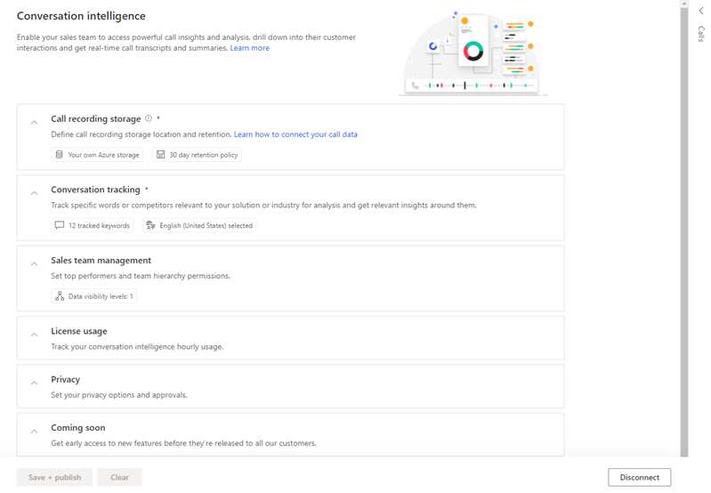  
5.	In the **Call recording storage** section, configure the storage-related options as follows:  
    - **Storage location**: Enter the **Storage connection string** and **Container name** to upload the call recordings for analysis. More information: [Configure conversation intelligence to connect call data](../sales/configure-conversation-intelligence-call-data.md)  
    - **Retention policy**: Choose a time limit for data retention. The application retains call recording data for the specified time limit and deletes it when the time limit is reached. More information: [Retention Policy](data-retention-deletion-policy.md#retention-policy)  
    > [!div class="mx-imgBorder"]
    > 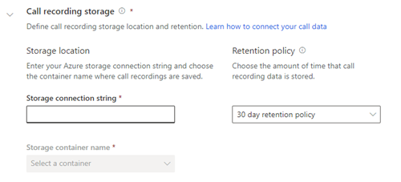  
6.	In the **Conversation tracking** section, add the keywords and competitors that you want to track on the call. You can update these keywords and trackers later when your organization's requirements change. Also, you can add languages that the sellers might use during their calls with customers. More information: [Configure conversation content](../sales/configure-keywords-competitors.md)    
    > [!div class="mx-imgBorder"]
    > 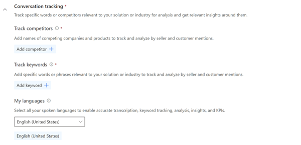  
    >[!NOTE]
    >-	Storage and conversation tracking are the only required fields for first-time onboarding to conversation intelligence. If you'd like, you can publish these settings if you want (skip to step 11). 
    >-	Sales managers can configure the conversation trackers specific to their team.  
7.	In the **Sales team management** section, configure the top sellers and hierarchy options as follows:  
    - **Call data visibility**: Select the levels of hierarchy for which sales managers can view conversation intelligence data.  
    - **Team members and top performers**: You can view the names of your team members whose calls are being analyzed in conversation intelligence, select your top performers, and delete data if necessary.  
        You can choose the top performers manually or let the application choose automatically. Select one of the following options:  
        - **Manually select top performers**: Choose top performers from the list of sellers. In the **Top performer** column, select the star icon corresponding to a seller. The seller is added to the top performers list, where the seller's data is compared against other sellers.   
        - **Enable automatic identification of top performers**: The application automatically selects the top performers based on the number of leads they qualified or opportunities they won. When you select this option, you choose whether to rank performers **by won opportunities** or **by lead qualification**.  
    > [!div class="mx-imgBorder"]
    > 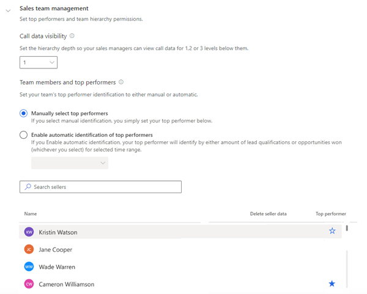  
    You can skip configuring this section and add your sales team later, when required. More information: [Configure and view your team page](../sales/configure-view-your-team-page.md)  
8.	In the **License usage** section, you can view the information about the total call recording processing hours left and used. This information view-only and can't be changed.  
    > [!div class="mx-imgBorder"]
    > 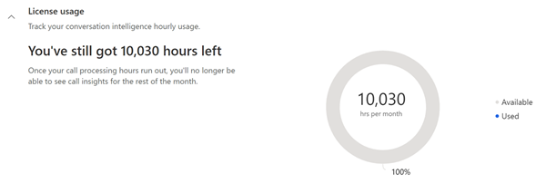   
9.	In the **Privacy** section, you can select the check box to allow Microsoft to improve the quality of insights through read-only access to your organization's data in conversation intelligence. This is optional.  
    > [!div class="mx-imgBorder"]
    > 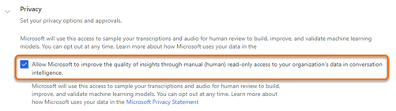   
10.	In the **Coming soon** section, select the **Access new features before they're released to all our customers** check box to turn on the "coming soon" feature.      
    If you don't want to enable preview features for your organization, skip this step. You can always enable them later. More information: [Enable coming soon features](../sales/enable-preview-features-sales-insights-app.md)  
    > [!div class="mx-imgBorder"]
    > 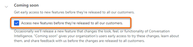  
11.	Select **Save + publish**.      
    A message is displayed to accept the terms and conditions. Read the terms and conditions, and the privacy statement, carefully. Select **Agree and continue**.      
    > [!div class="mx-imgBorder"]
    > 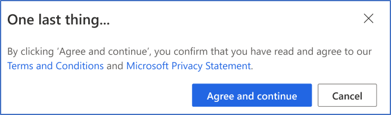  
Conversation intelligence is configured and ready for use in your organization.   

## Microsoft Teams

> [!IMPORTANT]
> - The enhanced experience for adding products is a preview feature. [!INCLUDE[cc-preview-features-definition](../includes/cc-preview-features-definition.md)]
> - [!INCLUDE[cc-preview-features-expect-changes](../includes/cc-preview-features-expect-changes.md)]
> - [!INCLUDE[cc-preview-features-no-ms-support](../includes/cc-preview-features-no-ms-support.md)] 

Conversation intelligence provides insights such as KPIs into sellers’ calls by analyzing the call recordings. When Microsoft Teams is integrated with conversation intelligence, making of calls and the analysis of conversations are made easy by providing real-time data on call recordings. Also, organization’s sales teams can drill down into their customer interactions, get real-time call transcripts, and post-call summaries.     
As an administrator, you must configure the conversation intelligence to integrate Microsoft Teams for your sales teams to get real-time call transcripts, post-call summaries, and call insights.     

### Review the prerequisites      
Review the following requirements before you configure Microsoft Teams calls for conversation intelligence:     
-	You must have an administrator or equivalent security role. To learn more, see [Assign a security role to a user](https://docs.microsoft.com/power-platform/admin/create-users-assign-online-security-roles#assign-a-security-role-to-a-user).
-	Your organization has a phone system installed with proper license to use. To learn more, see [Set up Phone System in your organization](https://docs.microsoft.com/MicrosoftTeams/setting-up-your-phone-system).
-	You have license to use Microsoft Teams. To learn more, see [Microsoft Teams add-on licenses](https://docs.microsoft.com/MicrosoftTeams/teams-add-on-licensing/microsoft-teams-add-on-licensing?tabs=small-business).
-	You must run the PowerShell script to record and store the Teams calls. If you are unable to run the script, contact you tenant administrator to run the script for your organization. To learn more, see [Run PowerShell script to record calls](#run-powershell-script-to-record-calls).       
### Run PowerShell script to record calls      
Before you configure the Teams dialer, run the PowerShell script to record calls through Teams and store them in default Microsoft storage for real-time processing.
You must have tenant administrator privileges to run the script. Follow these steps:     
1.	Download the PowerShell script from *https://<OUR_PRODUCTION_DOMAIN>/api/tenants/provisioning-script* to your local computer.      
2.	Open PowerShell command window and go to the script location.     
3.	To run the script, enter the following command and press Enter:     
    ```.\<script name>```     
    The package starts installing and a sign-in dialog box opens.     
4.	Enter your tenant administrator credentials to sign in to your organization to create the following:     
    -	Azure AD security group for whom the recording will be enabled.     
    -	Microsoft Teams related artifacts such as, service principle and recording policy.      
5.	Accept the default settings and the script installs successfully.     
    You can proceed to configure the Microsoft Teams for conversation intelligence.      
### Configure Microsoft Teams     
1.	Sign in to Dynamics 365, and go to your sales app.   
2.	Select the **change area**  in the lower-left corner of the page, and then select **Sales Insights settings**.  
    > [!div class="mx-imgBorder"]
    >   
3.	On the site map, under **Connection insights**, select **Conversation intelligence**.     
    The conversation intelligence requirements verification page opens.
    > [!div class="mx-imgBorder"]
    > 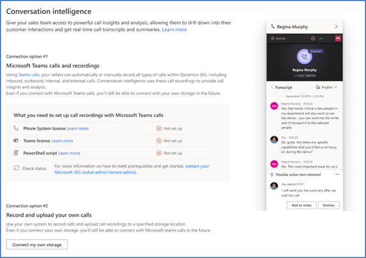     
4.	In the **What you need to set up Microsoft Teams calls** section, the application validates the licenses to use the phone system and Microsoft Teams for your organization. Also, verifies that the PowerShell script to record and store the calls for Microsoft Teams is run in your organization.     
    - Up on successful validation, the status corresponding to **Phone system license**, **Teams license**, and **PowerShell script** display **Status: Successfully set up**. Proceed to step 5.    
        > [!div class="mx-imgBorder"]
        > 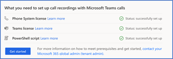      
    - <a name='teams-tenant-admin-contact'></a> If any of the validations fails, you can’t proceed with the configure and you must contact your tenant administrator to set up the phone system and Microsoft Teams for your organization.   
        When the tenant administrator completes the configuration of [phone system](https://docs.microsoft.com/MicrosoftTeams/setting-up-your-phone-system) and [Teams licenses](https://docs.microsoft.com/MicrosoftTeams/teams-add-on-licensing/microsoft-teams-add-on-licensing?tabs=small-business).    
        Configure [PowerShell script to record calls](#run-powershell-script-to-record-calls), you can continue with the configuration.    
        Select **Check status**.     
        > [!div class="mx-imgBorder"]
        > 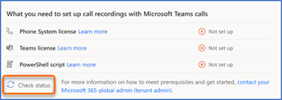     

    >[!NOTE]
    >If you don’t want to use the Microsoft Teams as your phone system and use your custom defined storage location to upload call recording, under **Record and upload your own calls** section, select **Connect my own storage**. You are directed to the storage setting page. To learn more, see [The Sales Hub app](#the-sales-hub-app).   
    >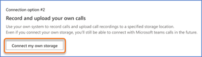
5.	Select **Get started** and the conversation intelligence configuration page opens.       
6.	Under the **Microsoft Teams call recordings (preview)** section, configure the call-related options as described:     

    | Option | Description |
    |--------|-------------|
    | Turn on Teams call preview | Enable the preview to use Microsoft Teams as your phone system to record calls. To learn more, see [Configure Microsoft Teams calls](https://docs.microsoft.com/dynamics365/sales-enterprise/configure-microsoft-teams-dialer). |
    | Call recording permissions | Specifies the security roles from your organization who has the permission to use the Teams dialer. By default, permission is granted to all security roles in your organization. If you want to add or remove security roles, see [Configure the dialer](https://docs.microsoft.com/dynamics365/sales-enterprise/configure-microsoft-teams-dialer#configure-the-dialer). |
    | Call recording activation | Choose the option to initiate the call recordings. <br>•	**Automatically**: select this option if you want the calls to be automatically recorded when a call is initiated. <br>•	**On demand**: Select this option if you want to allow sellers to start the call recording when a call is initiated. <br>Select the **Users can manually stop recording** option to allow uses to stop the call recording at any point during the call. |
    | Recording notification for customers | Enable this option to notify  customers when the call recording is initiated. This lets customers know that the sellers are recording their conversation. |
    
    > [!div class="mx-imgBorder"]
    > 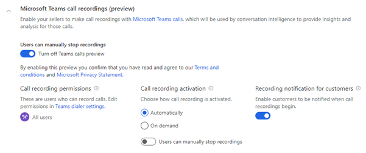   
7.	Under the **Call recording storage** section, configure the storage-related options as described:    

    | Option | Description |
    |--------|-------------|
    | Storage for call recordings | Select an option to store your call recordings for analysis. <br>•	**Microsoft provided storage**: Select this option if you want to use the Microsoft provided storage. By default, this option is selected, and we recommend you use this storage.<br>•	**Your own Azure storage**: Select this option if you want to use your custom Azure storage. After you select this option, enter the **Storage connection string** and **Container name**.<br> To learn more, see [Configure conversation intelligence to connect call data](configure-conversation-intelligence-call-data.md). |
    | Retention policy | Choose a retention time limit, the application retains the call recording data for the specified time limit and deletes when the time limit is reached. To learn more, see [Retention Policy](data-retention-deletion-policy.md#retention-policy). |   

    > [!div class="mx-imgBorder"]
    > 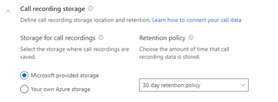

    >[!NOTE]
    >If you'd like, you can publish these settings if you want (skip to step 13).    
8.	Under the **Conversation tracking** section, add the keywords and competitors that you want to track on the call. You can update these keywords and trackers later when your organization requires a change. Also, you can add languages in which the sellers may use during their calls with customers.    
    To learn more, see [Configure keywords and competitors in Conversation content](configure-keywords-competitors.md).     
    > [!div class="mx-imgBorder"]
    >     
9. In the **Sales team management** section, configure the top sellers and hierarchy options as follows:  
    - **Call data visibility**: Select the levels of hierarchy for which sales managers can view conversation intelligence data.  
    - **Team members and top performers**: You can view the names of your team members whose calls are being analyzed in conversation intelligence, select your top performers, and delete data if necessary.  
        You can choose the top performers manually or let the application choose automatically. Select one of the following options:  
        - **Manually select top performers**: Choose top performers from the list of sellers. In the **Top performer** column, select the star icon corresponding to a seller. The seller is added to the top performers list, where the seller's data is compared against other sellers.   
        - **Enable automatic identification of top performers**: The application automatically selects the top performers based on the number of leads they qualified or opportunities they won. When you select this option, you choose whether to rank performers **by won opportunities** or **by lead qualification**.  
    > [!div class="mx-imgBorder"]
    >   
    You can skip configuring this section and add your sales team later, when required. More information: [Configure and view your team page](../sales/configure-view-your-team-page.md).     
10.	In the **License usage** section, you can view the information about the total call recording processing hours left and used. This information view-only and can't be changed.  
    > [!div class="mx-imgBorder"]
    >    
11.	In the **Privacy** section, you can select the check box to allow Microsoft to improve the quality of insights through read-only access to your organization's data in conversation intelligence. This is optional.  
    > [!div class="mx-imgBorder"]
    >    
12.	In the **Coming soon** section, select the **Access new features before they're released to all our customers** check box to turn on the "coming soon" feature.      
    If you don't want to enable preview features for your organization, skip this step. You can always enable them later. More information: [Enable coming soon features](../sales/enable-preview-features-sales-insights-app.md)  
    > [!div class="mx-imgBorder"]
    >   
13.	Select **Save + publish**.      
    A message is displayed to accept the terms and conditions. Read the terms and conditions, and the privacy statement, carefully. Select **Agree and continue**.      
    > [!div class="mx-imgBorder"]
    >     

Microsoft Teams dialer for Conversation intelligence is configured and ready for use in your organization.   

### See also

[Introduction to administer conversation intelligence](intro-admin-guide-sales-insights.md#administer-conversation-intelligence)  
[Prerequisites to use conversation intelligence](prereq-sales-insights-app.md)
