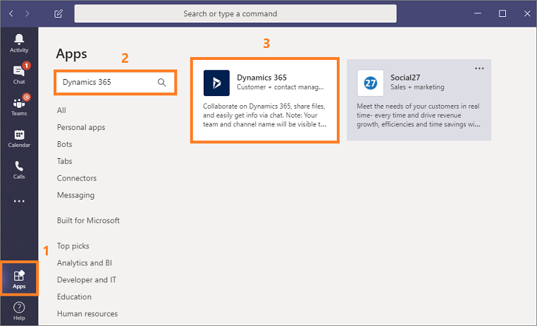
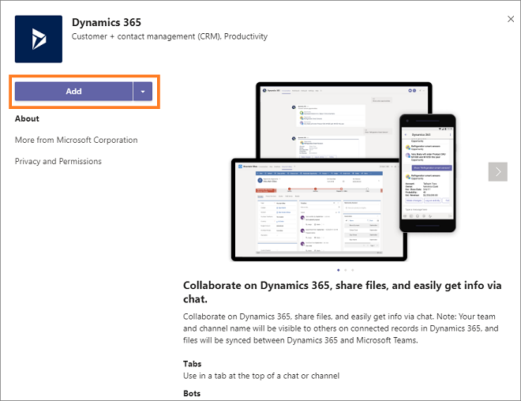

# Install Dynamics 365 assistant application on Microsoft Teams

[!INCLUDE [cc-beta-prerelease-disclaimer](../includes/cc-beta-prerelease-disclaimer.md)]

> [!IMPORTANT]
> - [!INCLUDE[cc_preview_features_definition](../includes/cc-preview-features-definition.md)]  
> - [!INCLUDE[cc_preview_features_expect_changes](../includes/cc-preview-features-expect-changes.md)]
> - Microsoft doesn't provide support for this preview feature. Microsoft Dynamics 365 Technical Support won’t be able to help you with issues or questions. Preview features aren't meant for production use and are subject to a separate [supplemental terms of use](https://go.microsoft.com/fwlink/p/?linkid=870960).

Dynamics 365 assistant application on Microsoft Teams helps the sales personals in the organization to keep track of daily meetings, customer interactions, and insights. When you add the application to the Microsoft Teams desktop app, you can open the app on the Teams mobile app and access the information as required. To learn more, see [Access the application on Microsoft Teams](access-assistant-application-teams.md). 

## Install Dynamics 365 assistant app

As an individual, you can add the application to Microsoft Teams to highlight the Dynamics 365 assistant app for yourself. When the application is added, you can sign into Microsoft Teams mobile app and access the Dynamics 365 assistant application.

> [!IMPORTANT]
> Microsoft Teams don't let users download apps directly from the Teams mobile app. You must first install the app on Microsoft Teams desktop application and then you can access the added app on Teams mobile app.

To add the application to Microsoft Teams, follow these steps:

1. Verify that you have reviewed prerequisites and installation procedures. To learn more, see [Enable Dynamics 365 assistant application on Microsoft Teams](intro-admin-guide-sales-insights.md#enable-dynamics-365-assistant-application-on-microsoft-teams).

2. Open Microsoft Teams desktop application and go to **Apps**.

3. On the Apps page, Search for dynamics, and then select the **Dynamics 365** tile.

    > [!div class="mx-imgBorder"]
    > 

4. Select **Add** to add the app.

    > [!div class="mx-imgBorder"]
    > 

    The Dynamics 365 app is added to Teams. You can sign into your Microsoft Teams mobile app and access the application.

### See also

[Enable Dynamics 365 assistant application on Microsoft Teams](intro-admin-guide-sales-insights.md#enable-dynamics-365-assistant-application-on-microsoft-teams)

[Configure Dynamics 365 assistant bot](configure-dynamics-365-bot.md)

[Overview of Dynamics 365 assistant](overview-dynamics-365-assistant-app-teams.md)