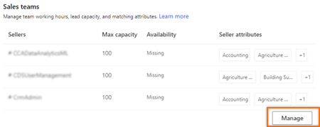
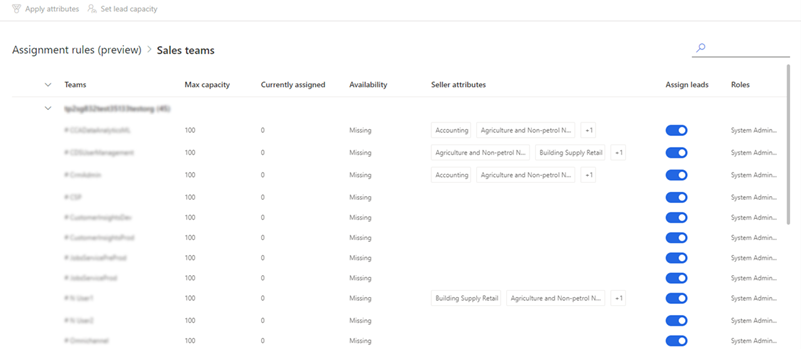
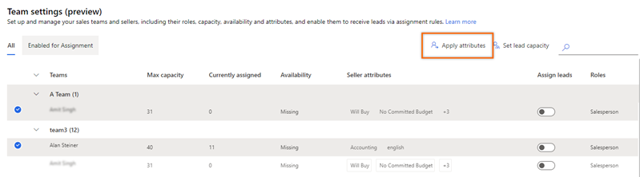
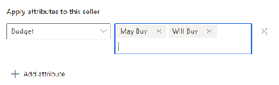
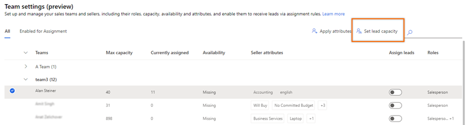
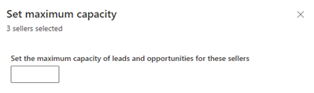
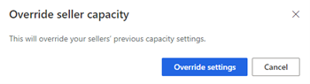
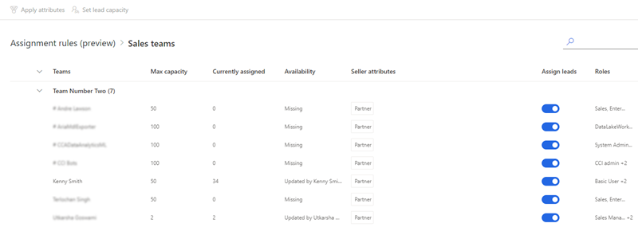
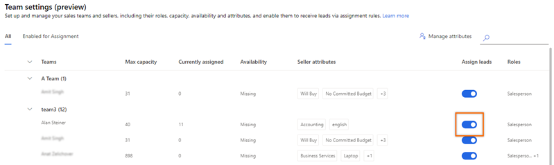
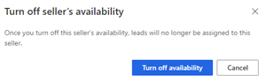

# Manage sales teams    
Using the sales team management in assignment rules, you can configure the lead capacity and matching attribute for sellers. By creating rules, based on the lead capacity and matching attribute you determines how the leads are assigned to sellers.     
You can use the Sales Teams settings page to:    
-	[Add attribute to sellers](#add-attributes-to-sellers)   
-	[Set lead capacity to sellers](#set-lead-capacity-to-sellers)    
-	[Turn off lead assignment to sellers](#turn-off-lead-assignment-to-sellers)

Before you start using the sales teams designer, verify that the security roles that are assigned for your sellers are selected while configuring the sales accelerator. For more information, see step 4 in [Set up the sales accelerator](enable-configure-sales-accelerator.md).     

## Add attributes to sellers    
The attribute defines the characteristic of a seller such as skills, location, and language. Before you apply the attributes to sellers, verify that the attributes are defined. More information: [Create an attribute](manage-seller-attributes.md#create-an-attribute).    

You can select multiple sellers to bulk apply the attributes.

**To add attributes**

1.	Sign in to your Dynamics 365 Sales Hub app.   
2.	Go to **Change area** in the lower-left corner of the page and select **Sales Insights settings**.   
3.	Under **Sales accelerator**, select **Assignment rules (preview)**.   
4.	On the **Assignment rules** page, go to the **Sales teams** section and then select **Manage**.    
    >[!div class="mx-imgBorder"]
    >   

    The **Sales teams** page lists the sales teams with sellers whose security roles are configured during the setup of sales accelerator.   

    >[!div class="mx-imgBorder"]
    >   

5.	On the **Sales team** page, select the seller, and then select **Apply attribute**.  

    >[!NOTE]
    >To bulk apply the attributes, select multiple sellers.   

    >[!div class="mx-imgBorder"]
    >  

    The **Apply attribute** pane opens on the right.   

6.	On the **Apply attribute** pane, select one of the following options to apply attributes:    
    -	**Replace**: This option replaces the existing attributes that are already applied to the seller. If there are any leads that were assigned to the seller based on the previous attributes, they will not be affected.    
    -	**Apply More**: This option adds more attributes to the seller apart from the attributes that were already applied.
7.	Select **+ Add attribute** and then choose the attribute and its corresponding values.
    >[!div class="mx-imgBorder"]
    >   
 
    After you have added the attribute, select **+ Add attribute** to add more attributes.
8.	Select **Apply**.    
    The attributes are applied to the sellers.

## Set lead capacity to sellers   
The lead capacity allows you to set an upper limit for seller to handle the number of leads that are assigned to them at any given time. When a seller reaches the upper limit, though a lead that is created and ready to be automatically assigned to the seller will not be assigned. You can view the unassigned leads in the Open Leads view.   

For example, Alen is a seller, and his lead capacity limit is set to 5. A new lead is generated, and assignment rule qualifies the lead to be assigned to Alen. However, Alen has reached lead assignment capacity of 5 and the newly generated lead will not be assigned to Alen.   

**To set lead capacity**

1.	Sign in to your Dynamics 365 Sales Hub app.   
2.	Go to **Change area** in the lower-left corner of the page and select **Sales Insights settings**.   
3.	Under **Sales accelerator**, select **Assignment rules (preview)**.   
4.	On the **Assignment rules** page, go to the **Sales teams** section and then select **Manage**.    
    >[!div class="mx-imgBorder"]
    >   

   The **Sales teams** page lists the sales teams with sellers whose security roles are configured during the setup of sales accelerator.     

    >[!div class="mx-imgBorder"]
    >   

5.	On the **Sales team** page, select the seller and then select **Set lead capacity**.  

    >[!NOTE]
    >To bulk apply the attributes, select multiple sellers.   

    >[!div class="mx-imgBorder"]
    >   

    The **Set maximum lead capacity** pane opens on the right.   

    >[!div class="mx-imgBorder"]
    >   

6.	Enter the maximum lead capacity value that the seller can handle in the **Enter the maximum number of leads for each seller** field.    
7.	Select **Apply**.    

    >[!NOTE]
    >If you are replacing the existing maximum lead capacity, a confirmation message displays to override the existing limit. Select **Override settings**.    
    > 
 
    The maximum lead capacity limit is set for the seller.

## Turn off lead assignment to sellers

When a seller is on vacation or unavailable due to other reasons, you can disable the lead assignment until the seller is available. 
  
1.	Sign in to your Dynamics 365 Sales Hub app.   
2.	Go to **Change area** in the lower-left corner of the page and select **Sales Insights settings**.   
3.	Under **Sales accelerator**, select **Assignment rules (preview)**.   
4.	On the **Assignment rules** page, go to the **Sales teams** section, and then select **Manage**.    
    >[!div class="mx-imgBorder"]
    >   

   The **Sales teams** page lists the sales teams with sellers whose security roles are configured during the setup of sales accelerator.   

    >[!div class="mx-imgBorder"]
    >   

5. Under the **Assign leads** column, turn off the toggle to disable the lead assignment.   
    >[!div class="mx-imgBorder"]
    >   

6. On the confirmation message, select **Turn off availability** and the lead assignment is turned off.  
    >[!div class="mx-imgBorder"]
    >

### See also

[Manage assignment rules for lead routing](create-manage-assignment-rules-lead-routing.md)    
[Create and activate an assignment rule](create-and-activate-assignment-rule.md)

[!INCLUDE[footer-include](../includes/footer-banner.md)]
