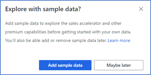
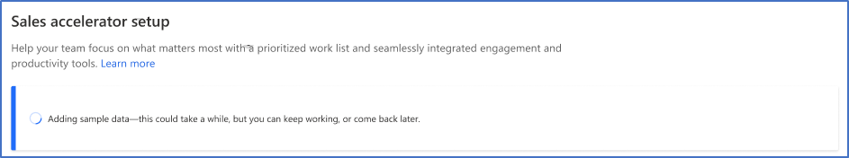
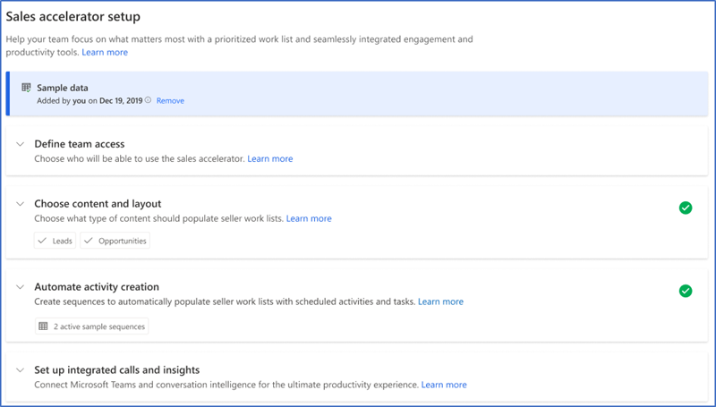
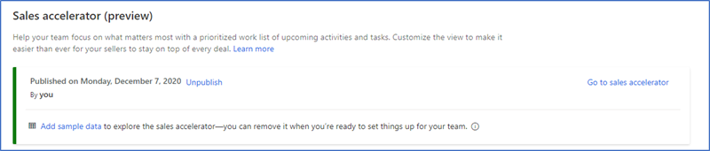
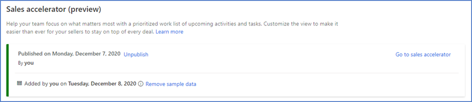
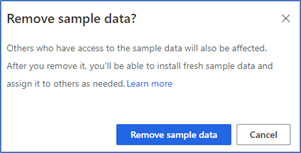

# Explore sales premium with sample data    

The sample data helps you visualize the product and its features, by enabling you to understand the end-to-end business scenarios and get started with sales accelerator. You can add the sample data without or after the configuration of sales accelerator. Also, you can remove the sample data from your organization any time when it’s not required  . 

>[!NOTE]
>To prevent unwanted results, the sample data is available only on non-production environments. 

## Sample data availability    
By default, the sample data is available for administrator who adds the sample data. Administrator can assign the records that are associated with sample data for other users to explore.     

## Distinguish between sample and actual data  
After you install the sample data, you can distinguish between sample and your actual organization’s data–sample data is always followed by (sample). For example, sample contacts are added as Michelle Harris (sample) and Alex Baker (sample).     

## Add sample data    
You can add sample data at any time you need–during or after the configuration of sales accelerator.    
>[!NOTE]
>Installing the sample data adds basic sales and sales premium entities. More information: [Reference](#reference).     
Have a Sales Insights, Sales Premium, production, or a trial license to use the sample data.

1.	Sign in to your sales app.   
2.	Go to **Change area** in the lower-left corner of the page and select **Sales Insight settings**.    
3.	Under **Sales accelerator**, select **Setup**.    
4.	Select **Get started** and a pop-up window is displayed to add sample data.    
5.	On the **Explore with sample data?** pop-up window, select **Add sample data**.    
    > [!div class="mx-imgBorder"]
    >    
    Sample data starts adding to your organization, this might take few minutes.   
    > [!div class="mx-imgBorder"]
    >      
6.	After the sample data is added to your organization, you can start using the sample data to play around and understand the sales accelerator and other premium features.   
    > [!div class="mx-imgBorder"]
    >      
    You can also add sample data after you have configured the sales accelerator. Select **Add sample data**.     
    > [!div class="mx-imgBorder"]
    >     
    After the sample data is added to your organization, a confirmation message is displayed with when the sample data is added.    
    > [!div class="mx-imgBorder"]
    >     

## Remove sample data   
As an administrator, you can remove sample data that is no longer required in your organization.     
>[!NOTE]
>You always add the sample data back whenever it’s required.    
**To remove the sample data:**    
1. Sign in to your sales app.   
2. Go to **Change area** in the lower-left corner of the page and select **Sales Insight settings**.    
3. Under **Sales accelerator**, select **Setup**.    
4.	On the setup page, select **Remove sample data**.    
    > [!div class="mx-imgBorder"]
    >        
5.	On the **Remove sample data?** confirmation message, select **Remove sample data**.   
    > [!div class="mx-imgBorder"]
    >      
    The application takes few seconds to remove the sample data from your organization.    

## Reference    
When sample data is added to your organization, the following record types are updated with sample data:      
-	Account
-	Action Card
-	Appointment
-	Competitor
-	Contact
-	Lead
-	Opportunity
-	Phone Call
-	Price List
-	Price List Item
-	Product
-	Sequence
-	User
    
### See also

[Configure sales accelerator](enable-configure-sales-accelerator.md)
