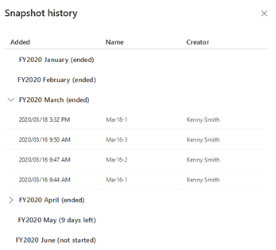

# Manage snapshots for a forecast

A snapshot freezes the forecast data at a moment in time. The frozen data includes aggregate column values, manual adjustments, and underlying record fields that directly impact the forecast. These snapshots can then be used to see how the forecast and the underlying data have changed over time.

To visualize the flow of forecast data between two snapshots, use the Flow chart. To learn more, see [Analyze deals flow between snapshots](analyze-deals-flow-between-snapshots.md).

## Prerequisites

Review the following prerequisites before you start using snapshots:

-	Purchase a **Dynamics 365 Sales Insights** license or start a trial to use advanced Sales Insights features.

-	Only users who have the privileges to create and write in the forecast configuration can create snapshots. To learn more, see [Security roles and privileges](/power-platform/admin/security-roles-privileges).

## Create a snapshot

Before you create a snapshot for a forecast, note the following:

-	Snapshots are available for active forecasts only

-	You can capture one forecast snapshot per day. However, if you want to take another snapshot, delete the most recent snapshot and capture a new snapshot.

-	You can't take snapshots for an active forecast that is either entirely in the past or entirely in the future. For example, today is January, 25th 2020, and your forecast has an end date of January, 24th 2020. In this example, you can't take snapshot of this forecast as the end date has already passed.

To create snapshots, follow these steps:

1.	Sign in to the **Sales Hub** app.

2.	At the bottom of the site map, select the **Change area** icon, and then select **App settings**.

3.	Under **Performance management**, select **Forecast configurations**.

4.	On the forecast grid page, select **Active** tab. A list of active configured forecasts is displayed.

    > [!div class="mx-imgBorder"]
    > 

5.	On the forecast that you want to create a snapshot, select the **More options** icon, and then select **Add/view snapshots**.

    > [!div class="mx-imgBorder"]
    > 

    The snapshot history page opens. A list of snapshots is displayed if there are snapshots already created for the forecast.

6.	On the **Snapshot history** dialog, select **+ Add snapshot**.

7.	Enter a name for the snapshot and then select the check icon.

    > [!div class="mx-imgBorder"]
    > 

    A confirmation message is displayed. 

8.	Select **Create**. 

The snapshot list refreshes to display the added snapshot and you can verify the progress on the status column.

## Delete a snapshot

To delete a snapshot, follow these steps:

1.	On the forecast, select the **More options** icon and then select **Add/view snapshots**. 

    > [!div class="mx-imgBorder"]
    > 

    The snapshot history dialog opens with a list of snapshots.

2.	Select the **More options** icon corresponding to the snapshot and the select **Delete**.
 
    > [!div class="mx-imgBorder"]
    > 
 
    A confirmation message is displayed. 

3.	Select **Delete**. 

    The snapshot list refreshes, and the deleted snapshot is removed from the list.

### See also

[Premium forecasting](configure-premium-forecasting.md)

[Analyze deals flow between snapshots](analyze-deals-flow-between-snapshots.md)