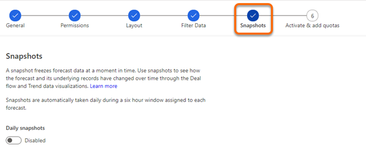
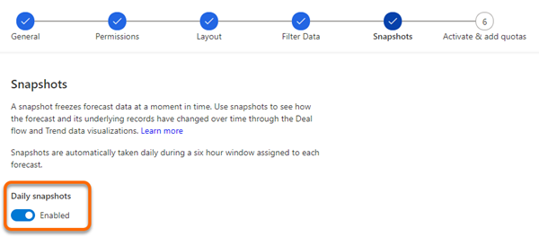

# Manage snapshots for a forecast

>[!NOTE]
>If you have opted in for early access, follow the process as specified in [Take snapshots automatically in early access](#take-snapshots-automatically-in-early-access).

A snapshot freezes the forecast data at a moment in time. The frozen data includes aggregate column values, manual adjustments, and underlying record fields that directly affect the forecast. You can use these snapshots to see how the forecast and its underlying data have changed over time.

To visualize the flow of forecast data between two snapshots, use a flow chart. To learn more, see [Analyze deals flows between snapshots](analyze-deals-flow-between-snapshots.md).

## Prerequisites

Review the following prerequisites before you start using snapshots:

-	Purchase a Dynamics 365 Sales Insights license or start a trial to use advanced Sales Insights features.

-	Only users who have the security roles required to create and write in the forecast configuration can create snapshots. To learn more, see [Security roles and privileges](https://docs.microsoft.com/power-platform/admin/security-roles-privileges).

## Create a snapshot

Before you create a snapshot for a forecast, note the following:

-	Snapshots are available for active forecasts only.

-	You can capture one forecast snapshot per day. However, if you want to take another snapshot, you can delete the most recent snapshot and then capture a new one.

-	You can't take snapshots for an active forecast that's either entirely in the past or entirely in the future. For example, if it's currently January 25, 2020 and your forecast has an end date of January 24, 2020, you won't be able to take a snapshot of this forecast because its end date has already passed.

- Snapshots save only the system-calculated forecast values and will not consider the adjusted values. To learn more, see [Adjust values in a forecast](https://docs.microsoft.com/dynamics365/sales-enterprise/adjust-values-in-forecast).

**To create snapshots**

1.	Sign in to the Sales Hub app.

2.	At the bottom of the site map, select the **Change area** icon, and then select **App settings**.

3.	Under **Performance management**, select **Forecast configurations**.

4.	On the forecast grid page, select the **Active** tab. A list of active configured forecasts is displayed.

    > [!div class="mx-imgBorder"]
    > 

5.	On the forecast from which you want to create a snapshot, select the **More options** icon, and then select **Add/view snapshots**.

    > [!div class="mx-imgBorder"]
    > 

    The snapshot history page opens. A list of snapshots is displayed if there are snapshots already created for the forecast.

6.	In the **Snapshot history** dialog box, select **+ Add snapshot**.

7.	Enter a name for the snapshot, and then select the check mark.

    > [!div class="mx-imgBorder"]
    > 

8.	In the confirmation message that appears, select **Create**. 

The snapshot list is refreshed to display the added snapshot, and you can verify its progress in the status column.

## Delete a snapshot

1.	In the forecast, select the **More options** icon, and then select **Add/view snapshots**. 

    > [!div class="mx-imgBorder"]
    > 

    The snapshot history dialog opens with a list of snapshots.

2.	Select the **More options** icon corresponding to the snapshot and the select **Delete**.
 
    > [!div class="mx-imgBorder"]
    > 
 
    A confirmation message is displayed. 

3.	Select **Delete**. 

The snapshot list is refreshed, and the deleted snapshot is removed from the list.

## Take snapshots automatically in early access

[!INCLUDE [cc-early-access](../includes/cc-early-access.md)]

A snapshot freezes the forecast data at a moment in time. The frozen data includes aggregate column values, manual adjustments, and underlying record fields that directly affect the forecast. You can use these snapshots to see how the forecast and its underlying data have changed over time. 

Now, snapshots can be taken automatically each day. You can enable snapshots while configuring forecasts. When enabled, the snapshots are taken daily for that forecast and you can view deal flows and trend data based on the snapshots.

>[!NOTE]
>- Premium forecasting must be enabled for the snapshot feature.
>- You can enable or disable snapshots any time while a forecast active. When disabled, the previously taken snapshots are still available.  

To enable the snapshots, follow these steps:

1.	While configuring a forecast, the **Snapshots** step is displayed. 

    More information: [Configure forecasts by using a custom rollup entity](https://docs.microsoft.com/dynamics365/sales-enterprise/configure-forecast-using-custom-rollup-entity)
 
    > [!div class="mx-imgBorder"]
    >  

2.	Set the **Daily snapshots** toggle to **Enabled**. After the forecast is active, snapshots are automatically taken daily. The initial snapshot might take a few hours to generate.

    > [!div class="mx-imgBorder"]
    >  
 
>[!IMPORTANT]
>While configuring columns for a forecast, ensure that each column is unique and the **Selector** option doesn't have duplicates. If duplicates exist, when you activate the forecast an error will be displayed that states that snapshots can't be enabled for the forecast.

### See also

[About premium forecasting](configure-premium-forecasting.md) 
[Analyze deals flow between snapshots](analyze-deals-flow-between-snapshots.md)
