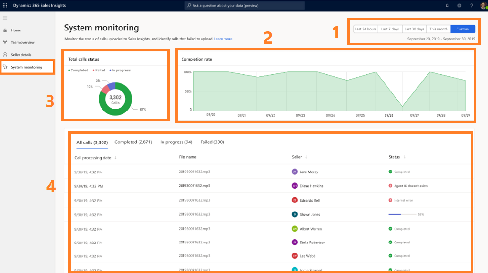

<!-- Hard to be sure, but in line 49, it looks like 87% and not 83% in the image.
>
Line 50 says "By default, the calls are sorted according to the date they are processed in descending  order. You can also sort the call list according to date, seller name, or status." If date is default, does it need to be included in that next sentence? Should it be "... according to file name, seller name, or status"? 
>
Please confirm that the names in the first image are from an approved fictitious names list. 
-->

# Monitor call and insight processing   

[!INCLUDE [cc-beta-prerelease-disclaimer](../includes/cc-beta-prerelease-disclaimer.md)]

> [!IMPORTANT]
> - [!INCLUDE[cc_preview_features_definition](../includes/cc-preview-features-definition.md)]  
> - [!INCLUDE[cc_preview_features_expect_changes](../includes/cc-preview-features-expect-changes.md)]
> - Microsoft doesn't provide support for this preview feature. Microsoft Technical Support won’t be able to help you with issues or questions. Preview features aren't meant for production use and are subject to a separate [supplemental terms of use](https://go.microsoft.com/fwlink/p/?linkid=870960).

As an administrator, you need to track and understand the status of sellers’ calls with customers in the application. The **System monitoring** page in the Conversation Intelligence application helps administrators ensure that the calls were successfully processed. Administrators can monitor the status of calls that have been processed, are yet to be processed, or could not be processed. When call processing errors occur, administrators can view the reasons for each error and take the appropriate steps.

To view the **System monitoring** page, follow these steps:

1.	Review the prerequisites. To learn more, see [Prerequisites to configure Conversation Intelligence](prereq-sales-insights-app.md).

2.	Open the **Conversation Intelligence** application. 

3.	Select **System monitoring** to open the system monitoring page.

    > [!div class="mx-imgBorder"]
    > 

    | Number | Feature | Description |
    |--------|---------|-------------|
    | 1 | Time period filter | You can filter the information on the page based on a time period, such as last 24 hours, last seven days, last month, current month, or a custom time period. For example, to view the information of the current month, select **This month**, and the information is filtered to display the current month's status in the **Total call status**, **Completion rate**, and **list of calls**. |
    | 2 | Completion rate | This insight shows the average percentage of total calls that are processed successfully at a given time. **Note**: If calls aren’t uploaded at all, for any reason, they will not appear in the graph. |
    | 3 | Total call status | This insight shows a pie chart of the total number of calls uploaded and the average percentage of calls in progress, failed, and completed. In this example you can see that a total of 3,302 calls were uploaded in which an average of 83% of calls were completed (successfully processed), 10% of calls failed, and 3% of calls are in progress. |
    | 4 | View list of calls | This table lists the total number of calls that are uploaded for processing. The table has four columns: Call process date, File name, Seller, and Status. By default, the calls are sorted according to the date they are processed in descending  order. You can also sort the call list according to date, seller name, or status. The **Status** column helps you identify the status of a call, such as completed, in progress, or failed. If a call is failed, an error is displayed. When you select the error, a pop-up window is displayed with information such as why the call failed to process, what you can do to resolve the error, and an **Activity ID**. You can copy the activity ID and provide it to your support team (or Microsoft Support) for further investigation, which can help you to debug the call process and resolve the error.  **Note**: To view the list of calls according to their status, select one of the tabs: **Completed**, **In progress**, or **Failed**. |

### See also

[Prerequisites to configure Conversation Intelligence](prereq-sales-insights-app.md)

[Improve seller coaching and sales potential with Conversation Intelligence](../sales/configure-conversation-intelligence-call-data.md)
