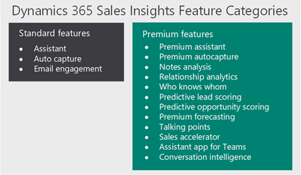

# Overview of Dynamics 365 Sales Insights

Welcome to [!INCLUDE[pn-dynamics-sales-insights](../includes/pn-dynamics-sales-insights.md)].

[!INCLUDE[pn-dynamics-sales-insights](../includes/pn-dynamics-sales-insights.md)] is a suite of features which continuously analyze the vast collection of customer-interaction data already stored in your Dynamics 365 Sales and Office 365 databases. This helps you to better understand your business relationships, evaluate your activities in relation to previous successes, and choose the best path forward. Also, it enables you to build strong relationships with customers, take actions based on insights, and close opportunities faster. These features are categorized as follows: 

- [Free Sales Insights features](#free-sales-insights-features) 

- [Advanced Sales Insights features](#advanced-sales-insights-features)

- [Sales Insights application](#sales-insights-application) 

The following diagram illustrates the various features available in [!INCLUDE[pn-dynamics-sales-insights](../includes/pn-dynamics-sales-insights.md)]: 

> [!div class="mx-imgBorder"]
> 

## Free Sales Insights features 

The free Sales Insights features available for free with Dynamics 365 Sales. These features consist of: 

- **Assistant (free)**: The assistant (formerly known as Relationship assistant) combines and analyzes the information that is at its disposal from Dynamics 365 Sales, and then generates a collection of action cards, which are displayed as your entry point to Dynamics 365 Sales on mobile devices, and as a carousel or column display on your web-based dashboards. To learn more, see  [Use assistant to guide customer communications](relationship-assistant.md). 

- **Auto capture (free)**: The auto capture analyzes your email messages directly in Microsoft Exchange to find all messages that might be relevant to your work in sales. The application looks for messages to or from relevant email addresses and presents you with the relevant messages right in Sales. To learn more, see [Auto capture of related emails](auto-capture.md). 

- **Email engagement (free)**: The email engagement helps you create more effective email messages—and to learn how your contacts are interacting with them. Stay on top of your email and prioritize those prospects or customers that are most engaged. To learn more, see [Use email engagement to view message interactions](email-engagement.md). 

## Advanced Sales Insights features 

The advanced Sales Insights features consist of [free Sales Insights features](#free-sales-insights-features) along with the following features: 

- **Assistant with Studio (full capabilities)**: The assistant in advanced features consists of base assistant capabilities along with enhanced features that allow you to create and display custom insight cards using the Studio to users. The Studio helps you to create custom insight cards through Microsoft Flow. After you create the cards, you can configure prioritization and who can see the cards. To learn more, see Manage insight cards. 

- **Relationship analytics**: The relationship assistant gathers information from Dynamics 365 Sales for key performance indicators (KPIs) and activity histories, and displays in a graphical representation. To learn more, see [Use Relationship analytics to gather KPIs](relationship-analytics.md). 

- **Predictive lead scoring**: The predictive lead scoring helps you to focus on revenue generation efforts by providing a score to prioritize efforts on quality leads. To learn more, see [Prioritize leads through scores](work-predictive-lead-scoring.md). 

- **Predictive opportunity scoring**: The predictive opportunity scoring helps you to focus on revenue generation efforts by providing score to prioritize efforts on quality opportunities. To learn more, see [Prioritize opportunities through scores](work-predictive-opportunity-scoring.md). 

- **Notes analysis**: The notes analysis monitors notes that you enter regarding a recent meeting or discussion with your customer to provide intelligent suggestions. To learn more, see [How notes analysis assists you with suggestion](notes-analysis.md). 

- **Talking points**: The talking points displays topics to start a conversation with your customer such as sports, vacation, family, and entertainment. To learn more, see [Know conversation starters for your customers](talking-points.md). 

- **Who knows whom**: The who knows whom provides details such as names and email addresses of your colleagues who know a lead that you are going to interact. To learn more, see [How to get introduced to a lead](who-knows-whom.md). 

## Sales Insights application 

The Sales Insights application provides you with the information and insights to intelligently manage the sales team, proactively coach sellers, and quickly answer questions regarding the business. To achieve this, the Dynamics 365 Sales Insights application provides you with information through key performance indicators (KPIs) for pipeline and deals, and intelligent call data KPIs through conversations intelligence. 

The features in the [!INCLUDE[pn-dynamics-sales-insights](../includes/pn-dynamics-sales-insights.md)] application are specifically designed to help sales managers and sellers to intelligently manage and quickly answer their most important business questions.

> [!NOTE]
> You must purchase a **[!INCLUDE[pn-dynamics-sales-insights](../includes/pn-dynamics-sales-insights.md)]** license to use Dynamics 365 Sales Insights features.

The following features are available under Dynamics 365 Sales Insights app:  

- View overall sales and seller insights
- Team report
- Conversation intelligence

To learn more, see [Overview of Sales Insights applications](dynamics365-sales-insights-app.md)

### See also

[Introduction to administer Sales Insights](../sales/intro-admin-guide-sales-insights.md)

[Privacy notice](privacy-notice.md)