# Personalize your sales accelerator     
As a seller, you can personalize the sales accelerator on how the activities are scheduled based on your work availability and what happens when you complete an activity.     
The following personal settings are available for you to configure:     
-	[Configure your work availability](#configure-your-work-availability)
-	[Configure the auto advance steps](#configure-the-auto-advance-steps)
-	[Configure steps and activities](#configure-steps-and-activities)

## Configure your work availability      
Configure your working days, hours, and days-off to adjust scheduled tasks and lead assignment according to your availability. For example, you are on a day-off on April 1, 2021, and you have few activities to complete on the same day. When you configure the calendar with a day-off, any scheduled activities on that day will be moved to your next available date or time.     

### Enable the availability option in sequence settings     
Before you start using this feature, contact your Dynamics 365 administrator or sequence manager to enable the **Timing and availability** settings. Follow these steps:     
1.	Sign in to your Dynamics 365 Sales Hub app.   
2.	Go to **Change area** in the lower-left corner of the page, and select **Sales Insights settings**.    
3.	Under **Sales accelerator**, select **Sequence** and then select **Settings**.    
    >[!div class="mx-imgBorder"]
    >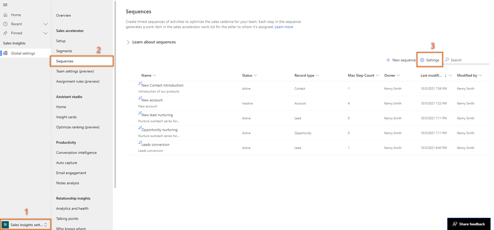     
4.	On the **Sequence settings** page, go to the **Timing and availability** section and enable the **Seller availability settings** option.   
    >[!div class="mx-imgBorder"]
    >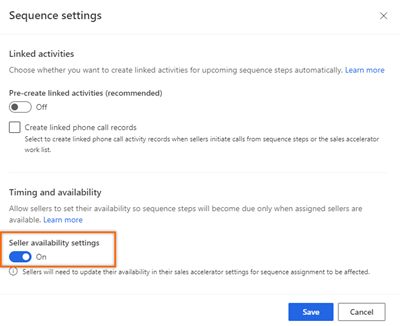      
5.	Save and close the setting.    

### Configure your availability   
1.	Sign in to Dynamics 365 Sales Hub app and go to **My work** > **Sales accelerator**.
2.	On the work list section, select the settings icon.   
    >[!div class="mx-imgBorder"]
    >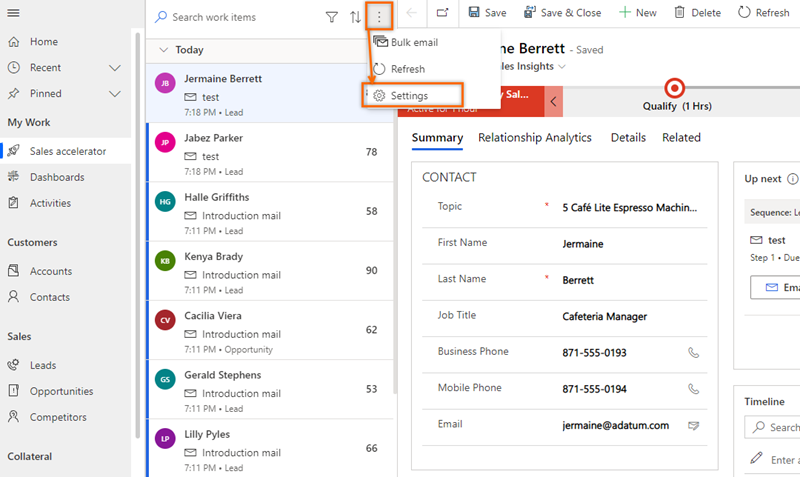     
3.	On the **Personal settings** page, select **Availability**.
    >[!div class="mx-imgBorder"]
    >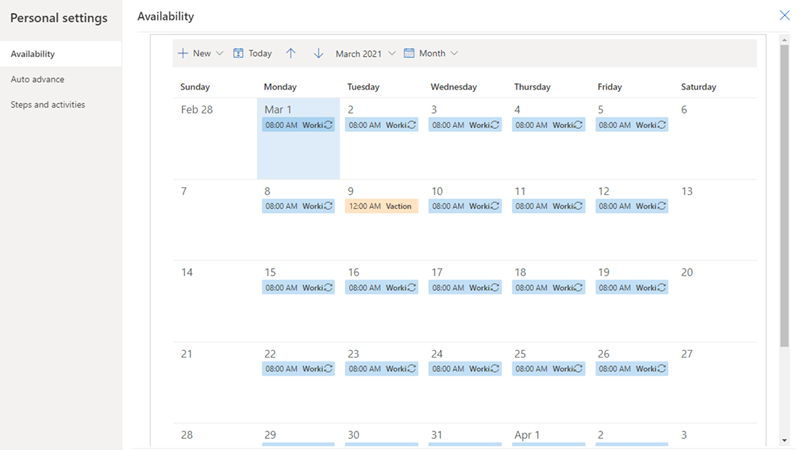      
4.	Select **+ New** and choose an option to configure your calendar according to your requirements.    
    -	**Working hours**: Use the **Working hours** option to configure your regular working hours in between defined dates. This helps sales accelerator to consider the assignment of activities to your work list.    
        >[!div class="mx-imgBorder"]
        >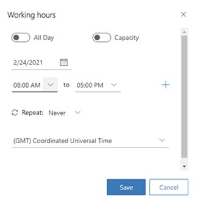    
        
        Configure the following options:     
        1.	Choose a date for which you want to configure the work hours.     
        2.	Select your work hours in the day. By default, work hours are configured as 9 hours from 8 AM to 5 PM without any breaks. To add general break or lunch hours in between the work hours, select the add (+) icon. In the example, you can see that a break of 30 minutes is added to the work hours. You can continue adding breaks in between the work hours.     
            >[!div class="mx-imgBorder"]
            >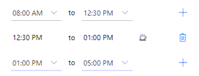    
        3.	Choose to repeat this work hour configuration to each day or only to this weekday of the week.    
            -	If you choose the option **Every day**, the configured work hours are applied to each day of the week including Saturday and Sunday. Select the day for which you don’t want to apply this work hour. In this example, Saturday and Sunday are removed from this work hour configuration.     
                Also, you can **choose an end date** on which you want to end this work hour configuration.      
                >[!div class="mx-imgBorder"]
                >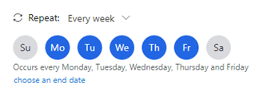    
            -	If you choose the option **Every week**, the configured work hours are applied to the same day of every week. In this example, the configuration is applied on Wednesday and the subsequent Wednesdays will have the same work hour configuration.     
                >[!div class="mx-imgBorder"]
                >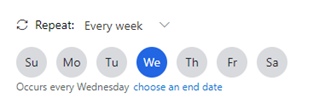    

                Also, you can **choose an end date** on which you want to end this work hour configuration.     
        4.	Choose your time zone. The time zone allows to match the time properly when your team is spread across geographies. By default, GMT (Greenwich Mean Time) is selected.    
        5.	Save the configurations.      
        The work hours are configured in your calendar for the selected time frame.     
    -	**Non-working**: Use the **Non-working** option to configure an unplanned break or time-out from your work on a particular day. Choose the period from which you want to take off in the day and then select **Save**.     
        For example, you have an unplanned appointment with doctor for a check-up between 1 PM to 4 PM on March  2, 2021 and use this option to update your calendar. Sales accelerator will consider the break and adjust the activity timeline to match your work hours.    
        >[!div class="mx-imgBorder"]
        >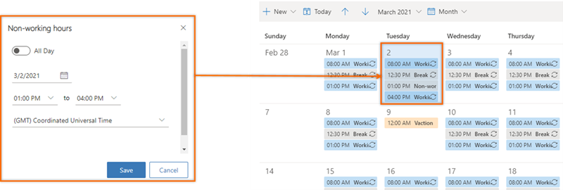    
    -	**Time off**: Use the **Time off** option to configure vacations or personal time-offs from work. This option blocks a full day or multiple days. When you are applying for multiple days, select the **All-day** option, choose a start, and end dates.     
        Provide a reason for other sellers to know your status on why you are taking off. Select your time zone and then save the configurations.    
        For example, you are going on a vacation with family from March 9, 2021 until March 12, 2021 and use this option to update your calendar. Sales accelerator will consider the vacation and adjust the activity timeline to match your vacation. The calendar is updated as displayed in the following screen.   
        >[!div class="mx-imgBorder"]
        >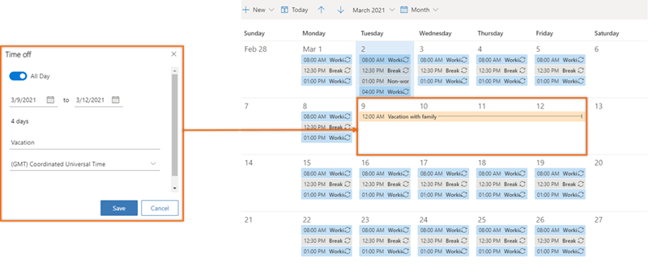    

## Configure the auto advance steps

The Auto advance settings specify the next course of action when you complete or skip an activity on a record.    
1.	Sign in to Dynamics 365 Sales Hub app and go to **My work** > **Sales accelerator**.
2.	On the work list section, select the settings icon.   
    >[!div class="mx-imgBorder"]
    >      
3.	On the **Personal settings** page, select **Auto advance**.      
    >[!div class="mx-imgBorder"]   
    >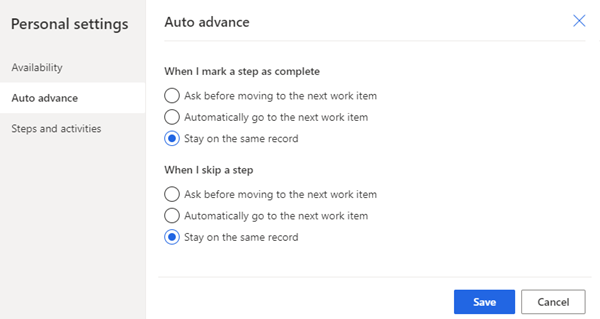      

    The following settings are available for completing or skipping the activity:       
    -	**Ask before moving to the next work item**: When an activity is completed or skipped, a message is displayed before you move to the next record in the work list. On the message, select an appropriate option to proceed. The following message is an example when you skip an activity.     
        >[!div class="mx-imgBorder"]
        >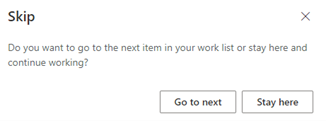       
    -	**Automatically go to the next work item**: When an activity is completed or skipped, the next record in the work list queue will automatically display.   
    -	**Stay on the same record**: When an activity is completed or skipped, the same record still is displayed, and the Up next widget displays the next activity that is defined in the sequence.    
4.	Save and close the settings.

## Configure steps and activities      
When a step is displayed in the **Up next** widget, a corresponding activity is automatically created on the timeline wall and linked to each other. When you complete the action such as, sending an email or making a call through the timeline wall, step is updated. By configuring the activities and steps, you can choose how the actions you perform on steps affect the linked activities and sequence steps.     

### Enable linking sequence steps and activities     
Before you start using this feature, contact your Dynamics 365 administrator or sequence manager to enable the **Steps and activities** settings. Follow these steps:

1.	Sign in to your Dynamics 365 Sales Hub app.   
2.	Go to **Change area** in the lower-left corner of the page, and select **Sales Insights settings**.    
3.	Under **Sales accelerator**, select **Sequence** and then select **Settings**.    
    >[!div class="mx-imgBorder"]
    >     
4.	On the **Sequence settings** page, go to the **Linked activities** section and enable the **Pre-create linked activities (recommended)** option.    

    >[!NOTE]
    > Select the **Exclude phone call activities** option to avoid creation of duplicate phone call activity when you are using Dynamics 365 Channel Integration Framework as your phone system. If not, a duplicate phone call activity is created on the timeline wall and a duplicate activity is created for the same when the step is waiting to be completed on the record.    

    >[!div class="mx-imgBorder"]
    >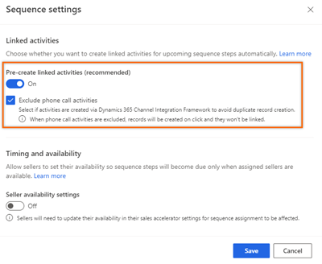     
 
5.	Save and close the setting.

### Configure steps and activities
1.	Sign in to Dynamics 365 Sales Hub app and go to **My work** > **Sales accelerator**.
2.	On the work list section, select the settings icon.   
    >[!div class="mx-imgBorder"]
    >     
3.	On the **Personal settings** page, select **Steps and activities**.       
4.	On the Steps and activities page, configure the options as required.     
    -	**When I send an email**: When you select this option and send an email through the timeline wall, the sequence step that is related to this activity is automatically marked as complete.     
    -	**When I mark a phone call activity record as complete**: When you select this option and make a phone call through the timeline wall, the sequence step that is related to this activity is automatically marked as complete.      
    -	**When I mark a phone call sequence step as complete**: When you complete a phone call activity in the sequence step, you can choose to enter the status of the activity or enter a default value that is defined for your organization.    
    -	**Link between skip and cancel**: Turn on this option mark a sequence step as canceled when you skip the step.     

    >[!div class="mx-imgBorder"]
    >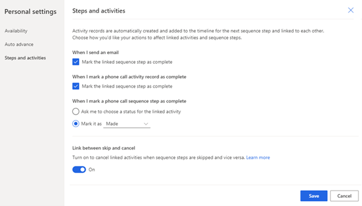     
 
5.	Save and close the settings.

### See also

[Prioritize sales pipeline through work list](prioritize-sales-pipeline-through-work-list.md)

[!INCLUDE[footer-include](../includes/footer-banner.md)]
