# Premium auto capture

Premium auto capture provides suggestions to create contacts (in addition to capturing emails and meetings), based on communications by reducing overall time spent on these tasks and enabling sales personnel to focus on generating revenue.

## Provide consent

When administrator enables premium auto capture, you need to provide consent  to allow Dynamics 365 Sales to access your Outlook data so that auto capture can provide suggestions on activities and contacts. You can provide consent through one of the following:
•	[Timeline](#through-timeline)
•	[Relationship assistant section](#through-relationship-assistant-section)
•	[Personal settings](#through-personal-settings)

### Through Timeline

1.	Sign in to Dynamics 365 Sales Hub app.

2.	From the site map, select an entity. For example, **Opportunities**.

3.	Select a record from the list. For example, Interest shown in AX27.

    > [!div class="mx-imgBorder"]
    > 

4.	On the **Timeline**, select **Allow access** to provide consent.

    > [!div class="mx-imgBorder"]
    > 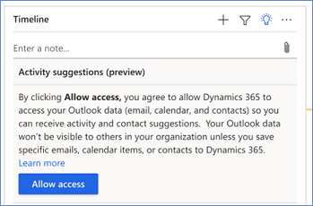 

    After you provide your consent, premium auto capture gathers the relevant suggestions, such as contacts and activities.

### Through Relationship assistant section

1.	Sign in to Dynamics 365 Sales Hub app.

2.	From the site map, select an entity. For example, **Dashboard**.

3.	On the **Relationship Assistant** section, select **Turn on suggestions**.
 
4.	On **Turn on activity and contact suggestions** message, select **Allow access** to provide consent.
 
    > [!div class="mx-imgBorder"]
    >  

    After you provide your consent, the auto capture gathers the relevant suggestions, such as contacts and activities.

### Through Personal settings

1.	Sign in to Dynamics 365 Sales Hub app.

2.	From the change area, select **Sales Insights settings**.

3.	From the site map, select **Sales Insights** > **Personal settings** > **Productivity intelligence** > **Auto capture**.

<!-- complete this section -->

## Manage activity suggestions on Timeline

When you open a record of an entity, the **Timeline** displays the activity suggestions, such as emails and meetings, that are available for the record. Based on the communication captured from your Microsoft Exchange, the suggestions are visible only to you. These suggestions are available for you to review and save for other users to view. You can also dismiss and edit suggestions to make sure you capture the right information in the right place. 

> [!div class="mx-imgBorder"]
> 

By default, a single suggestion is displayed. Select **Show more** and the suggestions are expanded to display up to three suggestions. 

If you have more than three suggestions, the **Show all** option is displayed. Select **Show all** to view all the available suggestions.

> [!div class="mx-imgBorder"]
> 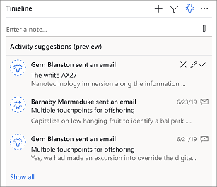

-	**Save**: Select this option to add a suggestion as an activity on the **Timeline** wall of a record. Once added, other users in your organization can view this suggestion for the record. For example, you opened an opportunity **Interest shown in AX27** and observed that there are few suggestions available under it on the **Timeline**. Corresponding to **Gern Blanston sent an email** suggestion, select save icon. The suggestion is saved as **Gern Blanston sent an email** activity on the **Timeline** wall and is visible for other users who access this opportunity.

    > [!div class="mx-imgBorder"]
    > 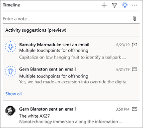 

-	**Edit**: Select this option to add a suggestion as an activity for another record. When you edit and save the suggestion, it will be available as activity on the **Timeline** wall of the added record and is visible for users who access that record. For example, you opened an opportunity **Interest shown in AX27**. On the **Timeline**, you observe that **Gern Blanston sent an email** suggestion is more appropriate for **Computer Appliances** opportunity than the suggested opportunity. Select the edit option and use the **Regarding** lookup entity to choose **Computer Appliances**. 
 
    > [!div class="mx-imgBorder"]
    > 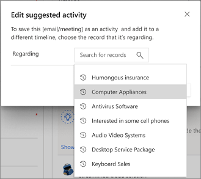 

    Save the change and a confirmation message displays specifying that the activity is added to the **Computer Appliances** opportunity.

-	**Dismiss**: Select this option if you do not want a suggestion to be added as an activity on the **Timeline** wall. For example, you opened an opportunity **Interest shown in AX27**. On the **Timeline**, you observe that **Gern Blanston sent an email** suggestion is not appropriate for regarding field that it is associated with and you want to ignore. Select the dismiss option and a confirmation message is displays. Select **OK** and the suggestion is ignored from the list. 

## Manage activity suggestions through grid

The activity suggestions grid provides a single view for all the captured activities based on your communications. This ensures that the information is not lost on **Timeline** and helps you keep track of activity suggestions at one location (**Activity suggestion** grid). The activity list consists of emails and meetings that are fetched and captured from your Outlook data by premium auto capture. 

> [!div class="mx-imgBorder"]
> 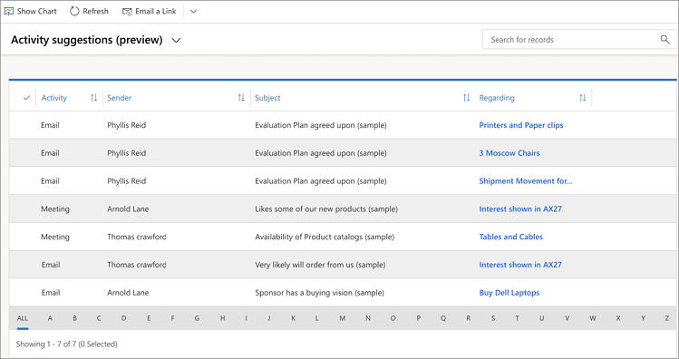

The Activity suggestions grid consists of the following columns:

-	**Activity**: This column specifies the type of activity, such as email or meeting. 

-	**Sender**: This column specifies the name from whom the activity is received.

-	**Subject**: This column specifies the subject line of the activity.

-	**Regarding**: This column specifies the record for which the activity can be added.

Also, **Relationship assistant** displays a card to alert you when new activity suggestions are available. Select **Open activity suggestions** to open the **Activity suggestions** grid and perform appropriate actions on the suggestions.

> [!div class="mx-imgBorder"]
> 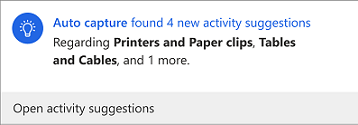

You can perform the following actions on the suggested activities:

-	Save, edit, or delete an activity

-	Save or delete multiple activities

### Save activity

To save an activity to be visible on the **Timeline** wall for a record for other sales personnel, follow these steps:

1.	Sign in to Dynamics 365 Sales Hub app.

2.	From the site map, select **Auto capture (preview)** > **Activity suggestions**.

    A list of available activities displays.

    > [!div class="mx-imgBorder"]
    > 

3.	Select an activity. In this example, we are selecting an email from **Phyllis Reid** that is related to **Printers and Paper clips**.

    > [!div class="mx-imgBorder"]
    > 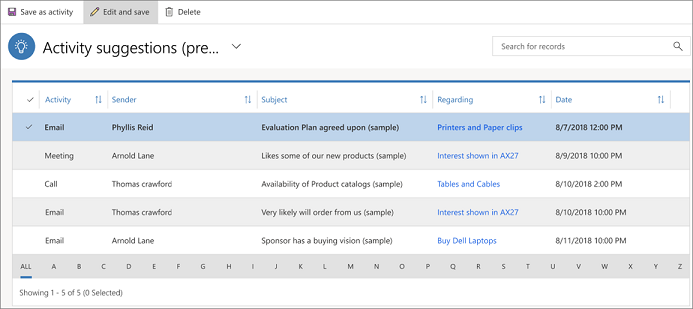

4.	On the toll bar, select **Save as activity**. A confirmation dialog opens.

    > [!div class="mx-imgBorder"]
    > 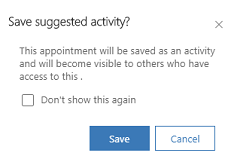
 
5.	Select **Save**.

    The activity suggestion is removed from the suggestions list and added to the **Timeline** wall of the regarding record, making it visible for everyone who has access to the record. 

### Edit activity

After reviewing the activity suggestion, you identify that the activity suggestion does not belong to the assigned **Regarding** entity. You can change regarding entity by selecting the appropriate entity for which the activity belongs. Follow these steps:

1.	Sign in to Dynamics 365 Sales Hub app.

2.	From the site map, select **Auto capture (preview)** > **Activity suggestions**.

    A list of available activities displays.

    > [!div class="mx-imgBorder"]
    > 
 
3.	Select an activity suggestion. In this example, we are selecting an email from **Phyllis Reid** that is related to **Printers and Paper clips**.

    > [!div class="mx-imgBorder"]
    > 

4.	Select **Edit and save**. A dialog opens to select the new regarding entity.

5.	Use the **Regarding** lookup entity to select a regarding entity for the activity suggestion. In this example, we are selecting **Computer Appliances** regarding.

    > [!div class="mx-imgBorder"]
    >  

6.	Select **Save**.

    The activity suggestion is removed from the suggestions list and added to the timeline wall of the regarding record, making it visible for everyone who has access to the record.

### Delete activity

Delete activity suggestions if you do not want them to add as activities on Timeline. Follow these steps:

1.	Sign in to Dynamics 365 Sales Hub app.

2.	From the site map, select **Auto capture (preview)** > **Activity suggestions**.

    A list of available activities displays.

    > [!div class="mx-imgBorder"]
    > 
 
3.	Select an activity suggestion. In this example, we are selecting an email from **Phyllis Reid** that is related to **Printers and Paper clips**.

    > [!NOTE]
    > You can select multiple activity suggestions to delete.

    > [!div class="mx-imgBorder"]
    > 
 
4.	Select **Delete**. A confirmation dialog opens.

    > [!div class="mx-imgBorder"]
    > 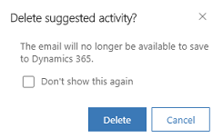
 
5.	Select **Delete**.

    A success message is displayed at the bottom of the screen and the activity suggestion is deleted from the suggestions list.
 
## Manage contact suggestions through grid

The Contact suggestions grid provides a single view with suggestions to create contacts that are captured based on your communications. The list consists of contacts that are captured from your Outlook data, such as To, From, email message, and signature of captured activities.  

> [!div class="mx-imgBorder"]
> 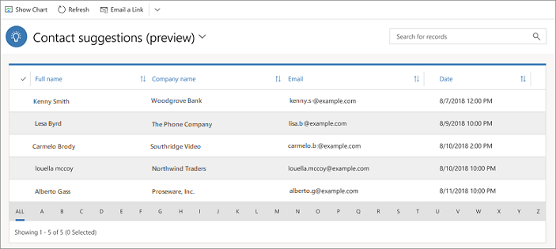

The Contact suggestions grid consists of the following columns:

-	**Full Name**: This column specifies the full name of the suggested contact.

-	**Company Name**: This column specifies the name of the company to which the contact suggestion is associated.

-	**Email**: This column specifies the email address of the contact suggestion.

Also, **Relationship assistant** displays a card to alert you when a contact suggestion is available. Select **Open contact suggestions** to open the **Contact suggestions grid** and perform appropriate actions on the suggestions.

> [!div class="mx-imgBorder"]
> 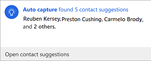
 
You can perform the following actions on the suggested contacts:

-	Edit, save, or delete a contact

-	Save or delete multiple contacts

### Save contact

To save a contact, follow these steps:

1.	Sign in to Dynamics 365 Sales Hub app.

2.	From the site map, select **Auto capture (preview)** > **Contact suggestions**.

    A list of available contact suggestions is displayed.

    > [!div class="mx-imgBorder"]
    > 

3.	Select a contact. In this example, we are selecting **Joel Mccoy**.

    > [!div class="mx-imgBorder"]
    > 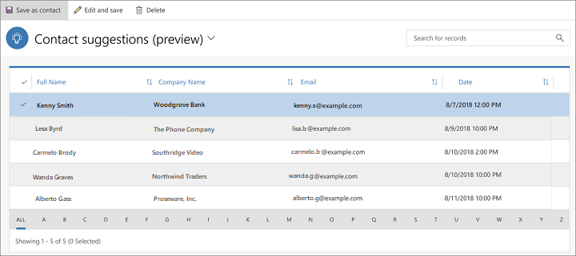

4.	Select **Save as contact**. A confirmation dialog opens.

    > [!div class="mx-imgBorder"]
    > 
 
5.	Select **Save**. 

    A success message is displayed at the bottom of the screen and the contact is created in your Dynamics 365 organization.
 
### Edit contact

After reviewing the contact suggestion, you identify that some information of the contact suggestion needs update. You can update the information and save. Follow these steps:

1.	Sign in to Dynamics 365 Sales Hub app.

2.	From the site map, select **Auto capture (preview)** > **Contact suggestions**.

    A list of available contact suggestions is displayed.

    > [!div class="mx-imgBorder"]
    > 

3.	Select a contact. In this example, we are selecting **Joel Mccoy**.

    > [!div class="mx-imgBorder"]
    > 

4.	Select **Edit and save**. A dialog opens to edit the contact information.

    > [!div class="mx-imgBorder"]
    > 

5.	Edit the contact information as required and select **Save**. 

    The contact is created and saved in your Dynamics 365 organization, and a confirmation message is displayed at the bottom of the screen.

### Delete contact

Delete contact suggestions if you do not want them to add to your contact list. Follow these steps:

1.	Sign in to Dynamics 365 Sales Hub app.

2.	From the site map, select **Auto capture (preview)** > **Contact suggestions**.

    A list of available contact suggestions is displayed.

    > [!div class="mx-imgBorder"]
    > 

3.	Select a contact. In this example, we are selecting **Joel Mccoy**.

    > [!NOTE]
    > You can select multiple contact suggestions to delete.

    > [!div class="mx-imgBorder"]
    > 

4.	Select **Delete**. A confirmation dialog opens.

    > [!div class="mx-imgBorder"]
    > 
 
5.	Select **Delete**.

    A success message is displayed at the bottom of the screen and the contact is deleted from the suggestions list.

### See also

[Enable and configure auto capture](configure-auto-capture.md)

[Basic auto capture](free-auto-capture.md)