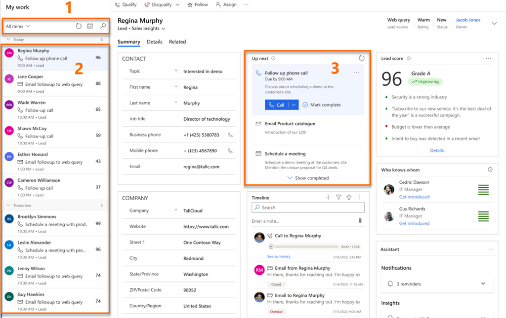
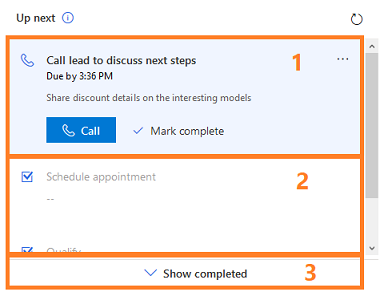

# Prioritize your sales pipeline by using the work list 

[!INCLUDE [cc-beta-prerelease-disclaimer](../includes/cc-beta-prerelease-disclaimer.md)]

> [!IMPORTANT]
> - [!INCLUDE[cc_preview_features_definition](../includes/cc-preview-features-definition.md)]  
> - [!INCLUDE[cc_preview_features_expect_changes](../includes/cc-preview-features-expect-changes.md)]
> - Microsoft doesn't provide support for this preview feature. Microsoft Technical Support won’t be able to help you with issues or questions. Preview features aren't meant for production use and are subject to a separate [supplemental terms of use](https://go.microsoft.com/fwlink/p/?linkid=870960).

During their workday, sellers need to juggle multiple tasks as they work on multiple leads and opportunities. As a result, it can be hard for them to plan and prioritize their customer-facing activities. The work list in the Sales accelerator for Dynamics 365 Sales Insights helps sellers prioritize their time and effort to ensure that important leads and opportunities aren't left behind. 

The Sales accelerator work list gives sellers the following capabilities:

- Manage and view records&mdash; leads and opportunities&mdash;that include the activities that are due to be performed that day, sorted by priority, and remove records after an activity has been completed. More information: [View my records through the work list](#view-my-records-through-work-list)

- Manage the work list by sorting, filtering, and grouping all records. More information: [Filter records in the work list](#filter-records-in-work-list)

- View relevant information about customers, such as personal details, past and future activities, and the related entities for each record. More information: [Understand the Up next widget](#understand-the-up-next-widget)

- Communicate with customers through phone and email. More information: [Connect with customers by using a record or the Up next widget](connect-with-customers.md)

- Add manual activities to records in addition to those that have been defined in a sequence, if an ad-hoc activity is required. More information: [Add manual tasks to records](#add-manual-tasks-to-records)

> [!NOTE]
> The work list is configured by a sales manager who defines the sequence of activities for leads and opportunities by using the sequence designer. More information: [Create and manage sequences](create-manage-sequences.md)

## Prerequisites

Review the following prerequisites before you start using work lists:

- The Sales accelerator feature is installed in your organization and your role is assigned to access work lists. More information: [Enable and configure the Sales accelerator](enable-configure-sales-accelerator.md)

- A softphone and an email server are configured for your security role. 

- Dynamics 365 Channel Integration Framework version 1 is installed and a channel provider is configured for your Dynamics 365 organization. More information: [Integrate a sample softphone dialer with Dynamics 365 Sales](integrate-sample-softphone.md)

- (Optional) [Predictive lead scoring](configure-predictive-lead-scoring.md) and [predictive opportunity scoring](configure-predictive-opportunity-scoring.md) are enabled, and models have been generated for your organization. Contact your administrator to enable these features.

## View my records by using the work list

The work list displays a list of records that are assigned to you or to the security role you're associated with. The records display activities that are due for the current date&mdash;or pending from previous dates&mdash;that were created manually or through a sequence. This helps you to access all records that include activities in one place, instead of navigating across multiple forms in the application. A sales manager can configure and determine the entities (leads and opportunities) to display to you in the work list. The top of the record in the work list will always be the next best customer with the highest prediction score.

**To view the work list**

1. Sign in to the Dynamics 365 Sales Hub app, and go to **Change area** > **Sales**.

2. From the site map, under **My Work**, select **Sales accelerator (preview)**. 

    The work list page opens, as shown in the following example.

    > [!div class="mx-imgBorder"]
    > 

    | Number | Feature | Description |
    |--------|---------|-------------|
    | 1 | **Filter, sort, group records** | You can filter, sort, and group the records that you want to view in the list to quickly identify the customers to contact. More information: [Filter records in work list ](#filter-records-in-work-list) By using the lookup icon, you can search for a specific record by using the record name. Also, you can filter the records according to the due date: select the calendar icon, and then select **By Today** or **From Tomorrow**. Refresh the list after you complete an activity on a record and the record will be removed from the list.|
    | 2 | **Records list** | Displays a list of records that are assigned to you or to a security role that you're part of. You must perform and complete the activities on these records from the current date and from previous dates. Each record displays the name of the record, primary contact name, next best action, priority scoring, and entity name. Select the record to view more information. You can perform the specified activity for the record by selecting the activity icon in the record. More information: [Connect with customers by using a record or the Up next widget ](connect-with-customers.md) When you complete an activity on the record, select the refresh icon, the list will be refreshed, and the record will be removed from the list. **Note**: The list displays records for a month from the current date. The records that are older than 30 days are automatically removed and won't be displayed.|
    | 3 | **Up next widget** | Displays the next best action that you can perform on a record for the given date. More information: [Understand the Up next widget](#understand-the-up-next-widget)|
    
## Filter records in the work list

Use filters to prioritize the records in the work list so you can reach customers at the right time. The work list provides the following filtering mechanisms to prioritize records:

- [Filter by](#filter-by)

- [Group by](#group-by)

- [Sort by](#sort-by)

### Filter by

Filter the list by selecting the entity and activity types. When you select the filters, the list is refreshed to display the filtered records.
    
- The **Entity type** filter options are **Lead** and **Opportunity**. You can select both options to view all records, or you can select an individual entity to view only the records that belong to that entity.

    You must select at least one option to display relevant records in the work list. If no records match your selected entity type, an empty list is displayed.

    By default, all filter options are selected.

- The **Activity type** filter options are **Call**, **Email**, and **Task**. You can select all or any specific option to filter the records to display in the work list.

    You must select at least one option to display relevant records in the work list. If no records match your selected activity type, an empty list is displayed.

    By default, all filter options are selected.

For example, when you select the entity type as **Lead** and the activity type as **Call**, the work list displays only the lead records that include call activities.<!--Edit okay?-->

### Group by

Organize records into groups by selecting a group type. In the header, you can see the total number of records available in each group. You can select the group type as:

- **Due time**: When you select this option, the records in the work list are grouped according to the time that an activity must be completed by. 

    For example, there are ten records in your work list. The number of records for which you need to complete activities within the due time are as follows: three for today, four from yesterday, and three from this week. When you select the **Due time** option, the records are grouped as **Today**, **Yesterday**, and **Last 7 days**. 

    By default, **Due time** is selected to group the records.

- **Entity type**: When you select this option, the records in the work list are grouped into **Leads** and **Opportunities**.

- **Activity type**: When you select this option, the records in the work list are grouped into **Call**, **Email**, and **Task** activity types.

- **Activity source**: When you select this option, the records in the work list are grouped into the source of the activities: **Sequence** and **Manual**.

### Sort by

Sort records by choosing a sort option. In the header, you can see the total number of records available in each sort order. You can select the sort option as:

- **Due time**: When you select this option, the records in the work list are sorted according to the due time before which an activity must be completed. You can select the sort order as: 

    - **Oldest on top** to view the records that include activities that have passed their due date, sorted from the longest time past due to the shortest.

    - **Newest on top** to view the records that include activities with the most recent due times, sorted from the most recent to the oldest.

    For example, there are ten records available in your work list. The number of records for which you need to complete the activities within the due time are as follows: three for today, four from yesterday, and three from this week. When you select the **Due time** option to sort by and **Newest on top** for the sort order, the records are sorted from the newest to oldest activity completion date into **Today**, **Yesterday**, and **Last 7 days**.

    By default, **Due time** and **Newest on top** are selected for sort order.

- **Priority score**: When you select this option, the records in the work list are sorted according to the priority score assigned to each task. You can select the sort order as:

    - **Lowest on top** to view the records in ascending order, with the lowest score on top.

    - **Highest on top** to view the records in descending order, with the highest score on top.

    For example, you have records with priority scores 95, 92, 89,45, 54, and 73. When you select the **Priority score** option to sort by and **Highest on top** for the sort order, records are sorted by priority in descending order, with the record that has highest score (95) on top.

- **Name**: When you select this option, the records in the work list are sorted according to the record name. You can select the sort order as **A to Z** to view the records in ascending order or **Z to A** to view them in descending order.

## Understand the Up next widget

Using the **Up next** widget, you can view and perform actions on activities on a record. The widget displays the current activity, upcoming activity, and completed activities. You can add these activities to a record manually or by using a sequence:

- In a sequence, a sales manager creates activities and applies them to the record according to business requirements. The activities in the sequence are displayed in the **Up next** widget.

- For manual tasks, you or a sales manager can create a task on the timeline. The task is displayed in the **Up next** widget as an activity, depending on its due time. This activity is available to you and other sellers who have access to the record.

The following image shows an example of the **Up next** widget.

> [!div class="mx-imgBorder"]
> 

1. **Current activity**: The current activity is a task that you must complete or skip to go to the next activity, which moves the record closer to completion. To perform an action such as making a phone call or sending an email, select the action icon displayed in the activity. More information: [Connect with customers by using a record or the Up next widget ](connect-with-customers.md)

    After you complete the action, select **Mark complete**, and the activity is closed and moved automatically to completed items and is displayed on the timeline.

    You can choose to skip the activity if you think it's not relevant to the record or you don't want to perform the action. Select **More options**, and then select **Skip**. The activity is skipped and moved to completed items.

2. **Upcoming activity**: The upcoming activity is view-only, and you can't perform an action. The upcoming activity is displayed so you know what activity will appear next when you complete the current activity.

3. **Completed activities**: The completed activities are the activities that are marked as complete or skipped for a record.
    
    To view the completed activities list, select **Show completed**. The section expands to display the list of completed activities with details such as whether the activity was completed or was it skipped, with date and time. You can't perform any actions on these tasks; they're view-only. The following screen is an example of an expanded section of completed items.

    > [!div class="mx-imgBorder"]
    > 

## Add manual tasks to records

Using the sequence, your sales manager can define activities for you such as email, phone calls, and tasks. To meet business requirements, you might have to add extra activities to a lead or an opportunity. You can manually add activities for leads and opportunities to appear in the **Up next** widget in addition to activities defined in the sequence for a given day. The manual activities include email, phone calls, and tasks.

The characteristics of manual activities are similar to an activity defined in a sequence. Sellers must perform the task and mark it as complete. Then the activity will be moved to the list of completed activities in the **Up next** widget. A sales manager or you, as a seller, can add the manual activity to the records that you or your security role owns.

**To add a manual activity**

1. Sign in to the Dynamics 365 Sales Hub app, and go to **Change area** > **Sales**.

2. From the site map, under **My Work**, select **Sales accelerator (preview)**. 

3. Select the record for which you want to add the manual task from the work list.

4. In the **Timeline** section, select the plus (+) icon.

    >[!NOTE]
    >Only **Email**, **Phone call**, and **Task** activities will be displayed in the **Up next** widget.

5. Select and configure the activity that you want to add to the record.

6. Save and close the activity.

The activity is added to the record and displayed in the **Up next** widget, based on its due date.

### See also

[What is the Sales accelerator?](sales-accelerator-intro.md)  
[Create and manage sequences](create-manage-sequences.md)
