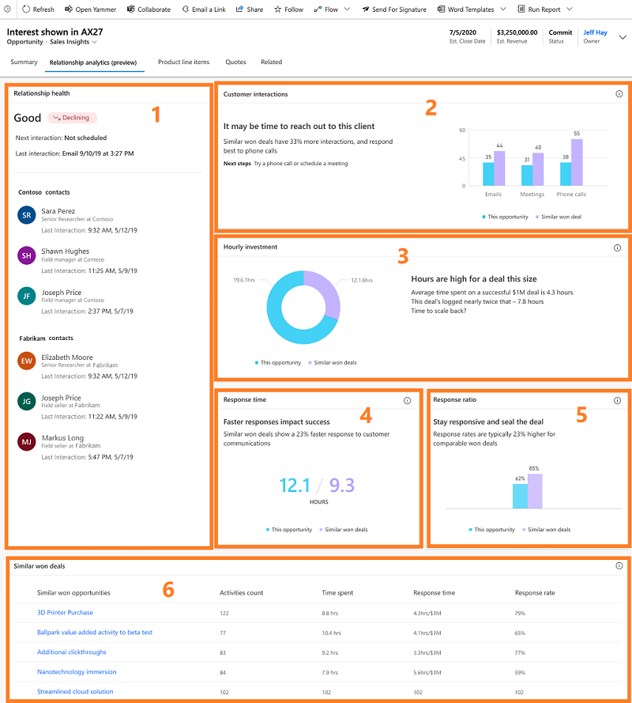

# Use Relationship analytics to gather KPIs 

We're introducing a feature called *Relationship analytics*. It enables [!INCLUDE[pn-dyn-365-sales](../includes/pn-dyn-365-sales.md)] to assemble relevant information from throughout its database to create a graphical display of key performance indicators (KPIs) and  activity histories. The graphical display shows KPIs and activity histories for any contact, opportunity, lead, or account. The feature also calculates the overall health and trend of each of your business relationships.  

 Relationship analytics help sales professionals and managers answer questions such as:  

-   Which opportunities should I spend my time on?  

-   Do we have a good relationship with the customer?  

-   How much time have we spent with our customer?  

-   When was the last time we contacted them?  

-   When is the next time we will contact them?  

-   How many emails and meetings have we exchanged?  

-   What is the customer's response rate?  

-   How many activities were initiated by the customer?  

-   How long does it take our team to respond?  

   

## Get the big picture with relationship analytics in list views  

Relationship analytics provides an activity history, KPIs, health score, and health trend for contact, opportunity, lead, and account records. The most important KPIs (including your team's previous and next activity) are shown in the list view for each of these record types, so you can get an overview and sort the list by them.  

  

   

## Identify critical opportunities with the relationship pipeline view  

The relationship pipeline view provides a bubble chart that gives you a quick overview of the health, close date, and estimated revenue for your upcoming opportunities. To view it:  

1.  Go to **Sales** > **Opportunities**.  

2.  From the drop-down menu, select **My Open Opportunities by Relationship**. 
     

3.  From the command bar, select **Show Chart**. 
      

4.  At the top of the charts pane, open the drop-down list and select **Relationship Pipeline**.   
      
    The relationship pipeline chart appears. 
     

Each upcoming opportunity is plotted as a bubble on the relationship pipeline chart. The size of each bubble indicates the estimated revenue of the opportunity. Health is plotted on the y-axis, so the higher up the bubble appears on the chart, the higher its health.  Estimated close date is plotted on the x-axis, so opportunities on the left side of the chart may expire soon. So, the most critical opportunities are those with the largest bubbles located near the bottom-left corner, while the most promising opportunities are near the top of the chart.  

Hover over a bubble to see the name of the opportunity and other details. Select a bubble to open its opportunity record. The color of each bubble indicates relationship health: green for good, yellow for fair, red for poor, and gray for zero (which indicates that the results have not been calculated, or that there is not enough data).  

  

The relationship pipeline chart relies on several values being available for each opportunity record, but in some cases, these values may be missing for some or all opportunities. This could be due to an oversight, or it could be because you don't use these fields at your organization. The chart represents missing values as follows:  

-   Opportunities that don't have a relationship health value are gray, with a value of zero. They are plotted at the bottom of the chart.  

-   Opportunities with an estimated close date in the past are not shown.  

-   Opportunities without an estimated close date are not shown.  

-   Opportunities without an estimated revenue value show a value of zero. They are plotted as very small bubbles.  

   

## Analyze the health and activity history of a customer or opportunity  
You can view complete relationship analytics for an individual record, including graphs, KPIs, email interaction history, full activity history, and relationship health. These details are available in two expandable sections when you view an individual record, such as a specific opportunity. 

 
  

**Relationship health and trend.** Shows your overall relationship health with the customer and includes the recent trend. 

  - **Next interaction.** Shows the date and time for the next activity that is scheduled for the record. If you have access to that activity, then you'll also see its name or subject. The next and last interactions are only shown for opportunity and lead entities.

  - **Last interaction.** Shows the date and time for the last activity that you completed for the record.  If you have access to that activity, then you'll also see its name or subject. The next and last interactions are only shown for opportunity and lead entities.

**All interactions.**  Shows the total number of activities initiated by members of your team and by the customer. The activities are broken down by general type such as email, meetings, and phone calls. 

**Time spent.** Shows the relative amount of time spent on activities related to the record, including <!--time spent by you,--> your team and the customer. For each activity where more than one team member was involved, the time spent on that activity is multiplied by the number of your team members that were present. But time spent by your customer is counted just once, even if more than one member of the customer's team was present.

**Email engagement.** Summarizes how your customer has interacted with the followed emails your team has sent to them. Unfollowed emails are not included, so you must enable and use the email-engagement feature to see any information here. [!INCLUDE[proc_more_information](../includes/proc-more-information.md)] [View message interactions with email engagement](email-engagement.md).

**Most contacted.** Provides statistics about the customer who are most contacted by your team. These contacts may include  [!INCLUDE[pn_dynamics_crm](../includes/pn-dynamics-crm.md)] users who are heavily involved with the customers even if they are not part of the record’s users.

**Most contacted by.** Provides statistics about your team who most contacted customers. These contacts may include customers who are heavily involved with your team even if they are not part of the record’s users.

**Relationship activities.** Provides a detailed look at activities over 90 days, broken down by date and activity type, such as emails sent, email received, meetings sent, meetings received, phone calls made, and phone calls received. 

## View similar opportunities 

[!INCLUDE [cc-beta-prerelease-disclaimer](../includes/cc-beta-prerelease-disclaimer.md)]

> [!IMPORTANT]
> - [!INCLUDE[cc_preview_features_definition](../includes/cc-preview-features-definition.md)]  
> - [!INCLUDE[cc_preview_features_expect_changes](../includes/cc-preview-features-expect-changes.md)]
> - Microsoft doesn't provide support for this preview feature. Microsoft Technical Support won’t be able to help you with issues or questions. Preview features aren't meant for production use and are subject to a separate [supplemental terms of use](https://go.microsoft.com/fwlink/p/?linkid=870960).

The enhanced relationship analytics is provided to you as a preview and administrator must enable before you start using. To learn more, see **step 6** in [Configure Relationship analytics](configure-relationship-analytics.md).

The current relationship analytics provides information such as graphs, KPIs, email interaction history, full activity history, and relationship health. This information doesn't offer a comparison with similar deals that are won, what is working, and what isn’t working in the deal’s engagement practices.

As a seller, it's important for you to understand what is working better for a deal and learn about the best engagement practices from similar deals that are won in the past. The enhanced relationship analytics displays comparable information on the KPIs, graphs, activity history, and relationship health with similar deals that are won. Also, a list of similar deals that are won is displayed at the bottom. By opening the deals, you can learn what has worked, and what didn't work and implement these learnings in the current deal to close.

The following screen is an example of enhanced relationship analytics:

> [!div class="mx-imgBorder"]
> 

1. **Relationship health**: Shows your overall relationship health with the customer and includes the recent trend for the deal. 
  
    - **Next interaction.** Shows the date and time for the next activity that is scheduled for the record. If you have access to that activity, then you'll also see its name or subject. The next and last interactions are only shown for opportunity and lead entities.
    - **Last interaction.** Shows the date and time for the last activity that you completed for the record. If you have access to that activity, then you'll also see its name or subject. The next and last interactions are only shown for opportunity and lead entities.
  
    Also, show the top three most active contacts for the deal from you and your customer's organizations with the last interaction time details.

2. **Customer interactions**: Shows the latest insight on average interactions with customers compared to similar deals that are closed as won. Also, suggest the next best interaction that you can do with this deal. 

    The graph displays the total number of activities initiated by members of your team and by the customer compared with the similar deals. The activities are broken down by general type such as email, meetings, and phone calls. 

3. **Hourly investment**: Shows the latest insight with average time spent on similar deals that are closed as won compared to the current deal. Also, suggest the next best action that you can do with this deal. 

    The graph displays the average time spent in interacting with customers in similar deals compared with the current deal.

4. **Response time**: Shows the latest insight on average time (in hours) take to respond to customer queries compared to similar deals that are closed as won. Also, suggest the next best action that you can do with this deal.

    The graph displays how fast you and your team is responding to customers in the current deal compared with similar deals.

5. **Response ratio**: Shows the latest insight on the rate at which the response is given to customers compared to similar deals that are closed as won. Also, suggest the next best action that you can do with this deal.

    The graph displays the percentage of the rate at which you and your team are responding to customers in the current deal compared with similar deals.

6. **Similar won deals**: Shows the list of similar opportunities that are closed as won deals. The columns display activities count, time spent, response time, and response ration for each opportunity. You can select and open an opportunity to view what has worked better in the deal to close as won and implement these observations in the current deal to close as won. The list refreshes every seven days.

   

## How relationship analytics values are calculated  

Relationship analytics values are derived from a careful analysis of the many related people, activities, companies, appointments, and emails stored on your [!INCLUDE[pn-dyn-365-sales](../includes/pn-dyn-365-sales.md)] and [!INCLUDE[pn_Microsoft_Exchange](../includes/pn-microsoft-exchange.md)] servers. The process for finding and calculating the scores is summarized in the following flow chart.  

   

The following sections describe the function of each block in the flow chart.  

   

### Step 1: Find contacts of interest for the record  

Relationship analytics is concerned with activities performed by the *people* associated with a given record. The first step in finding the relevant activities is to find out which contacts to include in the analysis. Relationship analytics also provides time-spent values for you, your team, and your customer's team, so the identity of who did what is important throughout the process.  

This table shows how the system finds contacts that have an interest in each type of record. Later, the system will look for activities associated with each contact and decide which of those activities should be included in KPI calculations for that record.  

|             | Internal contacts  |  External contacts |
|-------------|--------------------|--------------------|
|   Account   | -   Any [!INCLUDE[pn-dyn-365-sales](../includes/pn-dyn-365-sales.md)] user.|-   The **Primary Contact** for the account. -   All contacts in the account's **Contacts** list. |
| Opportunity | -   The **Owner** of the opportunity record. -   All users in the opportunity's **Sales Team** list. | -   The customer **Contact** listed for the opportunity. -   All contacts in the opportunity's **Stakeholders** list. -   The primary contact for the related **Account** record. |
|    Lead     | -   The **Owner** of the lead record. | -   Contact information in the lead's **Contact** section. -   All contacts in the lead's **Stakeholders** list. |
|   Contact   | -   Any [!INCLUDE[pn-dyn-365-sales](../includes/pn-dyn-365-sales.md)] user. | -   Contact information in the contact's **Contact** section.|

   

### Step 2: Link activities to the record  

Once the system has identified contacts of interest, it looks for activities associated with each contact and then identifies which activities to include in the relationship analytics for the record you are looking at. It identifies relevant activities as follows:  

- **Regarding records.** Any activity that has its **Regarding** value set to the current record is explicitly assigned to it and will always be included in its relationship analytics, even if that activity isn't also associated with a contact of interest.  

- **Email messages.** Includes all metadata from messages where the email address (or a reference to the contact record) for a contact of interest is shown in the **To**, **Cc**, or **From** field.  

- **Appointments.** Includes all metadata from appointments where a contact of interest is shown in the **Required** or **Optional** fields.  

- **Phone calls.** Includes all calls where  a contact of interest is shown in the **From** or **To** fields.  

   

### Examples of how relevant activities are identified  

Here are a few examples of how the rules outlined in the previous sections might be applied:  

-   If you are assigned to a lead and register a phone call activity with one of the stakeholders for that lead, then that phone call will be counted in the KPIs for that lead. Other users who call that same stakeholder, but who are not assigned to the lead, will not have their calls counted in the KPIs for that lead.  

-   If you are on the sales team for an opportunity and send an email regarding that opportunity to one of its stakeholders, then the metadata about that email will be counted in the KPIs for that account. An email from another user, who isn't on the team for that account, to that same stakeholder will not be counted for that opportunity.  

-   If you attend a meeting with the primary contact for an account, then the metadata about that appointment will be counted in the KPIs for that account and for that contact. If that account is also associated with an opportunity, the appointment will only count for that opportunity if you are also **Assigned** to that opportunity (or are on its **Sales Team**) and if the appointment is set as **Regarding** that opportunity.  

   

### Step 3: Compute relationship analytics KPIs  

After the system has found all the relevant activities, it's ready to calculate the KPIs and other analytics for each record. The following table summarizes the KPIs that are available.  

||Initiated or completed by your team|Initiated or completed by the customer's team|  
|-|-----------------------------------------|---------------------------------------------------|  
|Emails|Total number   Total time spent   Time line (number per week)   Number of replies|Total number   Total time spent   Time line (number per week)   Number of replies   Interaction results for followed emails (opens, attachment views, and link views)|  
|Appointments|Total number   Total time spent by your team (if several team members were present at an appointment, then the duration is multiplied by the number of  team members  present)  <!-- Total time spent by you (not multiplied by the number of team members) --> Time line (number per week)|Total number   Total time spent (not multiplied by the number of customer contacts that were present)   Time line (number per week)|  
|Phone calls|Total number   Total time spent   Time line (number per week)|Total number   Total time spent   Time line (number per week)|  
|Overall (all activities)|Total time spent|Total time spent|  

> [!NOTE]
> Email interaction statistics are only provided for *followed emails*, which requires you to use the *email engagement* feature. For more information about how to create and send followed emails, see [View message interactions with email engagement](email-engagement.md)  

 For KPIs that report <!--time spent by you,--> your team and your customer, the system finds durations by applying the rules outlined in the following table:  

|Activity type|Source of duration value|  
|-------------------|------------------------------|  
|Appointments|**Duration** field for the appointment record|  
|Calls|**Duration** field for the phone call record|  
|Emails|Estimated (2.5 minutes to read, 5 minutes to write)|  
|Other|**Duration** field for each record|  

> [!TIP]
> The time calculations for appointments are bit special. The details are given in the previous tables, but here's an example to illustrate it.  
> 
> If you hold an appointment where three members of your team (including you) meet with two members of your customer's team, and the appointment lasts for 30 minutes, then that appointment contributes to your time KPIs as follows:  
> 
> <!-- - **Time spent by me**: *30 minutes* (the appointment was 30 minutes) --> 
> - **Time spent by my team**: *90 minutes* (30 min. × 3 team members present)  
> - **Time spent by the customer**: *30 minutes* (time isn't multiplied by customer participants)  

   

### Step 4: Compute the relationship health and health trend  

The overall relationship health score is calculated by collecting the relevant activities, and weighting the activity by type (which enables your admin to set some types of activities to count more than others). The result is normalized to produce a health score between 0 and 100, and the health characterized as *good* (for a score of 60-100), *fair* (40-59) or *poor* (0-39).  

Please note:

- Health scores are computed for leads if they are in an active state. This stops once they reach a qualified or disqualified state.
- Health scores are computed for opportunities if the opportunity is open and ignored if it’s won or lost.
- Health scores are computed for contacts and accounts irrespective of their state.  

Your administrator can choose which types of activities are most relevant for your business. By default, all types of activities count the same, but your admin can increase or decrease the contribution of each type by up to 50 percent. In addition, your admin can choose how often salespeople should contact a customer (such as once a week); this setting also affects the health score.  

  

In addition to the absolute health score, the system also reports the general trend (up, down, or neutral) based on the number and value of recent activities. The trend direction updates relatively slowly, so it might take a little while to indicate a recent increase or decrease  in activity.  

### See also  

[Configure Relationship analytics](configure-relationship-analytics.md)

[GDPR for Dynamics 365 Sales Insights](embedded-intelligence-gdpr.md)

[Opt out of Relationship analytics (GDPR)](optout-relationship-analytics-gdpr.md)

[View and export KPI data (GDPR)](view-export-KPI-data-gdpr.md)

[Retrieve insights data using msdyn_RetrieveTypeValuesFromDCI action](retrieve-insights-data-msdyn-RetrieveTypeValuesFromDCI.md)