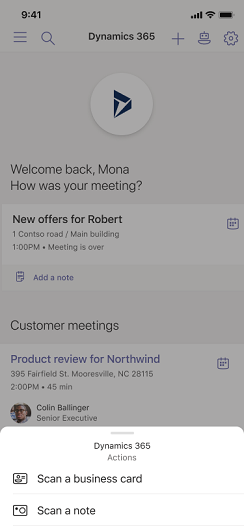
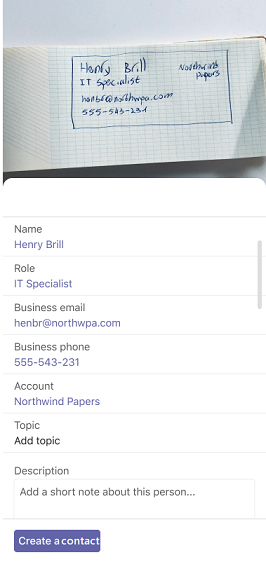
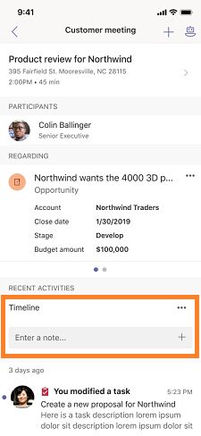
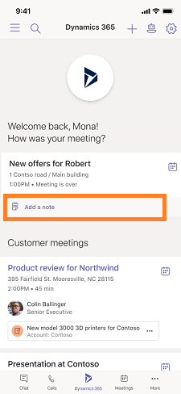

# Scan business cards and meeting notes

The Dynamics 365 assistant app provides an integrated scan option that allows you to quickly create or add notes, contacts, and tasks. For example, when you complete a meeting with a potential customer, using the scan option, you can scan the business card to create contact and handwritten notes to generate tasks and notes in Dynamics 365 Sales.

The following options are provided in the app to scan:

-	[Scan business cards](#scan-business-cards)

-	[Scan meeting notes](#scan-meeting-notes)

## Scan business cards

The scan business card option helps salespeople to quickly create contact in the app and then store in your Dynamics 365 Sales organization. When you scan a business card, it reads basic information from the card and populates data in fields of lead or contact records in Dynamics 365 Sales. This helps salespeople to spend their valuable time on important tasks then entering the data manually.

To scan a business card, follow these steps:

1.	Open the Dynamics 365 assistant app on Teams on mobile.

2.	On the home page, select **Add menu** (**+**). The options to scan slides from the bottom.

    > [!div class="mx-imgBorder"]
    > 

3.	Select **Scan a business card**. The mobile camera opens to scan the business card. 

    > [!div class="mx-imgBorder"]
    > 

4.	Face the camera towards the business card and ensure that the card remains with in the scan area (rectangle area). Snap a photo of the card. 

    The details of the cards such as name, role, business email, business phone, and account are captured on the creation form. 

    > [!div class="mx-imgBorder"]
    > 

5.	Review the captured information. If you find any information needs updates, you can select the field and update the information.

6.	Select **Create a contact** according to your requirement.

    The contact is created in your Dynamics 365 Sales organization.

## Scan meeting notes

The scan notes option in Dynamics 365 assistant app for Teams helps salespeople to quickly scan the handwritten meeting notes. When scanned, the application suggests actions based on the scanned notes such as creating task and adding notes.

You can open note scanner in two ways:

-	On the home page through **Add menu** (**+**). To learn more, see [Scan notes from add menu](#scan-notes-from-add-menu).

-	On a meeting page through **Add a note** or **Enter a note**. To learn more, see [Scan notes within a meeting](#scan-notes-within-a-meeting)

### Scan notes from add menu

1.	Open the Dynamics 365 assistant app on Teams on mobile.

2.	On the home page, select **Add menu** (**+**) and then select **Scan a note**. 

    > [!div class="mx-imgBorder"]
    > 

    The mobile camera opens to scan the handwritten notes.

3.	Face the camera towards the note and ensure that the note remains with in the scan area. Snap a photo of the note. 

    The application processes the captured details from the notes and displays in a scanned text area.

    > [!div class="mx-imgBorder"]
    > 

4.	Review the scanned text and is any changes are required, updated the information.

5.	Select **Suggest updates**. The application processes the scanned text and provides suggestions to add tasks and note.

    > [!div class="mx-imgBorder"]
    > 

6.	If no entity is suggested for the scanned note, an option set an entity is displayed. Select **Set regarding** and then add the relevant entity for the note. To learn more about adding entity, see [Regarding entity](working-with-meetings-teams.md#regarding-entity). 

7.	If you want to edit information of the tasks and notes, select **Edit** corresponding to task or note.

    -	For tasks, update the information such as description, adding due date, and changing priority and select **Done**.

    -	For note, edit the note with proper information and select **Done**.

8.	Select **Update**. 

    The suggested tasks and notes are added to the entity in your Dynamics 365 Sales organization.

### Scan notes within a meeting

1.	Open the Dynamics 365 assistant app on Teams on mobile.

2.	If the meeting is completed, select **Add a note**. 

    > [!div class="mx-imgBorder"]
    > 

    -OR-

    If the meeting not completed, open the meeting and select **Enter a note** on the **Timeline**.

    > [!div class="mx-imgBorder"]
    > 

3.	Select **Scan a note** and the mobile camera opens to scan the handwritten notes.

4.	Face the camera towards the note and ensure that the note remains with in the scan area. Snap a photo of the note. 

    The application processes the captured details from the notes and displays in a scanned text area.

    > [!div class="mx-imgBorder"]
    > 

5.	Review the scanned text and is any changes are required, updated the information.

6.	Select **Suggest updates**. The application processes the scanned text and provides suggestions to add tasks and note.

    > [!div class="mx-imgBorder"]
    > 

7.	If you want to edit information of the tasks and notes, select **Edit** corresponding to task or note.

    -	For tasks, update the information such as description, adding due date, and changing priority and select **Done**.

    -	For note, edit the note with proper information and select **Done**.

8.	Select **Update**. 

    The suggested tasks and notes are added to the entity in your Dynamics 365 Sales organization.

### See also

[Learn the basics](learn-basics-dynamics-365-application-teams.md)

[Install Dynamics 365 application on Microsoft Teams](install-assistant-application-microsoft-teams.md)