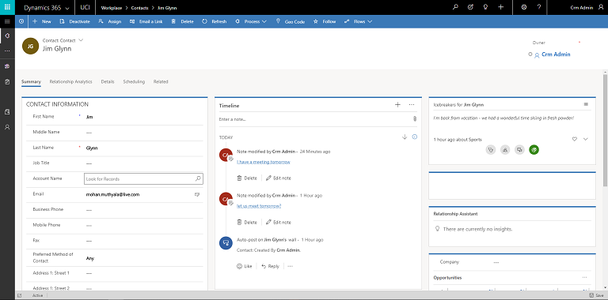
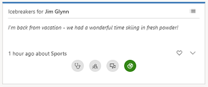
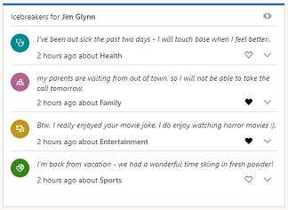

# Know conversation starters for your customers 

Applies to Dynamics 365 (online), version 9.0.2 

As a sales representative, you interact with many customers and it can be difficult to remember details about each, such as:
-  Latest entertainment event they attended.
-  Favorite sports or games they watch.
-  Vacations they had taken.

In [!INCLUDE[pn-crm-shortest](../includes/pn-crm-shortest.md)], **Talking points** provides a mechanism to automatically identify such conversation starters from your emails. The conservation starters include topics that are related to sports, vacation, family, and entertainment. These insights are available on the contact page. 

> [!NOTE]
> The system administrator configures which categories of Talking points should be displayed in your organization. 

<!--Note from editor: In the image, it looks like these talking points are in a section called Icebreakers rather than Takilng points, which could be confusing to a reader. Maybe this topic should mention the Icebreakers label.-->

> [!div class="mx-imgBorder"]
> 

> [!NOTE]
> If you do not see **Talking points** in the summary of the contact page, contact your administrator to enable it. [!INCLUDE[proc_more_information](../includes/proc-more-information.md)] [Configure and enable sales insights add-on](configure-enable-sales-insights-addon.md). <!--change image to change heading to Talking points-->

Let's say for example a customer sent you an email about a recent vacation in which he enjoyed skiing. Dynamics 365 analyzes the email and automatically categorizes it to sports. This text will appear in the Talking points tile in the sports category.  

> [!div class="mx-imgBorder"]
>   <!--change image to change heading to Talking points-->

Select each topic icon on the Talking points to navigate. This helps you to start a conversation with your customer and you can choose your customer’s area of interest. Select the  icon to view the complete message of a topic. If you want to view all the topics in the Talking points tile as a list, select the list icon.  

> [!div class="mx-imgBorder"]
>   <!--change image to change heading to Talking points-->

Talking points will display only the latest communication for each topic on the tile. For example, you received an email about a baseball game yesterday and you received another email today about football. The sports topic in the Talking points will be updated with the mail you received about football. 

## Privacy notice  

For specific privacy information about Dynamics 365 AI for Sales capabilities for sellers, see [Privacy notice](privacy-notice-seller.md).

### See also

[Configure and enable sales insights add-on](configure-enable-sales-insights-addon.md) <!--update with connection insights link-->