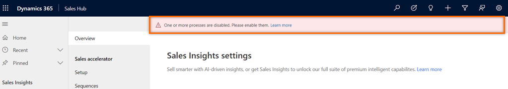
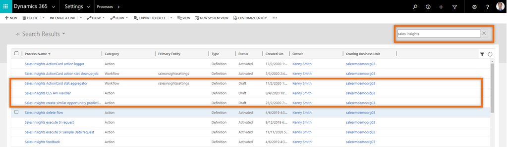

# Troubleshooting sales insights 

This article helps you troubleshoot and resolve issues related to the sales insights features.

## I'm unable to install or sales insights features aren't working as defined 

**Reason**   
This could happen when some of the processes that are related sales insights are disabled in your organization and a warning is displayed in the sales insights settings page as shown below:    
> [!div class="mx-imgBorder"]  
> 

**Resolution**    
To resolve this issue, enable the sales insights processes that are disabled. Follow these steps:   
1.  In your app, select the **Settings** icon, and then select **Advanced Settings**.   
    > [!div class="mx-imgBorder"]    
    >     
    The **Business Management** page opens.    
2.  On the navigation bar, select **Settings**, and then under **Process Center**, select **Processes**.    
3. On the **Processes** page, choose the **All Processes** view and the search for sale insights.    
    A list of sales insights processes is displayed.    
4. Verify that the statuses of all sales insights processes are in **Activated** state. In this example, you can see that the **Sales Insights ActionCard stat aggregator**, **Sales Insights CES API Handler**, and **Sales Insights create similar opportunity prediction model** processes are in draft state.  
    > [!div class="mx-imgBorder"]    
    >     
5. Select the processes that are in **Draft** state and activate.

[!INCLUDE[footer-include](../includes/footer-banner.md)]
