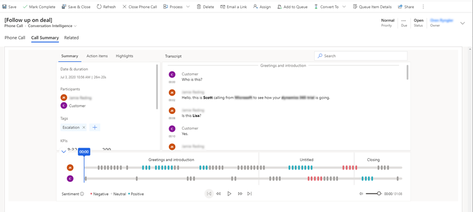
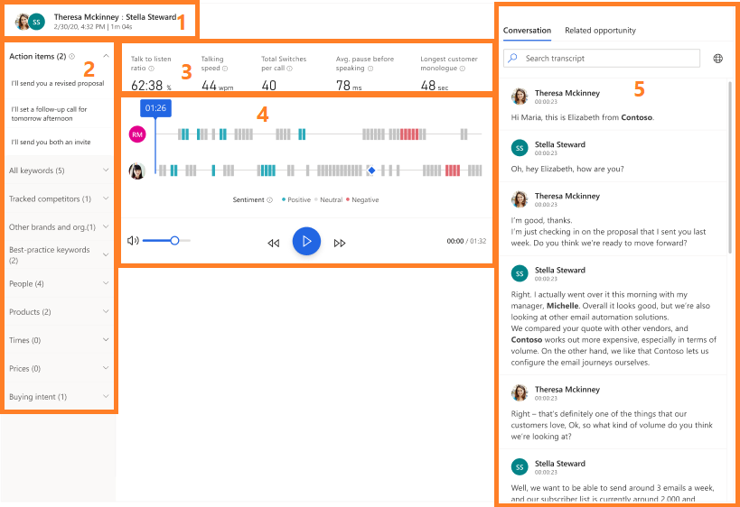

# View and understand call summary  

Sellers and their managers need an easy way to review their conversations with their customers, and quickly find relevant talking points, keywords, and insights.

The call summary page provides a high-level view on how the call went, and includes signals (such as identified action items and relevant keywords mentioned), the call timeline, a transcript, and more.

The information on the call summary page helps:

- Sellers quickly ramp up on past conversations with customers and highlight important topics and commitments.

- Managers get a high-level view of how their team is managing their relationships with customers.

The call summary is available in both Conversation Intelligence and Sales Hub apps.

## Prerequisites

Review the following prerequisites before using the call summary page:

- You must have configured Conversation Intelligence application to process the call recordings. To learn more, see [Administer Sales Insights application](intro-admin-guide-sales-insights.md#administer-sales-insights-application).

- You must have processed call recordings in Conversation Intelligence application. To learn more, see [Configure conversation intelligence to connect call data](configure-conversation-intelligence-call-data.md).

- You must have the latest [Sales Insights](https://appsource.microsoft.com/product/dynamics-365/mscrm.70b76f06-f739-4808-bd58-b5674a0a42d4?tab=Overview) installed in your organization to view the call insights tab in Sales Hub app. 

- You must include and update the CallPhoneCallCrmId parameter with your Dynamics 365 organization’s GUID to the metadata file while uploading the call recordings for processing. 

This helps to connect the call with the activity inside Dynamics 365. To learn more, see [Upload call recordings](configure-conversation-intelligence-call-data.md#upload-call-recordings).

## View call summary page in Conversation Intelligence

Open a conversation from the **Call history** section; the call summary page is displayed. To understand the call summary page, see [Understand the call summary page](). 

## View call insights tab in Sales Hub app

The **Call Insights** tab is available under activities for leads and opportunities. When a customer call regarding a lead or opportunity is processed in Conversation Intelligence, the **Call Insights** tab displays the information on the summary of the call. 

1.	Sign in to Dynamics 365 and select **Change area** > **Sales**.

2.	On the site map, select Activities. 

3.	Select a phone call activity for which you want to view the call summary.

4.	Select the Call Insights tab. The call summary of the selected phone activity is displayed. 

    >[!NOTE]
    >Select the **Related opportunity** tab to see the list of opportunities that are associated with the call. To add related opportunities to the call, select the lookup icon and add the opportunity.

    > [!div class="mx-imgBorder"]
    > 

    To understand the **Call Insight** tab, see [Understand the call summary page]().

## Understand the call summary page

The following image is an example of the call summary page:

> [!div class="mx-imgBorder"]
> 

Let's look at the KPIs and insights on the call summary page in detail:

1.	**Call details**: Displays the names of the participants, the subject of call, and time when the phone call happened.

2.	**Signals pane**: Displays relevant talking points that were mentioned during the call:

    -	**Action items**: Displays the list of actionable items mentioned during the call, for example, **I'll send you an email** or **I'll follow up with Michelle tomorrow**. When you click on an action item, you can see where it was mentioned on the timeline.

    -	**All keywords**: Displays keywords mentioned during the call. When you click on a keyword, you can see where it was mentioned on the timeline.

    -	**Tracked competitors**: Displays the defined competitors mentioned during the call. When you click on a competitor, you can see where it was mentioned on the timeline.

    -	**Tracked keywords**: Displays the pre-defined keywords that customers mentioned during the call. When you click on a keyword, you can see where it was mentioned on the timeline.

    -	**Other brands and org**: Displays brand and organization names (other than your organization’s) mentioned during the call. When you click on a brand or organization name, you can see where it was mentioned on the timeline. 

    -	**Best-practice keywords**: Displays keywords that can be used as best-practices during the call. When you click on a best practice keyword, you can see where it was mentioned on the timeline.

    -	**People**: Displays the names of people mentioned during the call. For example, **Sarah** calling from Contoso. When you click on a name, you can see where it was mentioned on the timeline.

    -	**Products**: Displays the names of the products mentioned during the call, for example, I only know how to use a **Fabrikam LED TV**. When you click on a product, you can see where it was mentioned on the timeline.

    -	**Times**: Displays times mentioned during the call, for example, let’s talk next **week**. When you click on a time, you can see where it was mentioned on the timeline.

    -	**Prices**: Displays prices mentioned during the call, for example, the product will cost **$50**. When you click on a price, you can see where it was mentioned on the timeline.

    -	**Buying intent**: Displays possible buying intent mentioned during the call, for example, **I want to buy a printer**. When you click on one below, you can see where it was mentioned on the timeline.

3.	**Core conversation information**: Displays metrics such as average talking speed, switch per conversations, average pause, and longest customer monologue.

4.	**Call playback timeline**: Displays the call playback timeline with the sentiments highlighted (such as positive, neutral, and negative). You can go to a specific moment on the call by clicking on the timeline. The call transcript (on the right) will automatically scroll to that moment in the call. You can also pause the call, rewind, forward, and adjust volume as required. 

5.	**Call transcript**: Provides a written record of the call. As a manager, you can review the transcript and leave a comment (for example, suggesting how the seller could possibly handle such a situation in the future). 

    As a seller, you can review the transcript and comments that are posted by your manager or coach on the timeline. You can provide replies to the comments appropriately.

    On a selected timeline, select **Add comment** to provide necessary replies or self-comments, and then select **Save**. 

    The bolded text in the transcript are the brands, tracked keywords, and competitors mentioned in the conversation. If the transcript is in a language other than English (and is one of the languages supported by Microsoft), you can select the Translate icon to convert the transcript into English.

    > [!div class="mx-imgBorder"]
    > 

### See also

[Overview of Dynamics 365 assistant](overview-dynamics-365-assistant-app-teams.md)

[Track and manage activities](https://docs.microsoft.com/dynamics365/sales-enterprise/manage-activities)
