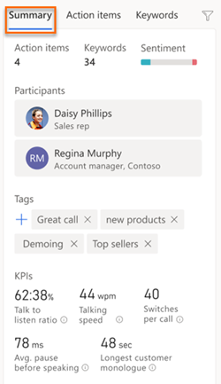
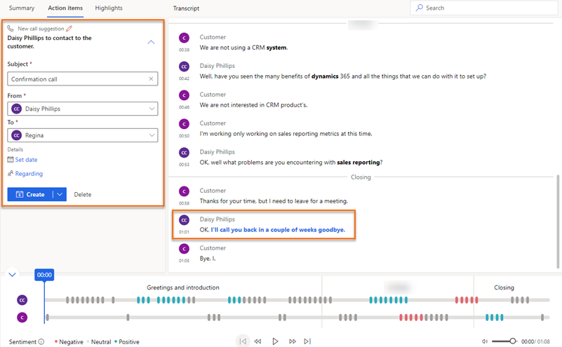
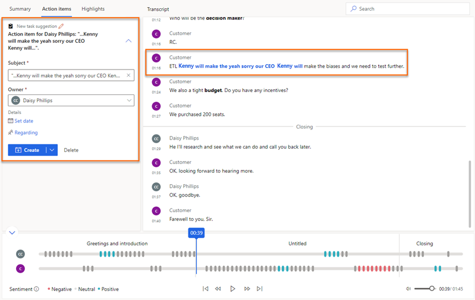
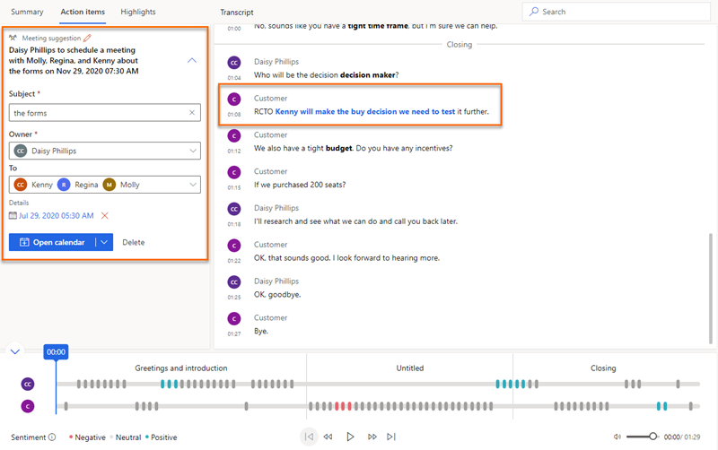
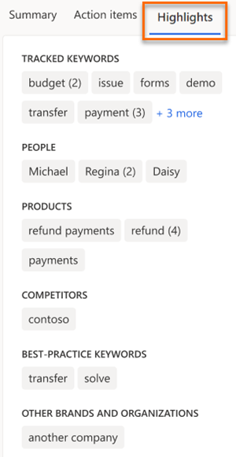
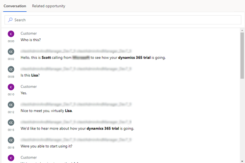
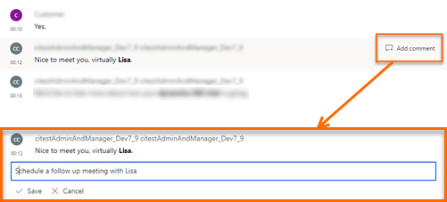
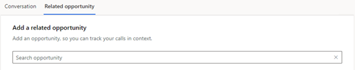

# View and understand call summary  

Sellers and their managers need an easy way to review their conversations with their customers and quickly find relevant talking points, keywords, and insights.  
The call summary page provides a high-level view of how the call went, and includes signals (such as identified action items and relevant keywords mentioned), the call timeline, a transcript, and more.  
The information on the call summary page helps:  
- Sellers quickly ramp up on past conversations with customers and highlight important topics and commitments.  
- Managers get a high-level view of how their team is managing their relationships with customers.  
The call summary is available in both conversation intelligence and Sales Hub apps.

## Prerequisites

Before using the call summary page, you must:  
- Configure conversation intelligence to process the call recordings. To learn more, see [Administer conversation intelligence](intro-admin-guide-sales-insights.md#administer-conversation-intelligence).  
- Process call recordings in conversation intelligence. To learn more, see [Configure conversation intelligence to connect call data](configure-conversation-intelligence-call-data.md).  
- Have the latest [Sales Insights](https://appsource.microsoft.com/product/dynamics-365/mscrm.70b76f06-f739-4808-bd58-b5674a0a42d4?tab=Overview) installed in your organization to view the call insights tab in the Sales Hub app.   
- Include and update the **CallPhoneCallCrmId** parameter with your Dynamics 365 organization’s GUID to the metadata file while uploading the call recordings for processing. To learn more, see [Configure conversation intelligence to connect call data](../sales/configure-conversation-intelligence-call-data.md).  
This helps to connect the call with the activity inside Dynamics 365. To learn more, see [Upload call recordings](configure-conversation-intelligence-call-data.md#upload-call-recordings).

## View call summary page in conversation intelligence

Open a conversation from the **Call history** section; the call summary page is displayed. To understand the call summary page, see [Understand the call summary page](#understand-the-call-summary-page). 

## View Call Insights tab in Sales Hub app

The **Call Insights** tab is available under activities for leads and opportunities. When a customer call regarding a lead or opportunity is processed in conversation intelligence, the **Call Insights** tab displays the information on the summary of the call.  
1.	Sign in to Dynamics 365 and select **Change area** > **Sales**.  
2.	On the site map, select **Activities**.   
3.	Select a phone call activity for which you want to view the call summary.  
4.	Select the **Call Insights** tab. The call summary of the selected phone activity is displayed.   
    > [!NOTE]
    > Select the **Related opportunity** tab to see the list of opportunities that are associated with the call. To add related opportunities to the call, select the lookup icon and add the opportunity.  
    > [!div class="mx-imgBorder"]
    >   
    To understand the **Call Insight** tab, see [Understand the call summary page](#understand-the-call-summary-page).

## Understand the call summary page

Typically, a call summary page can be divided into the following sections:  
- [Summary, action items, and highlights](#summary-action-items-and-highlights)  
- [Call transcript and translation](#call-transcript-and-translation)  
- [Call playback timeline and segmentation](#call-playback-timeline-and-segmentation)  

### Summary, action items, and highlights

- **Summary tab**: Displays the names of the participants along with the KPIs such as average talking speed, switch per conversations, average pause, and longest customer monologue. Also, you can see the tags that are added to the conversation for better searchability. The following image is an example of the **Summary** tab:  
    > [!div class="mx-imgBorder"]
    > 

- **Action items tab**: Displays the list of actionable items mentioned during the call where sellers required to keep track on after interacting with a customer. For example, **I'll send you an email** or **I'll follow up with Michelle tomorrow**. When you select an action item, you can see where it was mentioned on the timeline. The actionable items include: Send an email, set up a meeting, create a task, and set up a call.  

    - **Set up a call**: If there is a mention related to call in the transcript, the application analyzes the transcript and displays a suggestion to create a call. Also, the transcript is highlighted in Blue to show for which the call must be created. Enter the details:  
        - **Subject**: Provides an understanding on what the call is about for sellers who are viewing it. 
        - **From**: Select the name of the seller. The selected seller will make a call to the contact that you add in **To** field.   
        - **To**: Select the name of the customer for who the seller must make the call.
        - **Set date**: Select a date and time on which the call must be made.
        - **Regarding field**: Select a record from an entity that specifies what the call is about, such as opportunity, lead, contact, or account, which provides you with relevant information.   
        Select **Create** and the call activity is created. The call activity can be viewed under the activities of the attached record entity and the seller's activity list.
        >[!NOTE]
        >- While setting up a call, if you want to enter more details, select the down arrow icon corresponding to **Create** and select **Create and Edit**. Also, If you think it is more related to a task than a call, select **Create task**.   
        >- If you don't want to create a call activity, select **Delete**.  
        > [!div class="mx-imgBorder"]
        >    
        When the call activity is created, select the call under **See call** and the call activity is opened in a browser tab.  

    - **Create a task**: If there is a mention about a piece of work that the seller must perform in the transcript, the application analyzes the transcript and displays a suggestion to create a task. Also, the transcript is highlighted in Blue to show for which the task must be created. Enter the details:  
        - **Subject**: Provides an understanding on what the task is for sellers who are viewing it. 
        - **Owner**: Select the owner of the task from the list.
        - **Date and time**: Select a date in which the task must be completed.
        - **Regarding field**: Select a record from an entity that specifies what the task is about, such as opportunity, lead, contact, or account, which provides you with relevant information.  
        Select **Create** and the task activity is created. The task activity can be viewed under the activities of the attached record entity and the owner's activity list.   
        >[!NOTE]
        >- While creating the task activity, if you want to enter more details, select **Create and Edit**.
        >- If you don't want to create a task activity, select **Delete**.   
        > [!div class="mx-imgBorder"]
        >       
        When the task activity is created, select the task under **See task** and the task activity is opened in a browser tab.     

    - **Send an email**: If there is a mention related to email in the transcript, the application analyzes the transcript and displays a suggestion to send an email. Also, the transcript is highlighted in Blue to show for which the email must be sent. Enter the details:  
        - **Subject**: Provides an understanding on what the email is about for users who are receiving it. 
        - **From**: By default, the name of the seller who participated in the call is selected.    
        - **To**: Select the recipients for whom you want to send the email.
        Select **Open email** and your configured email editor is opened. Compose the email and send. 
        >[!NOTE]
        >- If you think it is more related to a task than an email, select **Create task**.   
        >- If you don't want to send an email, select **Delete**.  
        > [!div class="mx-imgBorder"]
        >    
         
    - **Set up a meeting**: If there is a mention related to a meeting in the transcript, the application analyzes the transcript and displays a suggestion to set up a meeting. Also, the transcript is highlighted in Blue to show for which the meeting must be set up. Enter the details:  
        - **Subject**: Provides an understanding on what the task is for sellers who are viewing it. 
        - **Owner**: By default, the name of the seller who participated in the call is selected.
        - **To**: Select the recipients for whom you want to send the email.
        - **Date and time**: Select a date and time on which you want to schedule the meeting.
        Select **Open calendar** and the meeting activity is opened in your configured calendar.    
        >[!NOTE]
        >- If you think it is more related to a task than an meeting, select **Create task**.   
        > [!div class="mx-imgBorder"]
        >       

- **Highlights tab**: Displays relevant talking points that were mentioned during the call.  
    - **Tracked keywords**: Displays the predefined keywords that customers mentioned during the call. When you select a keyword, you can see where it was mentioned on the timeline.  
    - **People**: Displays the names of people mentioned during the call; for example, Sarah calling from Contoso. When you select a name, you can see where it was mentioned on the timeline.  
    - **Products**: Displays the names of the products mentioned during the call; for example, I only know how to use a Fabrikam LED TV. When you select a product, you can see where it was mentioned on the timeline.  
    - **Competitors**: Displays the defined competitors mentioned during the call. When you select a competitor, you can see where it was mentioned on the timeline.  
    - **Best-practice keywords**: Displays keywords that can be used as best practices during the call. When you select a best practice keyword, you can see where it was mentioned on the timeline.  
    - **Other brands and org**: Displays brand and organization names (other than your organization’s) mentioned during the call. When you select a brand or organization name, you can see where it was mentioned on the timeline.  
    The following image is an example of the **Keywords** tab:  
    > [!div class="mx-imgBorder"]
    > 

### Call transcript and translation

- **Transcript tab**: Displays the written record of the call and timeline where you can read, comment, and translate. The following image is an example of the **Transcript** tab:  
    > [!div class="mx-imgBorder"]
    >           
    As a manager, you can review the transcript and leave a comment (for example, suggesting how the seller could possibly handle such a situation in the future).       
    As a seller, you can review the transcript and comments that are posted by your manager or coach on the timeline.      
    You can provide replies to the comments appropriately. Hover over a specific transcript on the timeline and select **Add comment** to provide necessary replies or self-comments, and then select **Save**.  
    > [!div class="mx-imgBorder"]
    >       
    The bolded text in the transcript are the brands, tracked keywords, and competitors mentioned in the conversation.      
    If the transcript is in a language other than English (and is one of the languages supported by Microsoft), you can select the translate icon  to convert the transcript into English.
<!--
- **Related opportunity tab**: Allows you to view or add opportunities that are related to the call and this helps other users who are viewing call summary to have an insight on what this conversation is regarding. If no opportunity is added to the conversation, select **Search** and add the related opportunity.      
    > [!div class="mx-imgBorder"]
    > -->

### Call playback timeline and segmentation

The following image is an example of playback section:  

> [!div class="mx-imgBorder"]
>      

Using the call playback feature, you can play and listen to the recorded call audio. Also, you can drag the progress bar or select at a specific point on timeline from where you want to listen. The call transcript will automatically scroll to that moment in the call. You can also pause the call, rewind, forward, and adjust volume as required.  
The playback timeline displays the sentiments highlighted (such as positive, neutral, and negative).  

When you go to **Highlights** tab and select a keyword or any other highlights, diamond icons appear on the playback timeline specifying that the selected highlight is mentioned at that time.  Also, hover over on a keyword displays a Gray diamond icon.  

The **Topics** section on the top of the playback timeline lets you understand how the conversation is divided into multiple segments. By selecting a segment, you can navigate to a specific segment in the conversation that is more important to you. Some examples of the segments are introduction, solution, price quote, and call close. The transcript is adjusted to display the start of the segment and the playback timeline is highlighted for the selected segment. Also, if the selected segment consists any action items and keywords, they are displayed under their respective tabs.  

### See also  
[Overview of Dynamics 365 assistant application for Teams](overview-dynamics-365-assistant-app-teams.md)  
[Track and manage activities](https://docs.microsoft.com/dynamics365/sales-enterprise/manage-activities)
