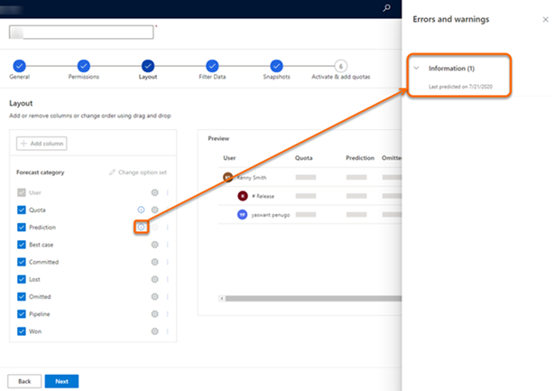
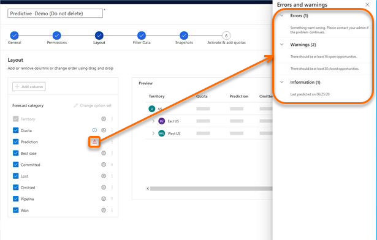

# View prediction model status 

<!--Early access preview note will be added here-->

You can view the details of the prediction model, such as last predicted date and errors in a forecast. After a model is generated, an icon is displayed corresponding to the **Prediction** column in the [Layout configuration step](https://docs.microsoft.com/dynamics365/sales-enterprise/choose-layout-and-columns-forecast) of a forecast. Based on the icon you can determine whether the model is successful or not.

>[!NOTE]
>After you configure and publish a forecast for the first time with prediction column, the column takes about two hours to display the data. 

## On successful prediction

Upon a successful prediction, an information icon is displayed corresponding the **Prediction** column. Select the icon and a side pane is displayed with date on the last prediction.

> [!div class="mx-imgBorder"]
> 

## On erroneous prediction

When the prediction fails, an alert icon is displayed corresponding the **Prediction** column. Select the icon and a side pane is displayed with information on errors, warnings, and last prediction date. Depending on this information, you can take necessary steps to resolve the issues and regenerate the model.

> [!div class="mx-imgBorder"]
> 

### See also

[Premium forecasting](configure-premium-forecasting.md)