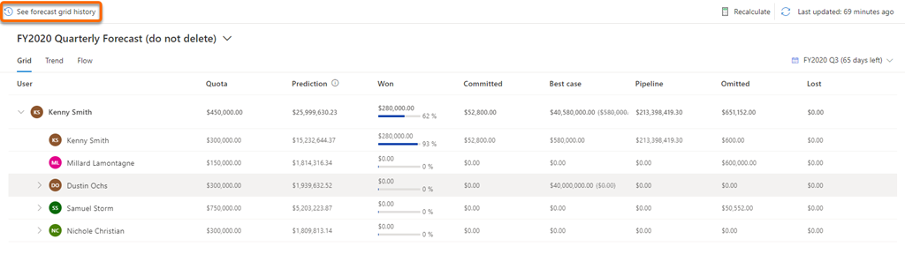
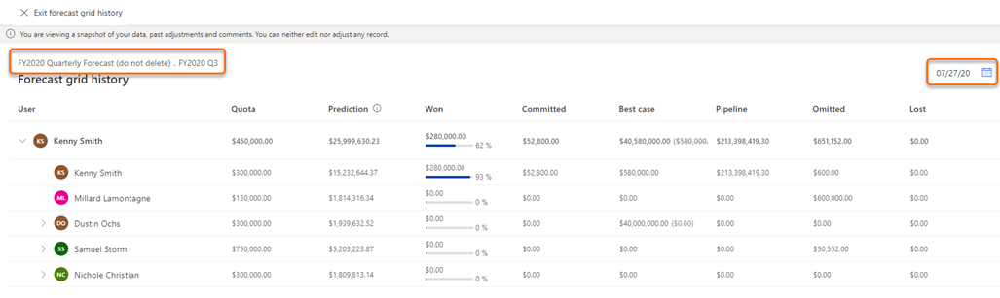
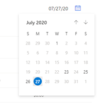
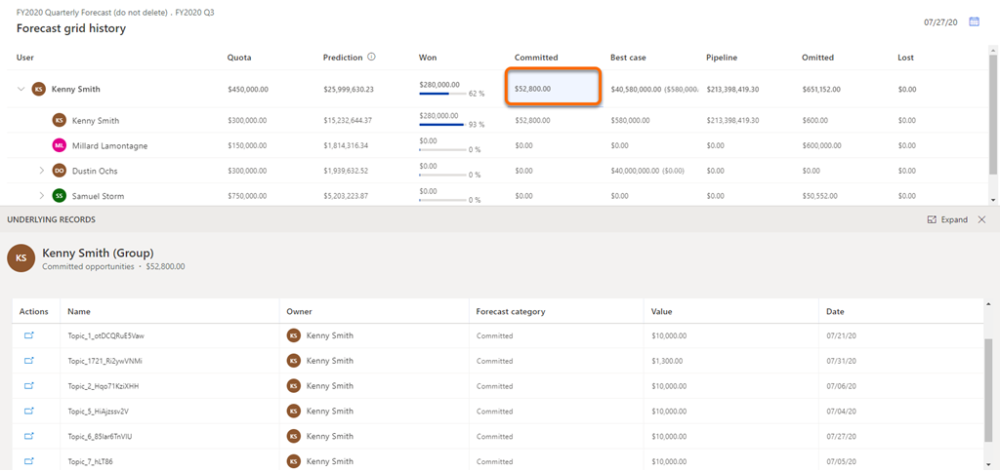

# View snapshot history

<!-- Early access preview note will be added here -->

Viewing a snapshot allows you to see and understand the data of the forecast at that moment in time when it's taken including the underlying opportunities. Also, you can compare and understand the data between your current forecast and snapshot on how the forecast is doing.

>[!NOTE]
>-	To view, you must have at least one snapshot created for the forecast.
>-	The data displayed in the snapshot is view only and can't be modified.

## Open and view snapshots

1.	Sign in to the **Sales Hub** app and go to **Performance** > **Forecasts**.

2.	Select the forecast for which you want to view the snapshots.

3.	Select **See forecast grid history**. 

    >[!NOTE]
    >The **See forecast grid history** option is inactive if there no snapshots available for the forecast.

    > [!div class="mx-imgBorder"]
    > 

    The latest snapshot for the forecast is displayed with information on forecast data at that point in time along with name and date.

    The name of the snapshot is in the following format: *forecast name.recurrence name*. In this example, you can see that name of the snapshot is **FY2020 Quarterly Forecast (do not delete).FY2020 Q3**.

    > [!div class="mx-imgBorder"]
    > 

    Also, the date on which the snapshot is taken is displayed and the format is based on your personal settings. In this example, the date format is **MM/DD/YY** (**07/27/20**).
  
4.	To view snapshot on a specific date, select the calendar icon and select the date. The snapshot for that day is displayed.

    >[!NOTE]
    >If a date is inactive, specifies that there is no snapshot available for that date.

    > [!div class="mx-imgBorder"]
    > 
 
## View underlying opportunities

For a snapshot, you can view the underlying opportunities of a column or users that are influencing the displayed budget amount at that point in time. By viewing the opportunities, you can analyze and understand how the opportunities are trending at that point in time.

1.	Open a snapshot. To learn more, see [Open and view snapshots](#open-and-view-snapshots).

2.	To see the underlying opportunities that are defining the value of the column at that point in time, select a column or user. In this example, Kenny Smith's **Committed** column is selected and the underlying opportunities that are contributing the value are displayed.

    > [!div class="mx-imgBorder"]
    > 

3.	To view the details of an underlying opportunity, under **Actions** column, select the navigate icon corresponding to the opportunity. 

The opportunity is opened in a new tab. The information displayed in the opportunity will be latest and not the information as on the date of snapshot.

### See also

[Take snapshots automaticlly](take-snapshots-daily.md)