# Work with LinkedIn activities

As a seller, you can use LinkedIn network, which contains millions of users with a unique depth and quality of information to research and connect with your customers. This functionality allows you to use LinkedIn Sales Navigator in your sequence to recommend the next best action.

When a sequence contains steps that are related to LinkedIn activities, you can do the following actions on the steps to interact with customers:

-	Do research on customer to know better. More information: [Research activity](#research-activity)
-	Get introduced to a customer. More information: [Get introduced activity](#get-introduced-activity)
-	Send personal messages to connect. More information: [Connect activity](#connect-activity)
-	Send an InMail to customer. More information: [Send InMail activity](#send-inmail-activity)

## Research activity

The **Research** activity allows you to view the LinkedIn profile including contact and account information of customers, which helps you in better understanding of customers before you start working with them.

You can do actions as described in the following table:

|              | Up next widget | Work list item |
|--------------|----------------|----------------|
| Sample image | 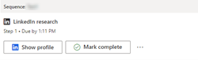 | 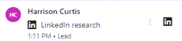|
| Action | Select **Show profile**. | Hover over the item and then select the LinkedIn icon. |
| Close step | Select **Mark as complete** to close the step and move to next step.  -Or- Select the **More options** icon and then choose an appropriate option: •	**Skip** to ignore the step. •	**Snooze** to look into the step later. •	**Assign** to assign the step to a different seller. | Select the **More options** icon and then choose an appropriate option: •	Select **Mark as complete** to close the step and move to next step. •	**Skip** to ignore the step. •	**Snooze** to look into the step later. •	**Assign** to assign the step to a different seller. |

When the action is selected, the **LinkedIn Research** side pane opens on the right with information on the customer profile and account. The following image is an example of research side pane:
 
>[!div class="mx-imgBorder"]
>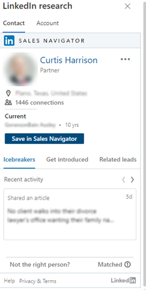

For more information on contact and account, see [Leads Module References](/linkedin/sales/display-services/leads-screenshots) and [Accounts Module References](/linkedin/sales/display-services/accounts-screenshots), respectively.

## Get introduced activity

The **Get introduced** activity allows you to ask for an introduction to a customer from anyone within your network who may be connected to the customer. If the Sales Navigator instance has licensed TeamLink, you’ll be able to see anyone in your organization who is connected to the customer who can make the introduction.

You can do actions as described in the following table:

|              | Up next widget | Work list item |
|--------------|----------------|----------------|
| Sample image | 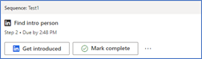 | 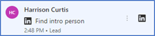|
| Action | Select **Get introduced**. | Hover over the item and then select the LinkedIn icon. |
| Close step | Select **Mark as complete** to close the step and move to next step.  -Or- Select the **More options** icon and then choose an appropriate option: •	**Skip** to ignore the step. •	**Snooze** to look into the step later. •	**Assign** to assign the step to a different seller. | Select the **More options** icon and then choose an appropriate option: •	Select **Mark as complete** to close the step and move to next step. •	**Skip** to ignore the step. •	**Snooze** to look into the step later. •	**Assign** to assign the step to a different seller. |

When the action is selected, the Find intro person side pane opens on the right. On the Contact tab, select Get introduced tab and the list of contacts who could introduce to the customer is displayed. 

The following image is an example of research side pane:

>[!div class="mx-imgBorder"]
>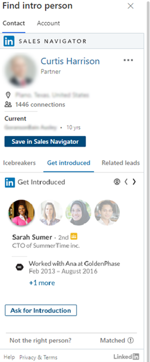 

For more information on get introduced, see [Get Introduced](/linkedin/sales/display-services/leads-screenshots#get-introduced).

## Connect activity

The **Connect** activity allows you to send connection invites along with personal messages, to solidify customer relationship and add them to your network.

You can do actions as described in the following table:

|              | Up next widget | Work list item |
|--------------|----------------|----------------|
| Sample image | 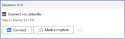 | 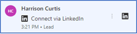|
| Action | Select **Connect**. | Hover over the item and then select the LinkedIn icon. |
| Close step | Select **Mark as complete** to close the step and move to next step.  -Or- Select the **More options** icon and then choose an appropriate option: •	**Skip** to ignore the step. •	**Snooze** to look into the step later. •	**Assign** to assign the step to a different seller. | Select the **More options** icon and then choose an appropriate option: •	Select **Mark as complete** to close the step and move to next step. •	**Skip** to ignore the step. •	**Snooze** to look into the step later. •	**Assign** to assign the step to a different seller. |

When the action is selected, the Connect via LinkedIn side pane opens on the bottom-right. On the Connect via LinkedIn tab, you can see the default message to connect with customer.

The following image is an example of connect message side pane:

>[!div class="mx-imgBorder"]
>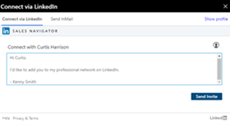 

For more information on connecting with customer, see [Connect](/linkedin/sales/display-services/leads-screenshots#connect).

## Send InMail activity

The **Send InMail** activity allows you to directly message customers through LinkedIn that you're not connected to.

You can do actions as described in the following table:

|              | Up next widget | Work list item |
|--------------|----------------|----------------|
| Sample image | 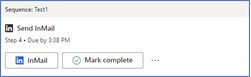 | 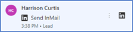|
| Action | Select **InMail**. | Hover over the item and then select the LinkedIn icon. |
| Close step | Select **Mark as complete** to close the step and move to next step.  -Or- Select the **More options** icon and then choose an appropriate option: •	**Skip** to ignore the step. •	**Snooze** to look into the step later. •	**Assign** to assign the step to a different seller. | Select the **More options** icon and then choose an appropriate option: •	Select **Mark as complete** to close the step and move to next step. •	**Skip** to ignore the step. •	**Snooze** to look into the step later. •	**Assign** to assign the step to a different seller. |

When the action is selected, the Send InMail side pane opens on the bottom-right. Go to Send InMail tab, and then enter subject, message, and any attachments if necessary and select Send. The InMail is sent to the customer.

> [!NOTE]
> To view the profile of the customer, select **Show profile**.

The following image is an example of InMail side pane:

>[!div class="mx-imgBorder"]
>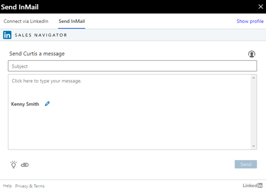 
 
For more information on sending InMails, see [Send an InMail Message](https://www.linkedin.com/help/linkedin/answer/437).

### See also

[Add LinkedIn activities to sequence](linkedin-activities-sequence.md)

[!INCLUDE[footer-include](../includes/footer-banner.md)]
